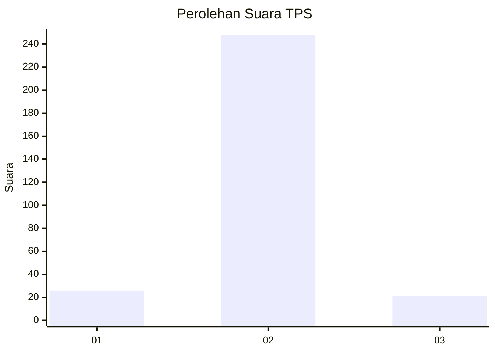
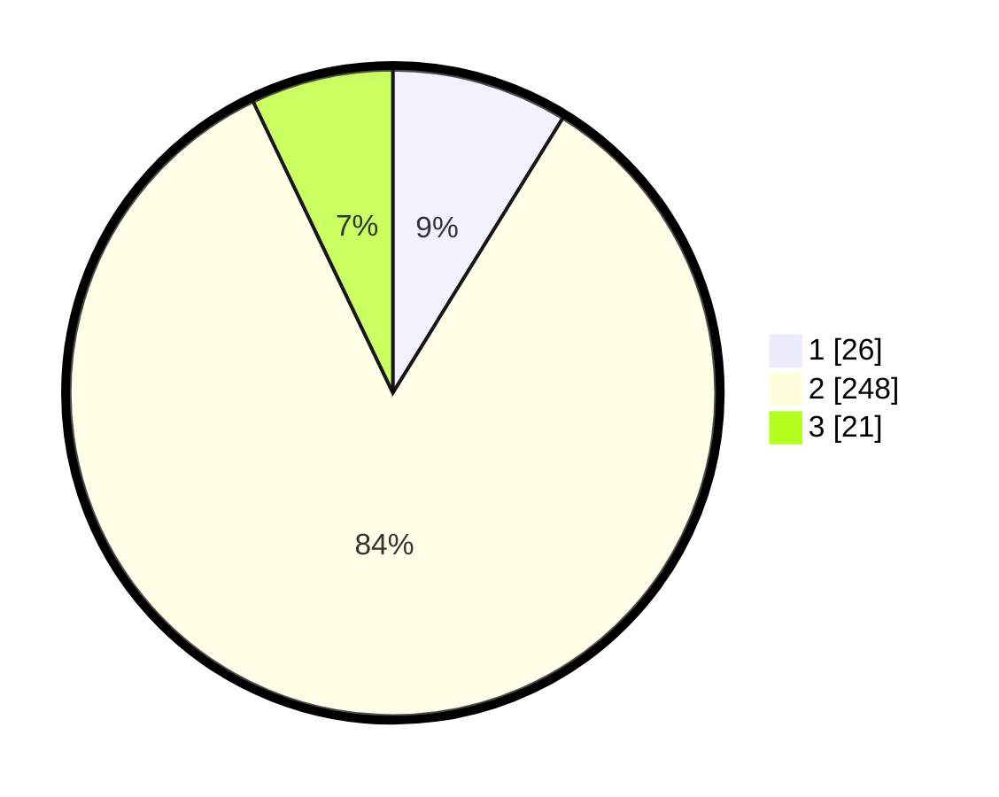

# Hasil

## Grafik

## Tabel

| No. | Nama Paslon    | Suara | Suara (raw) | Persentase |
|:--- |:-------------- | -----:| -----------:| ----------:|
| 1   | ANIES MUHAIMIN | 26    | [26][p-1]   | 8,81       |
| 2   | PRABOWO GIBRAN | 248   | [248][p-2]  | 84,07      |
| 3   | GANJAR MAHFUD  | 21    | [21][p-3]   | 7,12       |

[p-1]: https://github.com/gigit-pemilu/pemilu-2024-36-banten/blob/main/pilpres/hitung-suara/sub/36-banten/sub/03-tangerang/sub/04-jambe/sub/2004-taban/sub/903-tps/sub/paslon-1.txt
[p-2]: https://github.com/gigit-pemilu/pemilu-2024-36-banten/blob/main/pilpres/hitung-suara/sub/36-banten/sub/03-tangerang/sub/04-jambe/sub/2004-taban/sub/903-tps/sub/paslon-2.txt
[p-3]: https://github.com/gigit-pemilu/pemilu-2024-36-banten/blob/main/pilpres/hitung-suara/sub/36-banten/sub/03-tangerang/sub/04-jambe/sub/2004-taban/sub/903-tps/sub/paslon-3.txt

## Foto C Plano

https://sirekap-obj-formc.kpu.go.id/bbf9/pemilu/ppwp/36/03/04/20/04/3603042004903-20240221-104201--c8635a15-b60d-4781-899d-bb3468d7c4c4.jpg

https://sirekap-obj-formc.kpu.go.id/bbf9/pemilu/ppwp/36/03/04/20/04/3603042004903-20240221-104252--f1caafaf-7529-4410-a752-593dc7e5d993.jpg

https://sirekap-obj-formc.kpu.go.id/bbf9/pemilu/ppwp/36/03/04/20/04/3603042004903-20240221-104347--531df2d4-631f-4f11-8a8a-e7a06d092329.jpg

## Metadata

| Key        | Value               |
| ---------- | ------------------- |
| Time Stamp | 2024-02-24 22:31:28 |

