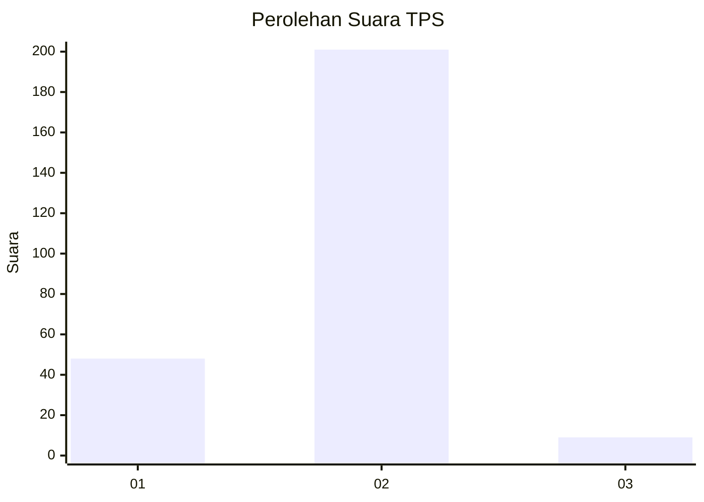
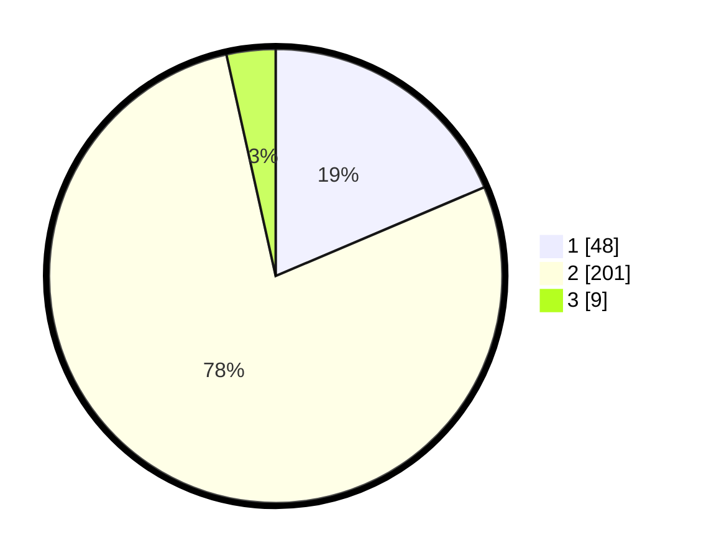

# Hasil

## Grafik

## Tabel

| No. | Nama Paslon    | Suara | Suara (raw) | Persentase |
|:--- |:-------------- | -----:| -----------:| ----------:|
| 1   | ANIES MUHAIMIN | 48    | [48][p-1]   | 18,60      |
| 2   | PRABOWO GIBRAN | 201   | [201][p-2]  | 77,91      |
| 3   | GANJAR MAHFUD  | 9     | [9][p-3]    | 3,49       |

[p-1]: https://github.com/gigit-pemilu/pemilu-2024/blob/main/pilpres/hitung-suara/sub/36-banten/sub/03-tangerang/sub/04-jambe/sub/2009-ancol-pasir/sub/001-tps/sub/paslon-1.txt
[p-2]: https://github.com/gigit-pemilu/pemilu-2024/blob/main/pilpres/hitung-suara/sub/36-banten/sub/03-tangerang/sub/04-jambe/sub/2009-ancol-pasir/sub/001-tps/sub/paslon-2.txt
[p-3]: https://github.com/gigit-pemilu/pemilu-2024/blob/main/pilpres/hitung-suara/sub/36-banten/sub/03-tangerang/sub/04-jambe/sub/2009-ancol-pasir/sub/001-tps/sub/paslon-3.txt

## Foto C Plano

https://sirekap-obj-formc.kpu.go.id/bbd0/pemilu/ppwp/36/03/04/20/09/3603042009001-20240214-210719--1873959f-f866-4be0-ac0b-d1bfb1d7e620.jpg

https://sirekap-obj-formc.kpu.go.id/bbd0/pemilu/ppwp/36/03/04/20/09/3603042009001-20240214-200725--7227e72a-7cfb-4cc9-8bac-8649f52666c9.jpg

https://sirekap-obj-formc.kpu.go.id/bbd0/pemilu/ppwp/36/03/04/20/09/3603042009001-20240214-201204--61993404-5288-4d95-a3f5-b2ccc3ed47fa.jpg

## Metadata

| Key        | Value               |
| ---------- | ------------------- |
| Time Stamp | 2024-02-15 00:41:44 |

