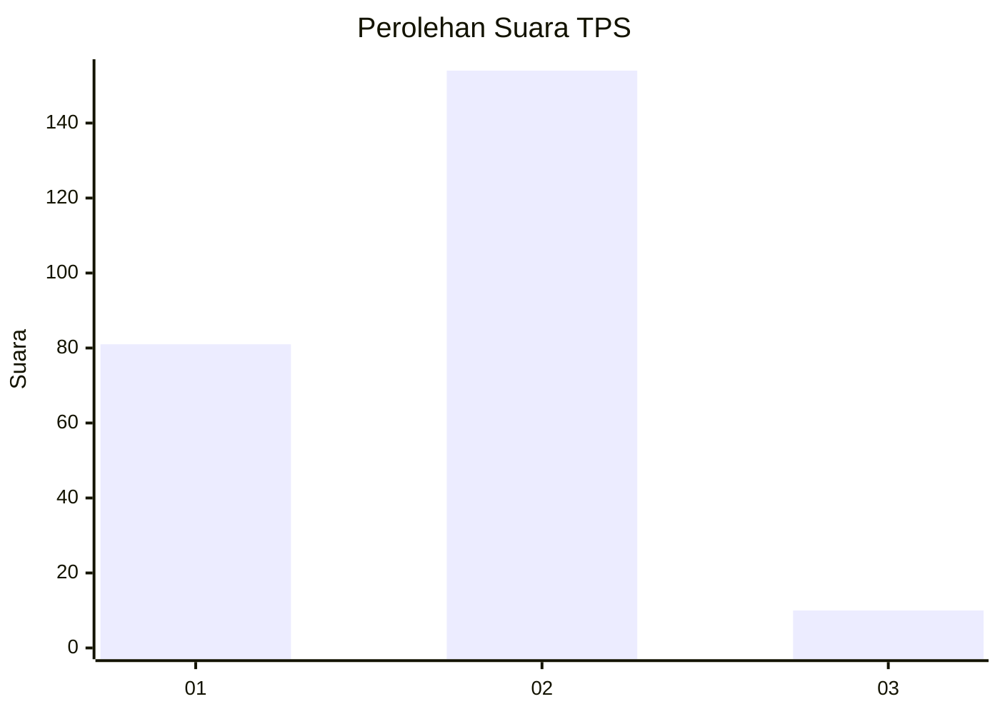
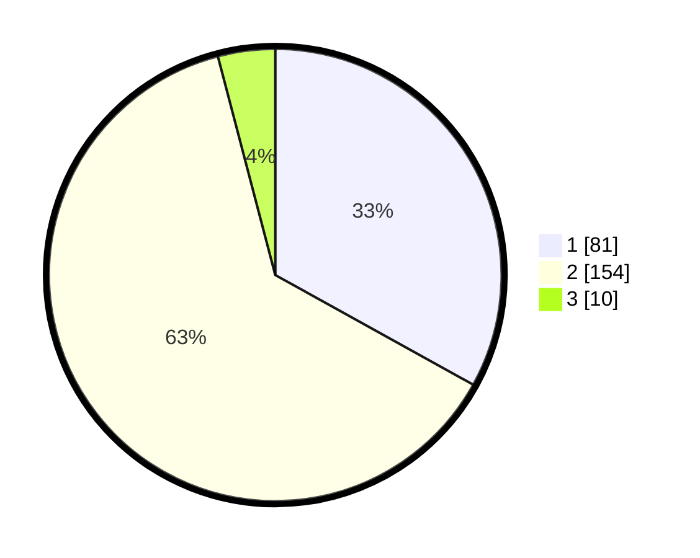

# Hasil

## Grafik

## Tabel

| No. | Nama Paslon    | Suara | Suara (raw) | Persentase |
|:--- |:-------------- | -----:| -----------:| ----------:|
| 1   | ANIES MUHAIMIN | 81    | [81][p-1]   | 33,06      |
| 2   | PRABOWO GIBRAN | 154   | [154][p-2]  | 62,86      |
| 3   | GANJAR MAHFUD  | 10    | [10][p-3]   | 4,08       |

[p-1]: https://github.com/gigit-pemilu/pemilu-2024-36-banten/blob/main/pilpres/hitung-suara/sub/36-banten/sub/03-tangerang/sub/05-cisoka/sub/2001-cisoka/sub/001-tps/sub/paslon-1.txt
[p-2]: https://github.com/gigit-pemilu/pemilu-2024-36-banten/blob/main/pilpres/hitung-suara/sub/36-banten/sub/03-tangerang/sub/05-cisoka/sub/2001-cisoka/sub/001-tps/sub/paslon-2.txt
[p-3]: https://github.com/gigit-pemilu/pemilu-2024-36-banten/blob/main/pilpres/hitung-suara/sub/36-banten/sub/03-tangerang/sub/05-cisoka/sub/2001-cisoka/sub/001-tps/sub/paslon-3.txt

## Foto C Plano

https://sirekap-obj-formc.kpu.go.id/d2bb/pemilu/ppwp/36/03/05/20/01/3603052001001-20240221-101910--053bec82-9053-4cde-8a9f-1f9bee6f025a.jpg

https://sirekap-obj-formc.kpu.go.id/d2bb/pemilu/ppwp/36/03/05/20/01/3603052001001-20240221-102112--8d3a3615-d6fb-424c-8d50-689b85783234.jpg

https://sirekap-obj-formc.kpu.go.id/d2bb/pemilu/ppwp/36/03/05/20/01/3603052001001-20240221-102222--99d2f88c-465a-4d1d-926a-cb27cf66976e.jpg

## Metadata

| Key        | Value               |
| ---------- | ------------------- |
| Time Stamp | 2024-02-25 15:00:00 |

