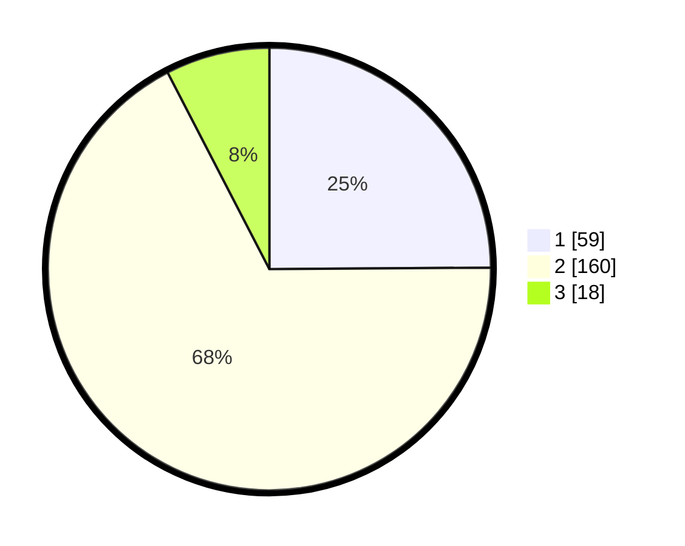

# Hasil

## Grafik

## Tabel

| No. | Nama Paslon    | Suara | Suara (raw) | Persentase |
|:--- |:-------------- | -----:| -----------:| ----------:|
| 1   | ANIES MUHAIMIN | 59    | [59][p-1]   | 24,89      |
| 2   | PRABOWO GIBRAN | 160   | [160][p-2]  | 67,51      |
| 3   | GANJAR MAHFUD  | 18    | [18][p-3]   | 7,59       |

[p-1]: https://github.com/gigit-pemilu/pemilu-2024-36-banten/blob/main/pilpres/hitung-suara/sub/36-banten/sub/03-tangerang/sub/05-cisoka/sub/2001-cisoka/sub/002-tps/sub/paslon-1.txt
[p-2]: https://github.com/gigit-pemilu/pemilu-2024-36-banten/blob/main/pilpres/hitung-suara/sub/36-banten/sub/03-tangerang/sub/05-cisoka/sub/2001-cisoka/sub/002-tps/sub/paslon-2.txt
[p-3]: https://github.com/gigit-pemilu/pemilu-2024-36-banten/blob/main/pilpres/hitung-suara/sub/36-banten/sub/03-tangerang/sub/05-cisoka/sub/2001-cisoka/sub/002-tps/sub/paslon-3.txt

## Foto C Plano

https://sirekap-obj-formc.kpu.go.id/c337/pemilu/ppwp/36/03/05/20/01/3603052001002-20240223-105328--bec5abb7-aa67-48b1-bbc0-c916198047d0.jpg

https://sirekap-obj-formc.kpu.go.id/c337/pemilu/ppwp/36/03/05/20/01/3603052001002-20240223-105356--aabc2d67-4571-414a-bff4-928e6046562c.jpg

https://sirekap-obj-formc.kpu.go.id/c337/pemilu/ppwp/36/03/05/20/01/3603052001002-20240223-105427--ae92421e-ae84-403c-bfbd-1eae7a8df140.jpg

## Metadata

| Key        | Value               |
| ---------- | ------------------- |
| Time Stamp | 2024-02-25 21:00:00 |

