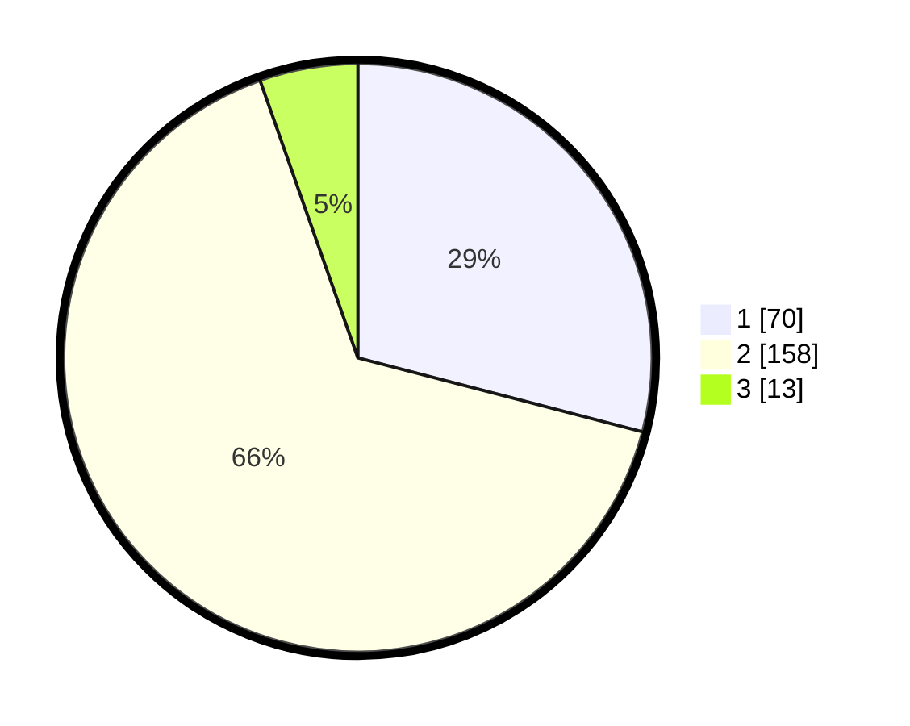

# Hasil

## Grafik

## Tabel

| No. | Nama Paslon    | Suara | Suara (raw) | Persentase |
|:--- |:-------------- | -----:| -----------:| ----------:|
| 1   | ANIES MUHAIMIN | 70    | [70][p-1]   | 29,05      |
| 2   | PRABOWO GIBRAN | 158   | [158][p-2]  | 65,56      |
| 3   | GANJAR MAHFUD  | 13    | [13][p-3]   | 5,39       |

[p-1]: https://github.com/gigit-pemilu/pemilu-2024/blob/main/pilpres/hitung-suara/sub/36-banten/sub/03-tangerang/sub/05-cisoka/sub/2001-cisoka/sub/003-tps/sub/paslon-1.txt
[p-2]: https://github.com/gigit-pemilu/pemilu-2024/blob/main/pilpres/hitung-suara/sub/36-banten/sub/03-tangerang/sub/05-cisoka/sub/2001-cisoka/sub/003-tps/sub/paslon-2.txt
[p-3]: https://github.com/gigit-pemilu/pemilu-2024/blob/main/pilpres/hitung-suara/sub/36-banten/sub/03-tangerang/sub/05-cisoka/sub/2001-cisoka/sub/003-tps/sub/paslon-3.txt

## Foto C Plano

https://sirekap-obj-formc.kpu.go.id/78bb/pemilu/ppwp/36/03/05/20/01/3603052001003-20240222-134407--183ea433-9bea-4048-8444-0c002cf0f5bb.jpg

https://sirekap-obj-formc.kpu.go.id/78bb/pemilu/ppwp/36/03/05/20/01/3603052001003-20240222-134520--386ea3d4-164e-41ab-92db-cdac336e1342.jpg

https://sirekap-obj-formc.kpu.go.id/78bb/pemilu/ppwp/36/03/05/20/01/3603052001003-20240222-134540--ad184e50-d1b8-41ea-ad63-334a2cae9560.jpg

## Metadata

| Key        | Value               |
| ---------- | ------------------- |
| Time Stamp | 2024-02-24 22:31:28 |

