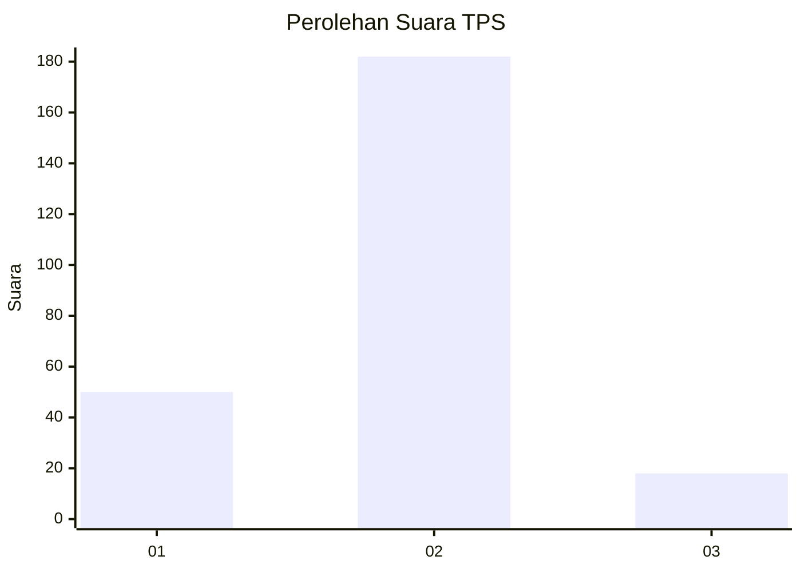
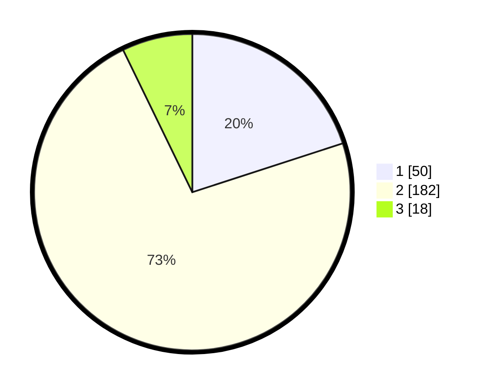

# Hasil

## Grafik

## Tabel

| No. | Nama Paslon    | Suara | Suara (raw) | Persentase |
|:--- |:-------------- | -----:| -----------:| ----------:|
| 1   | ANIES MUHAIMIN | 50    | [50][p-1]   | 20,00      |
| 2   | PRABOWO GIBRAN | 182   | [182][p-2]  | 72,80      |
| 3   | GANJAR MAHFUD  | 18    | [18][p-3]   | 7,20       |

[p-1]: https://github.com/gigit-pemilu/pemilu-2024/blob/main/pilpres/hitung-suara/sub/36-banten/sub/03-tangerang/sub/05-cisoka/sub/2001-cisoka/sub/004-tps/sub/paslon-1.txt
[p-2]: https://github.com/gigit-pemilu/pemilu-2024/blob/main/pilpres/hitung-suara/sub/36-banten/sub/03-tangerang/sub/05-cisoka/sub/2001-cisoka/sub/004-tps/sub/paslon-2.txt
[p-3]: https://github.com/gigit-pemilu/pemilu-2024/blob/main/pilpres/hitung-suara/sub/36-banten/sub/03-tangerang/sub/05-cisoka/sub/2001-cisoka/sub/004-tps/sub/paslon-3.txt

## Foto C Plano

https://sirekap-obj-formc.kpu.go.id/28ba/pemilu/ppwp/36/03/05/20/01/3603052001004-20240222-145704--31a0d52a-2946-44a8-aead-00e0bf2750b8.jpg

https://sirekap-obj-formc.kpu.go.id/28ba/pemilu/ppwp/36/03/05/20/01/3603052001004-20240221-152703--b9dab890-95b0-4dd4-a0f0-170e0d4ef740.jpg

https://sirekap-obj-formc.kpu.go.id/28ba/pemilu/ppwp/36/03/05/20/01/3603052001004-20240220-144803--3b8f532e-c578-4fd9-8aac-e51bed99d6ca.jpg

## Metadata

| Key        | Value               |
| ---------- | ------------------- |
| Time Stamp | 2024-02-25 02:00:00 |

