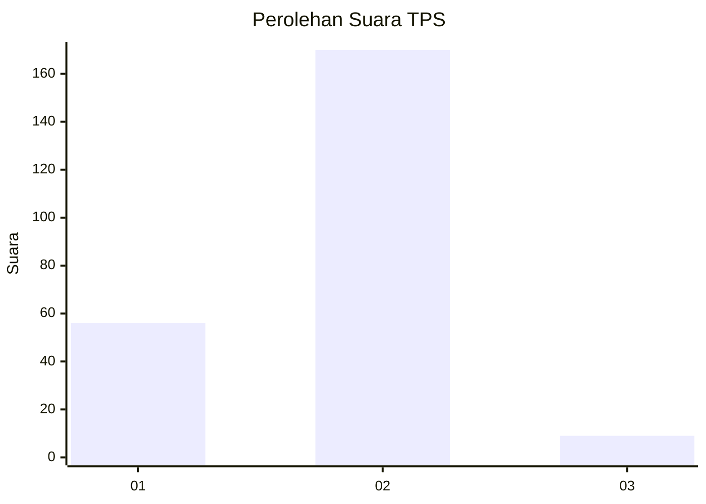

# Hasil

## Grafik

## Tabel

| No. | Nama Paslon    | Suara | Suara (raw) | Persentase |
|:--- |:-------------- | -----:| -----------:| ----------:|
| 1   | ANIES MUHAIMIN | 56    | [56][p-1]   | 23,83      |
| 2   | PRABOWO GIBRAN | 170   | [170][p-2]  | 72,34      |
| 3   | GANJAR MAHFUD  | 9     | [9][p-3]    | 3,83       |

[p-1]: https://github.com/gigit-pemilu/pemilu-2024-36-banten/blob/main/pilpres/hitung-suara/sub/36-banten/sub/03-tangerang/sub/05-cisoka/sub/2001-cisoka/sub/006-tps/sub/paslon-1.txt
[p-2]: https://github.com/gigit-pemilu/pemilu-2024-36-banten/blob/main/pilpres/hitung-suara/sub/36-banten/sub/03-tangerang/sub/05-cisoka/sub/2001-cisoka/sub/006-tps/sub/paslon-2.txt
[p-3]: https://github.com/gigit-pemilu/pemilu-2024-36-banten/blob/main/pilpres/hitung-suara/sub/36-banten/sub/03-tangerang/sub/05-cisoka/sub/2001-cisoka/sub/006-tps/sub/paslon-3.txt

## Foto C Plano

https://sirekap-obj-formc.kpu.go.id/5d56/pemilu/ppwp/36/03/05/20/01/3603052001006-20240221-211520--d6d00657-9022-477b-8502-1f7c6e88da3e.jpg

https://sirekap-obj-formc.kpu.go.id/5d56/pemilu/ppwp/36/03/05/20/01/3603052001006-20240221-211557--3ec4c375-754e-494a-b350-6196882b9b02.jpg

https://sirekap-obj-formc.kpu.go.id/5d56/pemilu/ppwp/36/03/05/20/01/3603052001006-20240220-170438--96b4749b-68bd-47bb-9e85-8bd70a3a9441.jpg

## Metadata

| Key        | Value               |
| ---------- | ------------------- |
| Time Stamp | 2024-02-24 22:31:28 |

