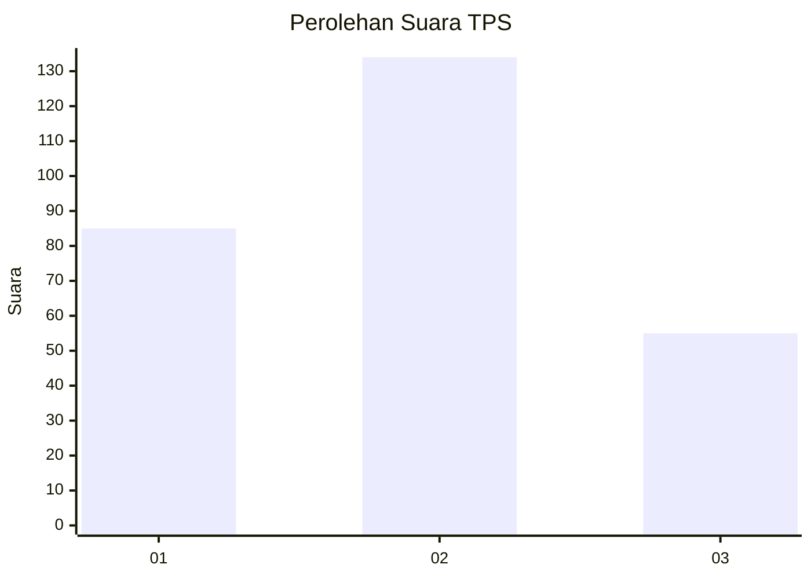
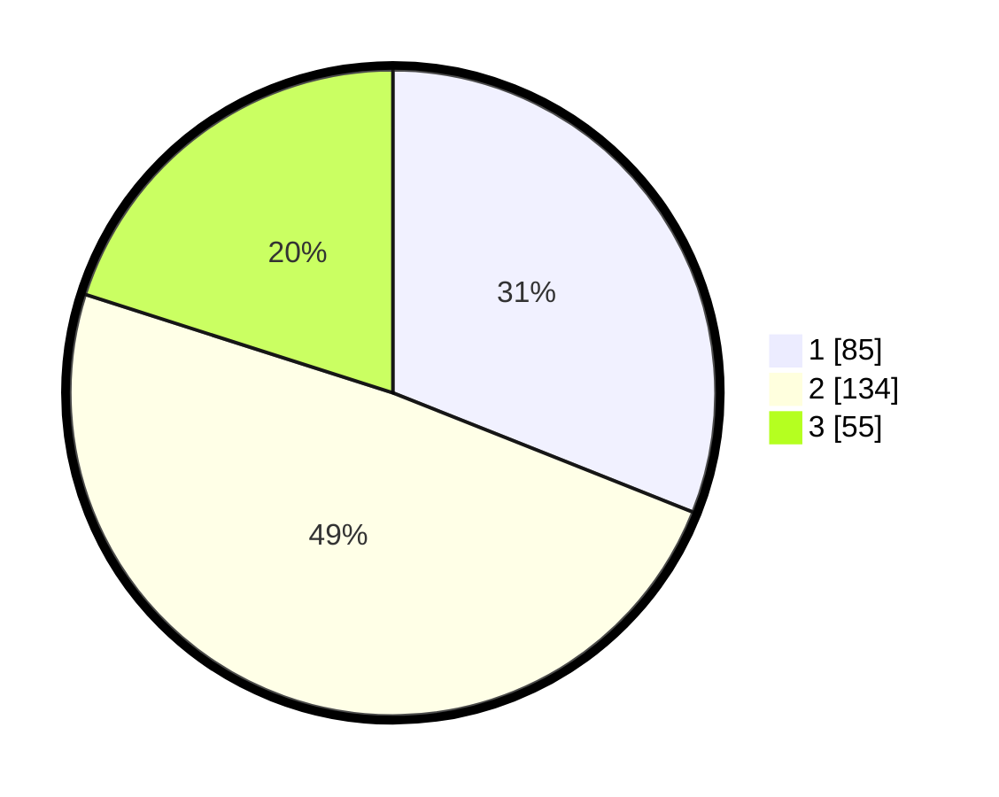

# Hasil

## Grafik

## Tabel

| No. | Nama Paslon    | Suara | Suara (raw) | Persentase |
|:--- |:-------------- | -----:| -----------:| ----------:|
| 1   | ANIES MUHAIMIN | 85    | [85][p-1]   | 31,02      |
| 2   | PRABOWO GIBRAN | 134   | [134][p-2]  | 48,91      |
| 3   | GANJAR MAHFUD  | 55    | [55][p-3]   | 20,07      |

[p-1]: https://github.com/gigit-pemilu/pemilu-2024-36-banten/blob/main/pilpres/hitung-suara/sub/36-banten/sub/03-tangerang/sub/05-cisoka/sub/2004-sukatani/sub/011-tps/sub/paslon-1.txt
[p-2]: https://github.com/gigit-pemilu/pemilu-2024-36-banten/blob/main/pilpres/hitung-suara/sub/36-banten/sub/03-tangerang/sub/05-cisoka/sub/2004-sukatani/sub/011-tps/sub/paslon-2.txt
[p-3]: https://github.com/gigit-pemilu/pemilu-2024-36-banten/blob/main/pilpres/hitung-suara/sub/36-banten/sub/03-tangerang/sub/05-cisoka/sub/2004-sukatani/sub/011-tps/sub/paslon-3.txt

## Foto C Plano

https://sirekap-obj-formc.kpu.go.id/b30d/pemilu/ppwp/36/03/05/20/04/3603052004011-20240226-022817--33b0ed90-d847-48ec-b021-386a0c4772b0.jpg

https://sirekap-obj-formc.kpu.go.id/b30d/pemilu/ppwp/36/03/05/20/04/3603052004011-20240226-022848--e6806efe-813e-4727-bd5c-902f34eb5478.jpg

https://sirekap-obj-formc.kpu.go.id/b30d/pemilu/ppwp/36/03/05/20/04/3603052004011-20240226-022927--72a05bde-a013-49d9-9683-e5daab7b2fca.jpg

## Metadata

| Key        | Value               |
| ---------- | ------------------- |
| Time Stamp | 2024-02-26 03:00:00 |

## DATA PEMILIH TETAP

Jumlah pemilih dalam DPT: **757**.
 * L: **777**.
 * P: **757**.

## DATA PENGGUNA HAK PILIH

Jumlah pengguna hak pilih dalam DPT: **557**.
 * L: **777**.
 * P: **757**.

Jumlah pengguna hak pilih dalam DPTb: **1**.
 * L: **0**.
 * P: **50**.

Jumlah pengguna hak pilih dalam DPK: **0**.
 * L: **0**.
 * P: **0**.

Jumlah pengguna hak pilih: **0**.
 * L: **0**.
 * P: **0**.

## JUMLAH SUARA SAH DAN TIDAK SAH

JUMLAH SELURUH SUARA SAH: **236**.

JUMLAH SUARA TIDAK SAH: **707**.

JUMLAH SELURUH SUARA SAH DAN SUARA TIDAK SAH: **0**.

