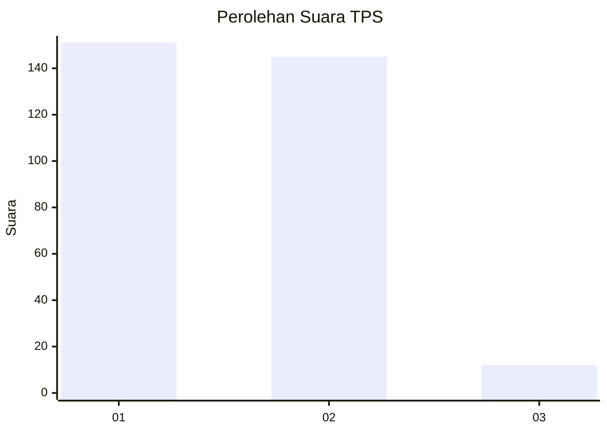
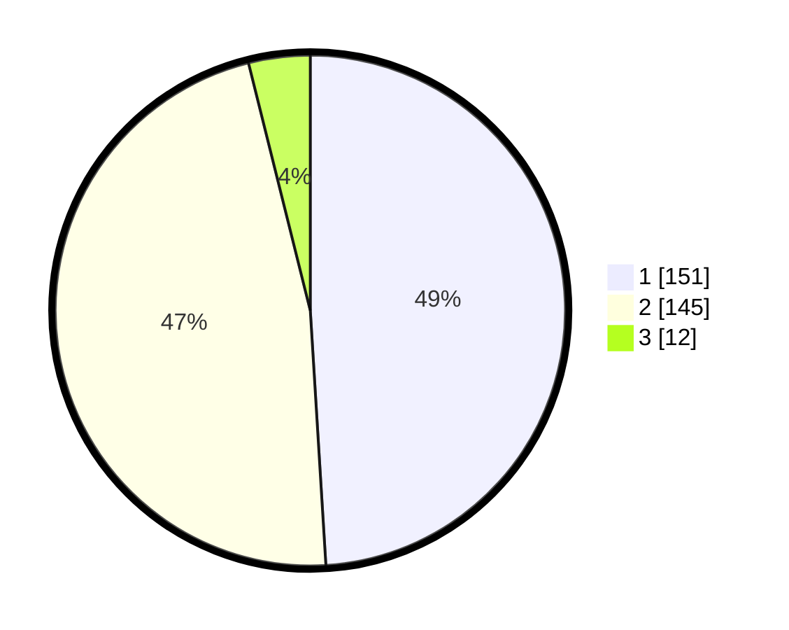

# Hasil

## Grafik

## Tabel

| No. | Nama Paslon    | Suara | Suara (raw) | Persentase |
|:--- |:-------------- | -----:| -----------:| ----------:|
| 1   | ANIES MUHAIMIN | 151   | [151][p-1]  | 49,03      |
| 2   | PRABOWO GIBRAN | 145   | [145][p-2]  | 47,08      |
| 3   | GANJAR MAHFUD  | 12    | [12][p-3]   | 3,90       |

[p-1]: https://github.com/gigit-pemilu/pemilu-2024/blob/main/pilpres/hitung-suara/sub/36-banten/sub/03-tangerang/sub/05-cisoka/sub/2008-cempaka/sub/005-tps/sub/paslon-1.txt
[p-2]: https://github.com/gigit-pemilu/pemilu-2024/blob/main/pilpres/hitung-suara/sub/36-banten/sub/03-tangerang/sub/05-cisoka/sub/2008-cempaka/sub/005-tps/sub/paslon-2.txt
[p-3]: https://github.com/gigit-pemilu/pemilu-2024/blob/main/pilpres/hitung-suara/sub/36-banten/sub/03-tangerang/sub/05-cisoka/sub/2008-cempaka/sub/005-tps/sub/paslon-3.txt

## Foto C Plano

https://sirekap-obj-formc.kpu.go.id/1cf4/pemilu/ppwp/36/03/05/20/08/3603052008005-20240223-161110--d47595bc-50f5-4c40-b90e-059dc8350e1c.jpg

https://sirekap-obj-formc.kpu.go.id/1cf4/pemilu/ppwp/36/03/05/20/08/3603052008005-20240223-161143--4d5bd3fd-bd26-4d90-a706-b8306395f423.jpg

https://sirekap-obj-formc.kpu.go.id/1cf4/pemilu/ppwp/36/03/05/20/08/3603052008005-20240223-161218--e64ed71f-0272-443f-9740-3dfcf55e1165.jpg

## Metadata

| Key        | Value               |
| ---------- | ------------------- |
| Time Stamp | 2024-02-25 17:00:00 |

