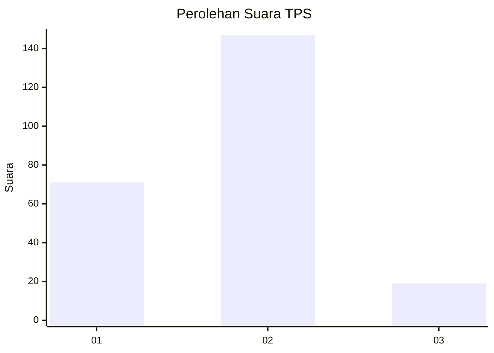
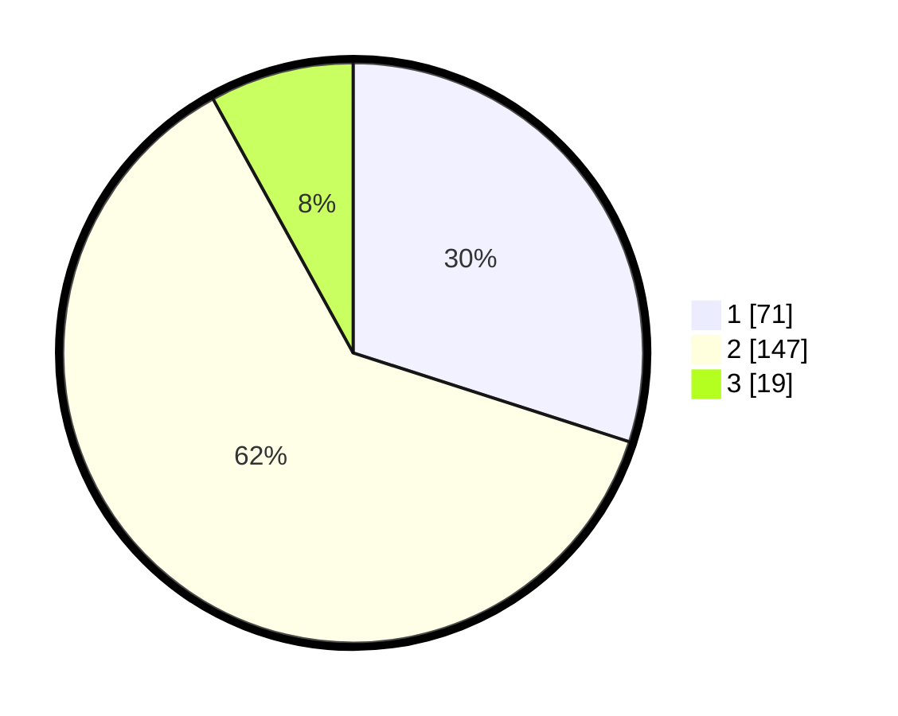

# Hasil

## Grafik

## Tabel

| No. | Nama Paslon    | Suara | Suara (raw) | Persentase |
|:--- |:-------------- | -----:| -----------:| ----------:|
| 1   | ANIES MUHAIMIN | 71    | [71][p-1]   | 29,96      |
| 2   | PRABOWO GIBRAN | 147   | [147][p-2]  | 62,03      |
| 3   | GANJAR MAHFUD  | 19    | [19][p-3]   | 8,02       |

[p-1]: https://github.com/gigit-pemilu/pemilu-2024/blob/main/pilpres/hitung-suara/sub/36-banten/sub/03-tangerang/sub/05-cisoka/sub/2017-jeungjing/sub/003-tps/sub/paslon-1.txt
[p-2]: https://github.com/gigit-pemilu/pemilu-2024/blob/main/pilpres/hitung-suara/sub/36-banten/sub/03-tangerang/sub/05-cisoka/sub/2017-jeungjing/sub/003-tps/sub/paslon-2.txt
[p-3]: https://github.com/gigit-pemilu/pemilu-2024/blob/main/pilpres/hitung-suara/sub/36-banten/sub/03-tangerang/sub/05-cisoka/sub/2017-jeungjing/sub/003-tps/sub/paslon-3.txt

## Foto C Plano

https://sirekap-obj-formc.kpu.go.id/0c24/pemilu/ppwp/36/03/05/20/17/3603052017003-20240217-120841--ed6c94e1-226a-4957-90c0-bbfa08083942.jpg

https://sirekap-obj-formc.kpu.go.id/0c24/pemilu/ppwp/36/03/05/20/17/3603052017003-20240217-120931--99ae54e5-5dfd-49bb-a0c5-6795025d7302.jpg

https://sirekap-obj-formc.kpu.go.id/0c24/pemilu/ppwp/36/03/05/20/17/3603052017003-20240217-121042--5aec2cd5-ebcd-4026-ae39-e32395fb0aa0.jpg

## Metadata

| Key        | Value               |
| ---------- | ------------------- |
| Time Stamp | 2024-02-17 13:37:34 |

## DATA PEMILIH TETAP

Jumlah pemilih dalam DPT: **500**.
 * L: **5**.
 * P: **300**.

## DATA PENGGUNA HAK PILIH

Jumlah pengguna hak pilih dalam DPT: **0**.
 * L: **5**.
 * P: **0**.

Jumlah pengguna hak pilih dalam DPTb: **120**.
 * L: **705**.
 * P: **713**.

Jumlah pengguna hak pilih dalam DPK: **820**.
 * L: **575**.
 * P: **570**.

Jumlah pengguna hak pilih: **0**.
 * L: **770**.
 * P: **18**.

## JUMLAH SUARA SAH DAN TIDAK SAH

JUMLAH SELURUH SUARA SAH: **237**.

JUMLAH SUARA TIDAK SAH: **2**.

JUMLAH SELURUH SUARA SAH DAN SUARA TIDAK SAH: **239**.

