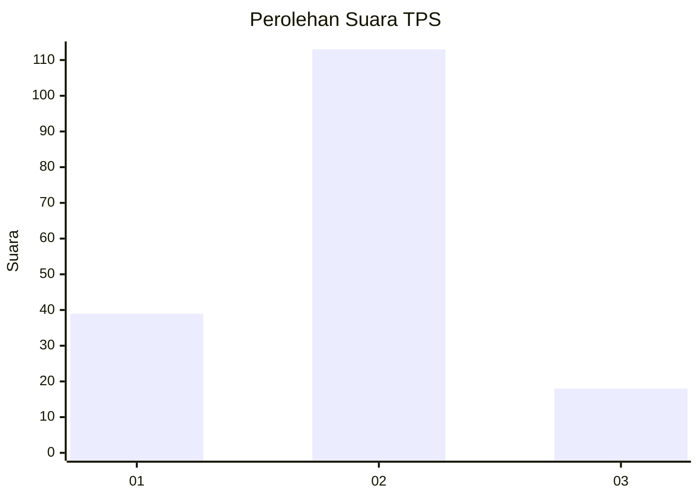

# Hasil

## Grafik

## Tabel

| No. | Nama Paslon    | Suara | Suara (raw) | Persentase |
|:--- |:-------------- | -----:| -----------:| ----------:|
| 1   | ANIES MUHAIMIN | 39    | [39][p-1]   | 22,94      |
| 2   | PRABOWO GIBRAN | 113   | [113][p-2]  | 66,47      |
| 3   | GANJAR MAHFUD  | 18    | [18][p-3]   | 10,59      |

[p-1]: https://github.com/gigit-pemilu/pemilu-2024/blob/main/pilpres/hitung-suara/sub/36-banten/sub/03-tangerang/sub/06-kresek/sub/2001-pasir-ampo/sub/006-tps/sub/paslon-1.txt
[p-2]: https://github.com/gigit-pemilu/pemilu-2024/blob/main/pilpres/hitung-suara/sub/36-banten/sub/03-tangerang/sub/06-kresek/sub/2001-pasir-ampo/sub/006-tps/sub/paslon-2.txt
[p-3]: https://github.com/gigit-pemilu/pemilu-2024/blob/main/pilpres/hitung-suara/sub/36-banten/sub/03-tangerang/sub/06-kresek/sub/2001-pasir-ampo/sub/006-tps/sub/paslon-3.txt

## Foto C Plano

https://sirekap-obj-formc.kpu.go.id/b266/pemilu/ppwp/36/03/06/20/01/3603062001006-20240215-182235--7e4f6c3e-d67c-4c6b-ba3f-397fd81c59eb.jpg

https://sirekap-obj-formc.kpu.go.id/b266/pemilu/ppwp/36/03/06/20/01/3603062001006-20240216-213110--dd5fd396-5823-422b-af2a-8a7d3d60aa17.jpg

https://sirekap-obj-formc.kpu.go.id/b266/pemilu/ppwp/36/03/06/20/01/3603062001006-20240216-061006--33d010ea-f6ad-4ce7-b6c1-3761e07c9c80.jpg

## Metadata

| Key        | Value               |
| ---------- | ------------------- |
| Time Stamp | 2024-02-19 11:00:00 |

