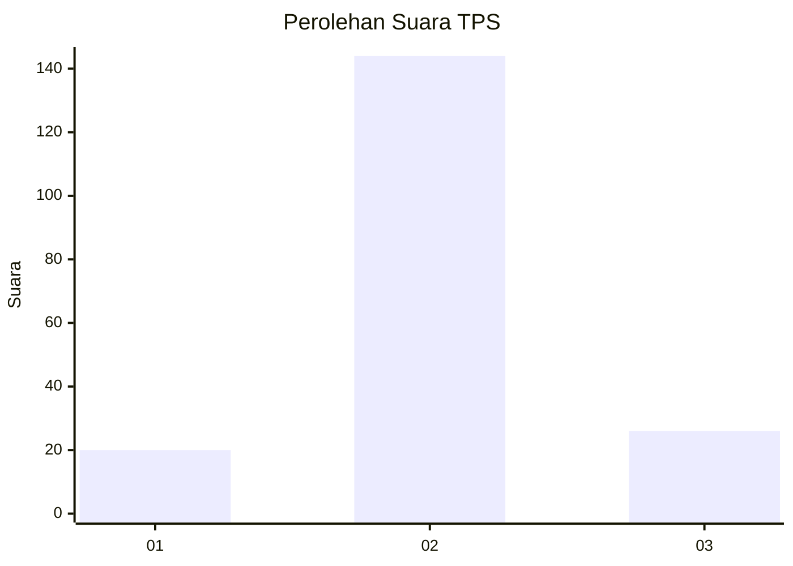
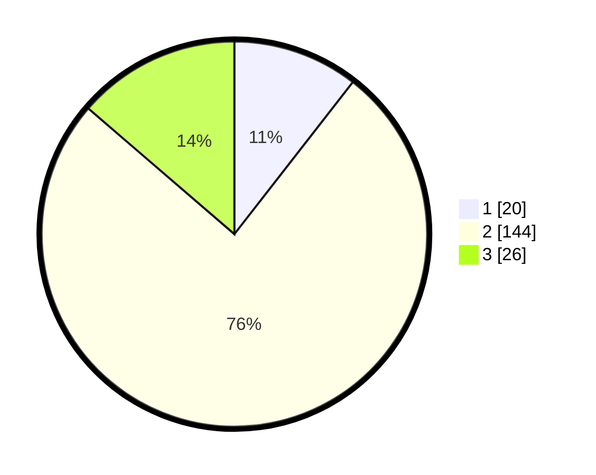

# Hasil

## Grafik

## Tabel

| No. | Nama Paslon    | Suara | Suara (raw) | Persentase |
|:--- |:-------------- | -----:| -----------:| ----------:|
| 1   | ANIES MUHAIMIN | 20    | [20][p-1]   | 10,53      |
| 2   | PRABOWO GIBRAN | 144   | [144][p-2]  | 75,79      |
| 3   | GANJAR MAHFUD  | 26    | [26][p-3]   | 13,68      |

[p-1]: https://github.com/gigit-pemilu/pemilu-2024/blob/main/pilpres/hitung-suara/sub/36-banten/sub/03-tangerang/sub/06-kresek/sub/2001-pasir-ampo/sub/012-tps/sub/paslon-1.txt
[p-2]: https://github.com/gigit-pemilu/pemilu-2024/blob/main/pilpres/hitung-suara/sub/36-banten/sub/03-tangerang/sub/06-kresek/sub/2001-pasir-ampo/sub/012-tps/sub/paslon-2.txt
[p-3]: https://github.com/gigit-pemilu/pemilu-2024/blob/main/pilpres/hitung-suara/sub/36-banten/sub/03-tangerang/sub/06-kresek/sub/2001-pasir-ampo/sub/012-tps/sub/paslon-3.txt

## Foto C Plano

https://sirekap-obj-formc.kpu.go.id/4e3a/pemilu/ppwp/36/03/06/20/01/3603062001012-20240215-000139--f8776624-3779-4a1f-9447-395229162ddc.jpg

https://sirekap-obj-formc.kpu.go.id/4e3a/pemilu/ppwp/36/03/06/20/01/3603062001012-20240215-000334--7b0318ec-e2a8-4dc0-86a4-0c66faa02835.jpg

https://sirekap-obj-formc.kpu.go.id/4e3a/pemilu/ppwp/36/03/06/20/01/3603062001012-20240215-000549--e1e2287b-a3ac-43a6-9de8-54949d41f3b0.jpg

## Metadata

| Key        | Value               |
| ---------- | ------------------- |
| Time Stamp | 2024-02-16 12:51:22 |

