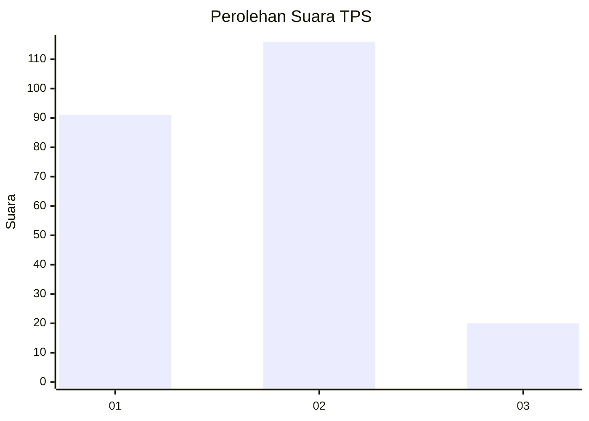
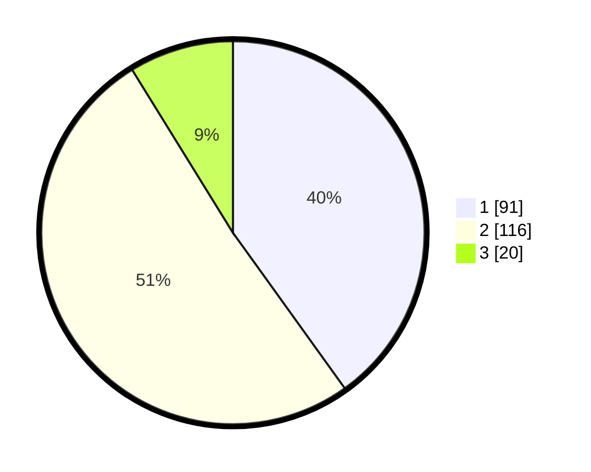

# Hasil

## Grafik

## Tabel

| No. | Nama Paslon    | Suara | Suara (raw) | Persentase |
|:--- |:-------------- | -----:| -----------:| ----------:|
| 1   | ANIES MUHAIMIN | 91    | [91][p-1]   | 40,09      |
| 2   | PRABOWO GIBRAN | 116   | [116][p-2]  | 51,10      |
| 3   | GANJAR MAHFUD  | 20    | [20][p-3]   | 8,81       |

[p-1]: https://github.com/gigit-pemilu/pemilu-2024-36-banten/blob/main/pilpres/hitung-suara/sub/36-banten/sub/03-tangerang/sub/07-kronjo/sub/2001-kronjo/sub/002-tps/sub/paslon-1.txt
[p-2]: https://github.com/gigit-pemilu/pemilu-2024-36-banten/blob/main/pilpres/hitung-suara/sub/36-banten/sub/03-tangerang/sub/07-kronjo/sub/2001-kronjo/sub/002-tps/sub/paslon-2.txt
[p-3]: https://github.com/gigit-pemilu/pemilu-2024-36-banten/blob/main/pilpres/hitung-suara/sub/36-banten/sub/03-tangerang/sub/07-kronjo/sub/2001-kronjo/sub/002-tps/sub/paslon-3.txt

## Foto C Plano

https://sirekap-obj-formc.kpu.go.id/1ae1/pemilu/ppwp/36/03/07/20/01/3603072001002-20240215-004009--553ad62d-87a4-4bdc-9a08-f10d7a1b5102.jpg

https://sirekap-obj-formc.kpu.go.id/1ae1/pemilu/ppwp/36/03/07/20/01/3603072001002-20240214-190015--42f133e3-ac45-4c36-87ed-ddde12f0b88a.jpg

https://sirekap-obj-formc.kpu.go.id/1ae1/pemilu/ppwp/36/03/07/20/01/3603072001002-20240215-004153--ea80b089-2af8-423b-af3d-41cb0b37e144.jpg

## Metadata

| Key        | Value               |
| ---------- | ------------------- |
| Time Stamp | 2024-02-16 16:25:10 |

