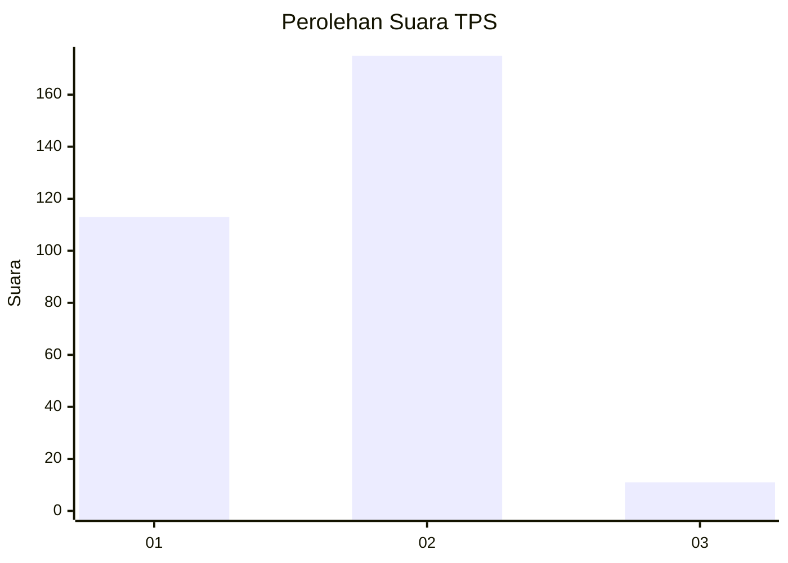
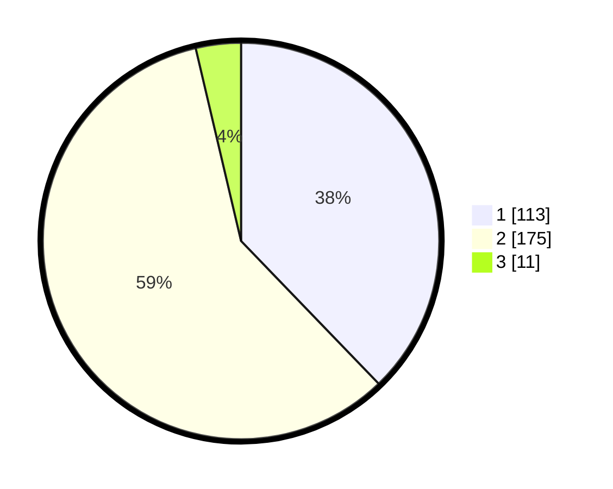

# Hasil

## Grafik

## Tabel

| No. | Nama Paslon    | Suara | Suara (raw) | Persentase |
|:--- |:-------------- | -----:| -----------:| ----------:|
| 1   | ANIES MUHAIMIN | 113   | [113][p-1]  | 37,79      |
| 2   | PRABOWO GIBRAN | 175   | [175][p-2]  | 58,53      |
| 3   | GANJAR MAHFUD  | 11    | [11][p-3]   | 3,68       |

[p-1]: https://github.com/gigit-pemilu/pemilu-2024-36-banten/blob/main/pilpres/hitung-suara/sub/36-banten/sub/03-tangerang/sub/07-kronjo/sub/2009-pagedangan-udik/sub/017-tps/sub/paslon-1.txt
[p-2]: https://github.com/gigit-pemilu/pemilu-2024-36-banten/blob/main/pilpres/hitung-suara/sub/36-banten/sub/03-tangerang/sub/07-kronjo/sub/2009-pagedangan-udik/sub/017-tps/sub/paslon-2.txt
[p-3]: https://github.com/gigit-pemilu/pemilu-2024-36-banten/blob/main/pilpres/hitung-suara/sub/36-banten/sub/03-tangerang/sub/07-kronjo/sub/2009-pagedangan-udik/sub/017-tps/sub/paslon-3.txt

## Foto C Plano

https://sirekap-obj-formc.kpu.go.id/aebb/pemilu/ppwp/36/03/07/20/09/3603072009017-20240215-011405--2cbd195f-9a4b-46a0-846c-53a8fb4986f7.jpg

https://sirekap-obj-formc.kpu.go.id/aebb/pemilu/ppwp/36/03/07/20/09/3603072009017-20240215-012137--adc81133-bbfc-4d67-962c-e7c8512036a9.jpg

https://sirekap-obj-formc.kpu.go.id/aebb/pemilu/ppwp/36/03/07/20/09/3603072009017-20240215-011548--1410d2f4-e9fd-4631-80f1-141f46a4cc2c.jpg

## Metadata

| Key        | Value               |
| ---------- | ------------------- |
| Time Stamp | 2024-02-26 12:00:00 |

