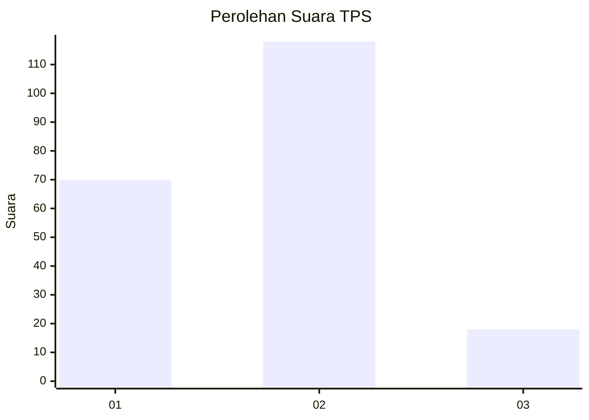
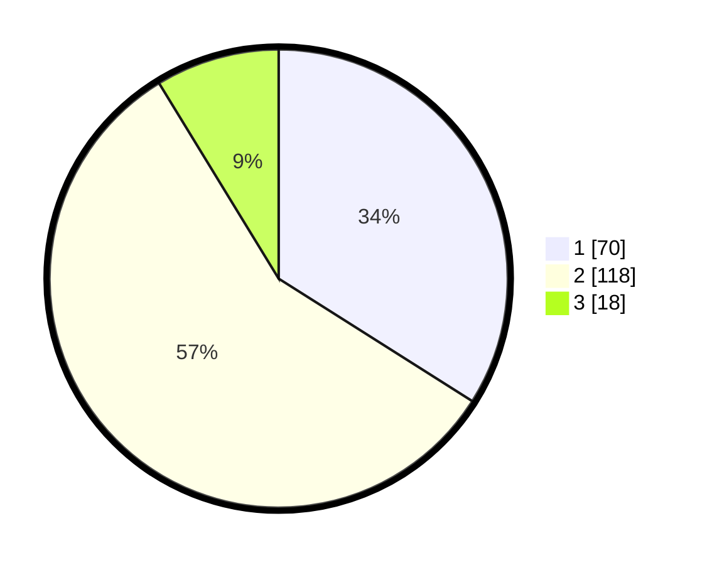

# Hasil

## Grafik

## Tabel

| No. | Nama Paslon    | Suara | Suara (raw) | Persentase |
|:--- |:-------------- | -----:| -----------:| ----------:|
| 1   | ANIES MUHAIMIN | 70    | [70][p-1]   | 33,98      |
| 2   | PRABOWO GIBRAN | 118   | [118][p-2]  | 57,28      |
| 3   | GANJAR MAHFUD  | 18    | [18][p-3]   | 8,74       |

[p-1]: https://github.com/gigit-pemilu/pemilu-2024/blob/main/pilpres/hitung-suara/sub/36-banten/sub/03-tangerang/sub/08-mauk/sub/2001-mauk-barat/sub/009-tps/sub/paslon-1.txt
[p-2]: https://github.com/gigit-pemilu/pemilu-2024/blob/main/pilpres/hitung-suara/sub/36-banten/sub/03-tangerang/sub/08-mauk/sub/2001-mauk-barat/sub/009-tps/sub/paslon-2.txt
[p-3]: https://github.com/gigit-pemilu/pemilu-2024/blob/main/pilpres/hitung-suara/sub/36-banten/sub/03-tangerang/sub/08-mauk/sub/2001-mauk-barat/sub/009-tps/sub/paslon-3.txt

## Foto C Plano

https://sirekap-obj-formc.kpu.go.id/ba89/pemilu/ppwp/36/03/08/20/01/3603082001009-20240218-145906--e031bd0a-82f5-42f3-ad42-e80e985de8fe.jpg

https://sirekap-obj-formc.kpu.go.id/ba89/pemilu/ppwp/36/03/08/20/01/3603082001009-20240218-145345--a7e1a7b7-5026-4930-9ac4-086923b25c24.jpg

https://sirekap-obj-formc.kpu.go.id/ba89/pemilu/ppwp/36/03/08/20/01/3603082001009-20240218-145509--ed0f3a5f-df6c-4815-b10a-d0983eda1b1e.jpg

## Metadata

| Key        | Value               |
| ---------- | ------------------- |
| Time Stamp | 2024-02-19 06:16:00 |

## DATA PEMILIH TETAP

Jumlah pemilih dalam DPT: **215**.
 * L: **332**.
 * P: **903**.

## DATA PENGGUNA HAK PILIH

Jumlah pengguna hak pilih dalam DPT: **222**.
 * L: **173**.
 * P: **152**.

Jumlah pengguna hak pilih dalam DPTb: **226**.
 * L: **881**.
 * P: **247**.

Jumlah pengguna hak pilih dalam DPK: **223**.
 * L: **781**.
 * P: **472**.

Jumlah pengguna hak pilih: **225**.
 * L: **247**.
 * P: **193**.

## JUMLAH SUARA SAH DAN TIDAK SAH

JUMLAH SELURUH SUARA SAH: **206**.

JUMLAH SUARA TIDAK SAH: **9**.

JUMLAH SELURUH SUARA SAH DAN SUARA TIDAK SAH: **215**.

