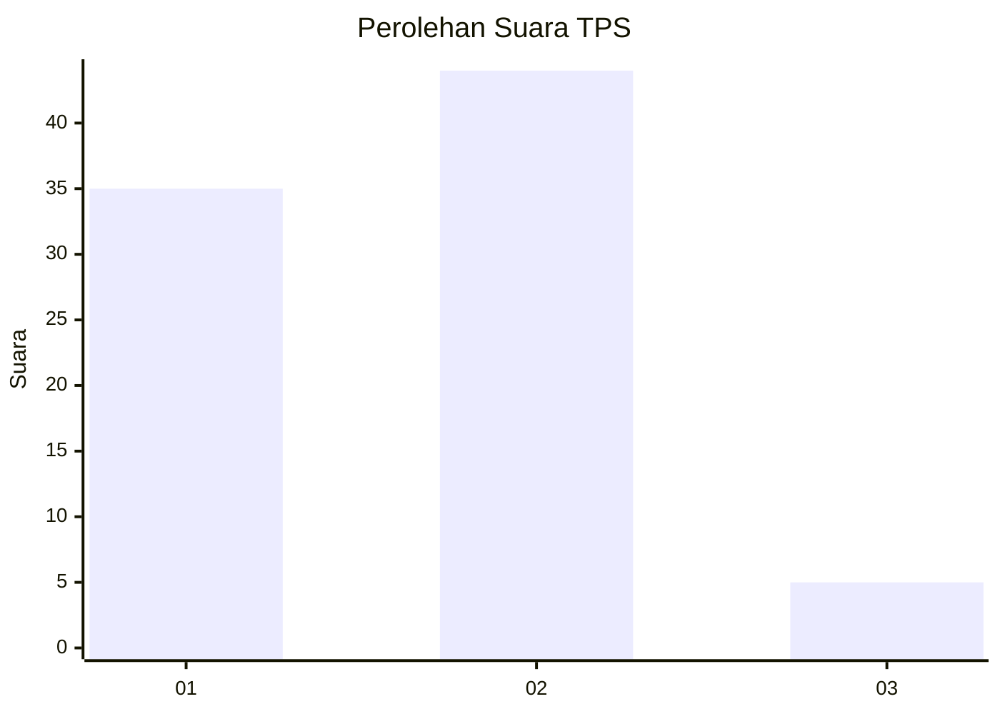
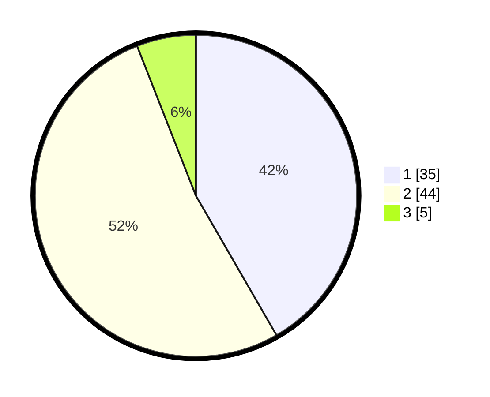

# Hasil

## Grafik

## Tabel

| No. | Nama Paslon    | Suara | Suara (raw) | Persentase |
|:--- |:-------------- | -----:| -----------:| ----------:|
| 1   | ANIES MUHAIMIN | 35    | [35][p-1]   | 41,67      |
| 2   | PRABOWO GIBRAN | 44    | [44][p-2]   | 52,38      |
| 3   | GANJAR MAHFUD  | 5     | [5][p-3]    | 5,95       |

[p-1]: https://github.com/gigit-pemilu/pemilu-2024-36-banten/blob/main/pilpres/hitung-suara/sub/36-banten/sub/03-tangerang/sub/08-mauk/sub/2003-tegal-kunir-kidul/sub/011-tps/sub/paslon-1.txt
[p-2]: https://github.com/gigit-pemilu/pemilu-2024-36-banten/blob/main/pilpres/hitung-suara/sub/36-banten/sub/03-tangerang/sub/08-mauk/sub/2003-tegal-kunir-kidul/sub/011-tps/sub/paslon-2.txt
[p-3]: https://github.com/gigit-pemilu/pemilu-2024-36-banten/blob/main/pilpres/hitung-suara/sub/36-banten/sub/03-tangerang/sub/08-mauk/sub/2003-tegal-kunir-kidul/sub/011-tps/sub/paslon-3.txt

## Foto C Plano

https://sirekap-obj-formc.kpu.go.id/7be1/pemilu/ppwp/36/03/08/20/03/3603082003011-20240222-105117--bacbcd3d-b713-4922-8fc7-5d69bac11823.jpg

https://sirekap-obj-formc.kpu.go.id/7be1/pemilu/ppwp/36/03/08/20/03/3603082003011-20240222-105143--66e56ce4-8806-4eb2-92cb-b2d98966f2dc.jpg

https://sirekap-obj-formc.kpu.go.id/7be1/pemilu/ppwp/36/03/08/20/03/3603082003011-20240222-105225--9f0fb3e9-1358-435c-8c80-e3fcf4ee4c71.jpg

## Metadata

| Key        | Value               |
| ---------- | ------------------- |
| Time Stamp | 2024-02-22 11:00:00 |

## DATA PEMILIH TETAP

Jumlah pemilih dalam DPT: **286**.
 * L: **52**.
 * P: **529**.

## DATA PENGGUNA HAK PILIH

Jumlah pengguna hak pilih dalam DPT: **228**.
 * L: **553**.
 * P: **54**.

Jumlah pengguna hak pilih dalam DPTb: **880**.
 * L: **0**.
 * P: **88**.

Jumlah pengguna hak pilih dalam DPK: **80**.
 * L: **800**.
 * P: **0**.

Jumlah pengguna hak pilih: **923**.
 * L: **505**.
 * P: **313**.

## JUMLAH SUARA SAH DAN TIDAK SAH

JUMLAH SELURUH SUARA SAH: **222**.

JUMLAH SUARA TIDAK SAH: **6**.

JUMLAH SELURUH SUARA SAH DAN SUARA TIDAK SAH: **228**.

