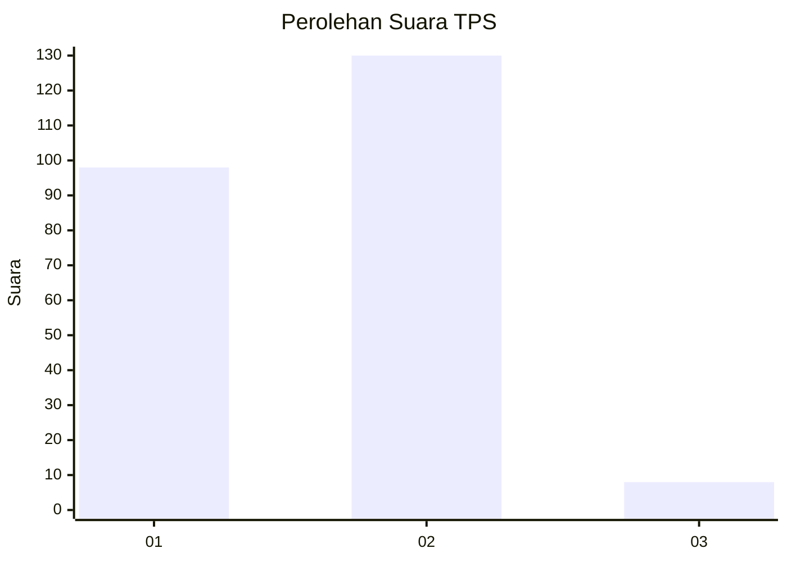
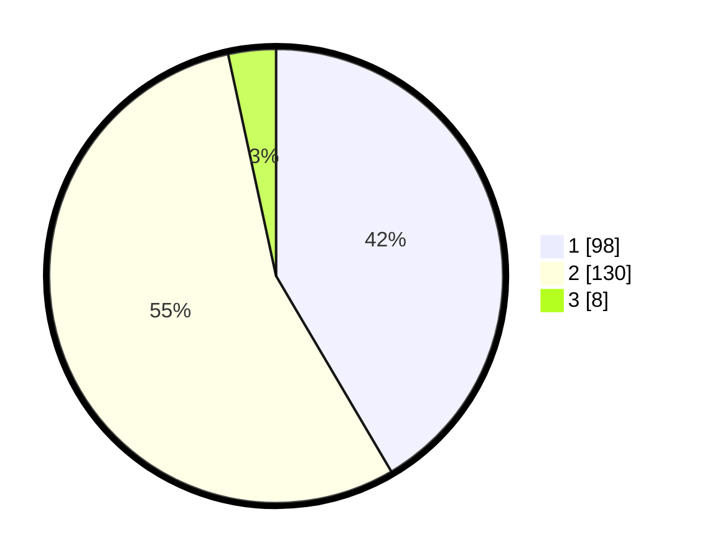

# Hasil

## Grafik

## Tabel

| No. | Nama Paslon    | Suara | Suara (raw) | Persentase |
|:--- |:-------------- | -----:| -----------:| ----------:|
| 1   | ANIES MUHAIMIN | 98    | [98][p-1]   | 41,53      |
| 2   | PRABOWO GIBRAN | 130   | [130][p-2]  | 55,08      |
| 3   | GANJAR MAHFUD  | 8     | [8][p-3]    | 3,39       |

[p-1]: https://github.com/gigit-pemilu/pemilu-2024/blob/main/pilpres/hitung-suara/sub/36-banten/sub/03-tangerang/sub/08-mauk/sub/2004-tegal-kunir-lor/sub/007-tps/sub/paslon-1.txt
[p-2]: https://github.com/gigit-pemilu/pemilu-2024/blob/main/pilpres/hitung-suara/sub/36-banten/sub/03-tangerang/sub/08-mauk/sub/2004-tegal-kunir-lor/sub/007-tps/sub/paslon-2.txt
[p-3]: https://github.com/gigit-pemilu/pemilu-2024/blob/main/pilpres/hitung-suara/sub/36-banten/sub/03-tangerang/sub/08-mauk/sub/2004-tegal-kunir-lor/sub/007-tps/sub/paslon-3.txt

## Foto C Plano

https://sirekap-obj-formc.kpu.go.id/1b67/pemilu/ppwp/36/03/08/20/04/3603082004007-20240214-204443--f1e14fac-6d5a-4101-8c50-e0191876877e.jpg

https://sirekap-obj-formc.kpu.go.id/1b67/pemilu/ppwp/36/03/08/20/04/3603082004007-20240215-040641--7e56c058-39af-48c6-8f33-278051fe8263.jpg

https://sirekap-obj-formc.kpu.go.id/1b67/pemilu/ppwp/36/03/08/20/04/3603082004007-20240214-204502--9a8e1f2c-40ff-4cf1-8758-4bd8f55920bd.jpg

## Metadata

| Key        | Value               |
| ---------- | ------------------- |
| Time Stamp | 2024-02-24 22:31:28 |

## DATA PEMILIH TETAP

Jumlah pemilih dalam DPT: **535**.
 * L: **0**.
 * P: **555**.

## DATA PENGGUNA HAK PILIH

Jumlah pengguna hak pilih dalam DPT: **222**.
 * L: **445**.
 * P: **52**.

Jumlah pengguna hak pilih dalam DPTb: **255**.
 * L: **445**.
 * P: **222**.

Jumlah pengguna hak pilih dalam DPK: **217**.
 * L: **55**.
 * P: **252**.

Jumlah pengguna hak pilih: **200**.
 * L: **55**.
 * P: **220**.

## JUMLAH SUARA SAH DAN TIDAK SAH

JUMLAH SELURUH SUARA SAH: **236**.

JUMLAH SUARA TIDAK SAH: **4**.

JUMLAH SELURUH SUARA SAH DAN SUARA TIDAK SAH: **240**.

