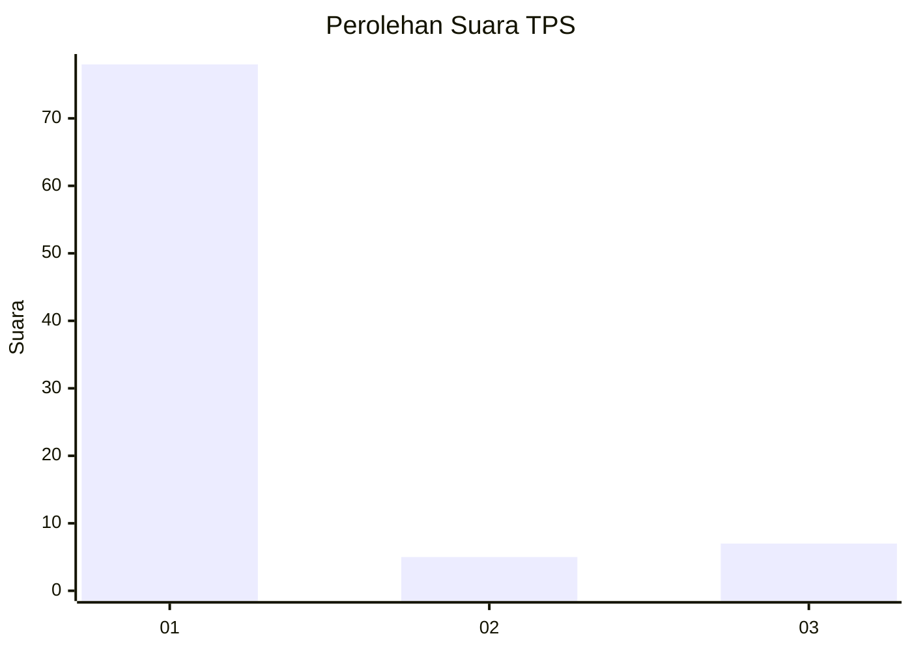
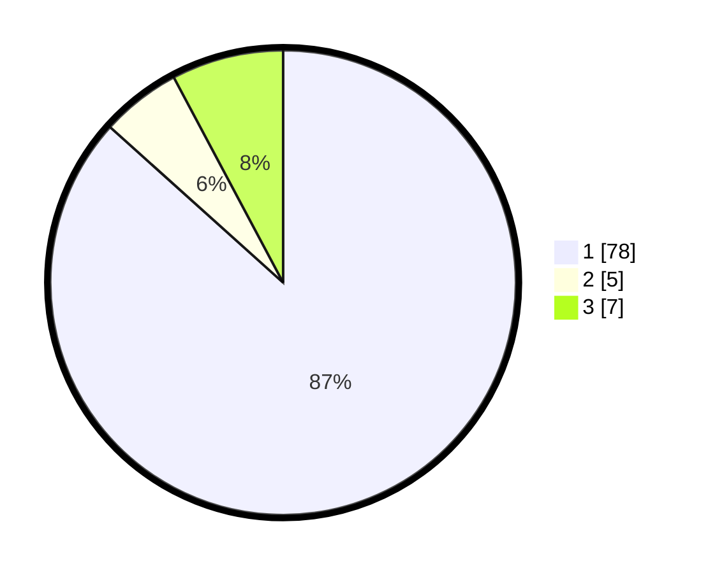

# Hasil

## Grafik

## Tabel

| No. | Nama Paslon    | Suara | Suara (raw) | Persentase |
|:--- |:-------------- | -----:| -----------:| ----------:|
| 1   | ANIES MUHAIMIN | 78    | [78][p-1]   | 86,67      |
| 2   | PRABOWO GIBRAN | 5     | [5][p-2]    | 5,56       |
| 3   | GANJAR MAHFUD  | 7     | [7][p-3]    | 7,78       |

[p-1]: https://github.com/gigit-pemilu/pemilu-2024/blob/main/pilpres/hitung-suara/sub/36-banten/sub/03-tangerang/sub/08-mauk/sub/2007-kedung-dalem/sub/001-tps/sub/paslon-1.txt
[p-2]: https://github.com/gigit-pemilu/pemilu-2024/blob/main/pilpres/hitung-suara/sub/36-banten/sub/03-tangerang/sub/08-mauk/sub/2007-kedung-dalem/sub/001-tps/sub/paslon-2.txt
[p-3]: https://github.com/gigit-pemilu/pemilu-2024/blob/main/pilpres/hitung-suara/sub/36-banten/sub/03-tangerang/sub/08-mauk/sub/2007-kedung-dalem/sub/001-tps/sub/paslon-3.txt

## Foto C Plano

https://sirekap-obj-formc.kpu.go.id/fdff/pemilu/ppwp/36/03/08/20/07/3603082007001-20240223-110651--7c1a35e6-caf5-4d48-96cc-a47ff39a0a94.jpg

https://sirekap-obj-formc.kpu.go.id/fdff/pemilu/ppwp/36/03/08/20/07/3603082007001-20240223-110719--bafe678c-0681-43dc-b7aa-c91aca5e30cd.jpg

https://sirekap-obj-formc.kpu.go.id/fdff/pemilu/ppwp/36/03/08/20/07/3603082007001-20240223-110809--dd1d98c4-001d-4745-8750-e3ff09e8fe7a.jpg

## Metadata

| Key        | Value               |
| ---------- | ------------------- |
| Time Stamp | 2024-02-24 22:31:28 |

## DATA PEMILIH TETAP

Jumlah pemilih dalam DPT: **653**.
 * L: **620**.
 * P: **123**.

## DATA PENGGUNA HAK PILIH

Jumlah pengguna hak pilih dalam DPT: **355**.
 * L: **755**.
 * P: **553**.

Jumlah pengguna hak pilih dalam DPTb: **0**.
 * L: **800**.
 * P: **88**.

Jumlah pengguna hak pilih dalam DPK: **800**.
 * L: **808**.
 * P: **0**.

Jumlah pengguna hak pilih: **243**.
 * L: **601**.
 * P: **602**.

## JUMLAH SUARA SAH DAN TIDAK SAH

JUMLAH SELURUH SUARA SAH: **200**.

JUMLAH SUARA TIDAK SAH: **813**.

JUMLAH SELURUH SUARA SAH DAN SUARA TIDAK SAH: **263**.

