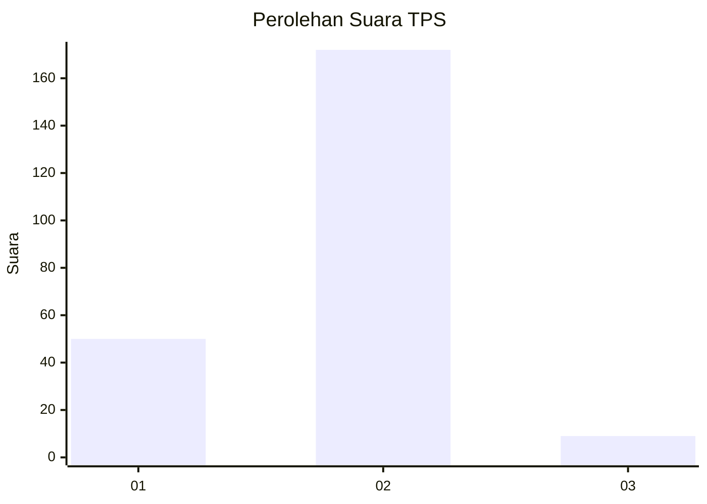

# Hasil

## Grafik

## Tabel

| No. | Nama Paslon    | Suara | Suara (raw) | Persentase |
|:--- |:-------------- | -----:| -----------:| ----------:|
| 1   | ANIES MUHAIMIN | 50    | [50][p-1]   | 21,65      |
| 2   | PRABOWO GIBRAN | 172   | [172][p-2]  | 74,46      |
| 3   | GANJAR MAHFUD  | 9     | [9][p-3]    | 3,90       |

[p-1]: https://github.com/gigit-pemilu/pemilu-2024-36-banten/blob/main/pilpres/hitung-suara/sub/36-banten/sub/03-tangerang/sub/09-kemiri/sub/2001-patramanggala/sub/001-tps/sub/paslon-1.txt
[p-2]: https://github.com/gigit-pemilu/pemilu-2024-36-banten/blob/main/pilpres/hitung-suara/sub/36-banten/sub/03-tangerang/sub/09-kemiri/sub/2001-patramanggala/sub/001-tps/sub/paslon-2.txt
[p-3]: https://github.com/gigit-pemilu/pemilu-2024-36-banten/blob/main/pilpres/hitung-suara/sub/36-banten/sub/03-tangerang/sub/09-kemiri/sub/2001-patramanggala/sub/001-tps/sub/paslon-3.txt

## Foto C Plano

https://sirekap-obj-formc.kpu.go.id/f97c/pemilu/ppwp/36/03/09/20/01/3603092001001-20240218-094446--7836f1cc-7b74-4b87-a808-90ef1eb5466b.jpg

https://sirekap-obj-formc.kpu.go.id/f97c/pemilu/ppwp/36/03/09/20/01/3603092001001-20240218-094534--efdae898-6081-4b78-a986-fefb41999974.jpg

https://sirekap-obj-formc.kpu.go.id/f97c/pemilu/ppwp/36/03/09/20/01/3603092001001-20240218-094633--0e42e1cf-08d8-4aa8-982d-ce3c234e915a.jpg

## Metadata

| Key        | Value               |
| ---------- | ------------------- |
| Time Stamp | 2024-02-19 06:16:00 |

