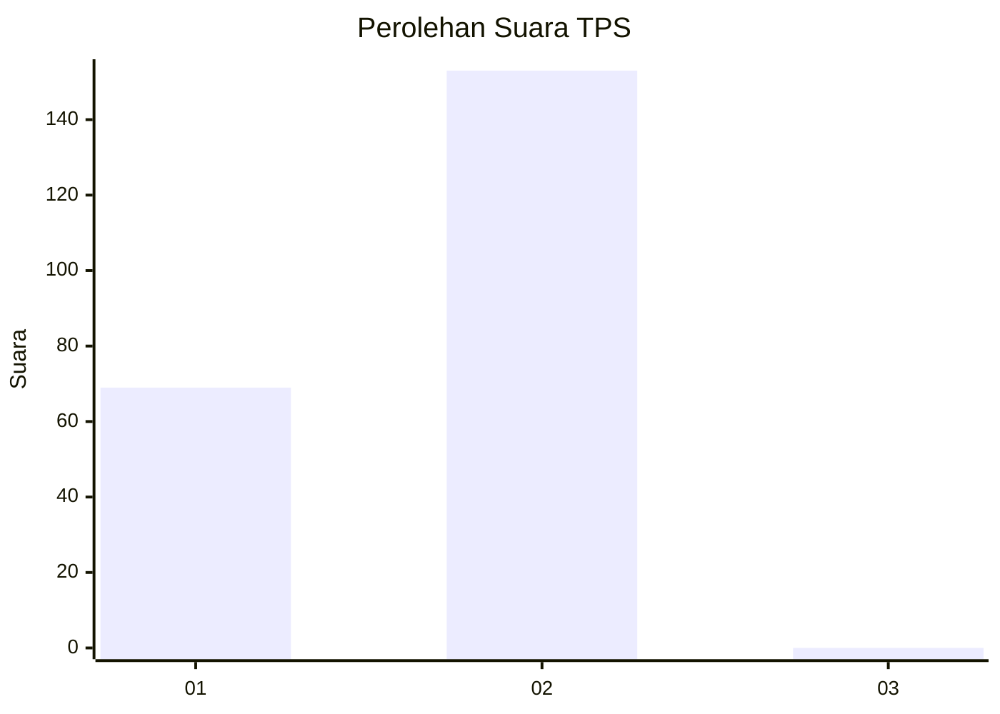
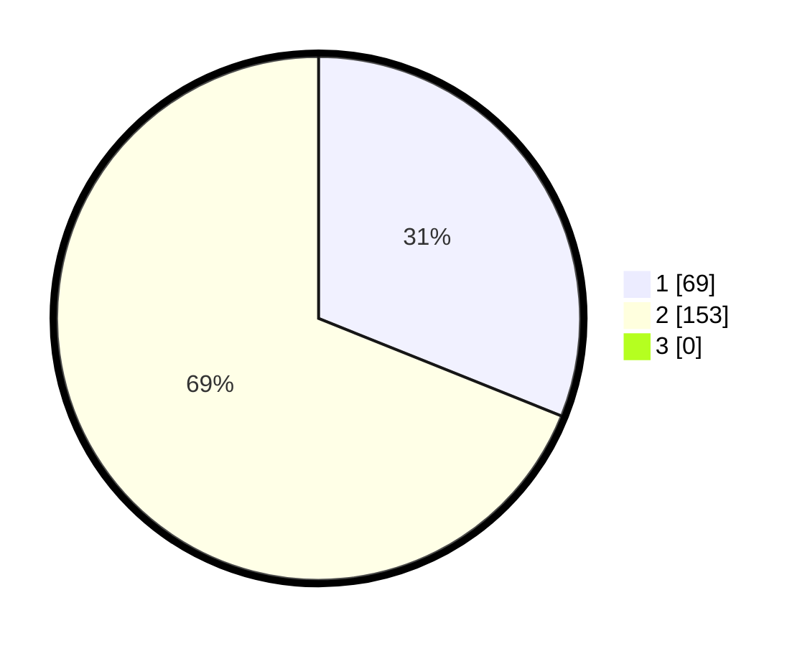

# Hasil

## Grafik

## Tabel

| No. | Nama Paslon    | Suara | Suara (raw) | Persentase |
|:--- |:-------------- | -----:| -----------:| ----------:|
| 1   | ANIES MUHAIMIN | 69    | [69][p-1]   | 31,08      |
| 2   | PRABOWO GIBRAN | 153   | [153][p-2]  | 68,92      |
| 3   | GANJAR MAHFUD  | 0     | [0][p-3]    | 0,00       |

[p-1]: https://github.com/gigit-pemilu/pemilu-2024-36-banten/blob/main/pilpres/hitung-suara/sub/36-banten/sub/03-tangerang/sub/09-kemiri/sub/2001-patramanggala/sub/002-tps/sub/paslon-1.txt
[p-2]: https://github.com/gigit-pemilu/pemilu-2024-36-banten/blob/main/pilpres/hitung-suara/sub/36-banten/sub/03-tangerang/sub/09-kemiri/sub/2001-patramanggala/sub/002-tps/sub/paslon-2.txt
[p-3]: https://github.com/gigit-pemilu/pemilu-2024-36-banten/blob/main/pilpres/hitung-suara/sub/36-banten/sub/03-tangerang/sub/09-kemiri/sub/2001-patramanggala/sub/002-tps/sub/paslon-3.txt

## Foto C Plano

https://sirekap-obj-formc.kpu.go.id/6202/pemilu/ppwp/36/03/09/20/01/3603092001002-20240218-095435--56dce834-faa2-4e43-b201-053675cd3646.jpg

https://sirekap-obj-formc.kpu.go.id/6202/pemilu/ppwp/36/03/09/20/01/3603092001002-20240218-095859--35fed4a8-76cb-4225-88be-1bf7f8afcfe9.jpg

https://sirekap-obj-formc.kpu.go.id/6202/pemilu/ppwp/36/03/09/20/01/3603092001002-20240218-100432--15c82749-874e-4b04-9f03-f2d6ca97bbb5.jpg

## Metadata

| Key        | Value               |
| ---------- | ------------------- |
| Time Stamp | 2024-02-19 06:16:00 |

