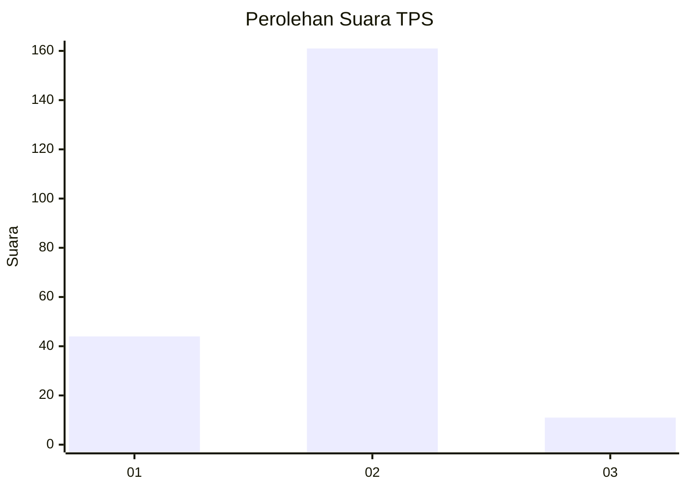
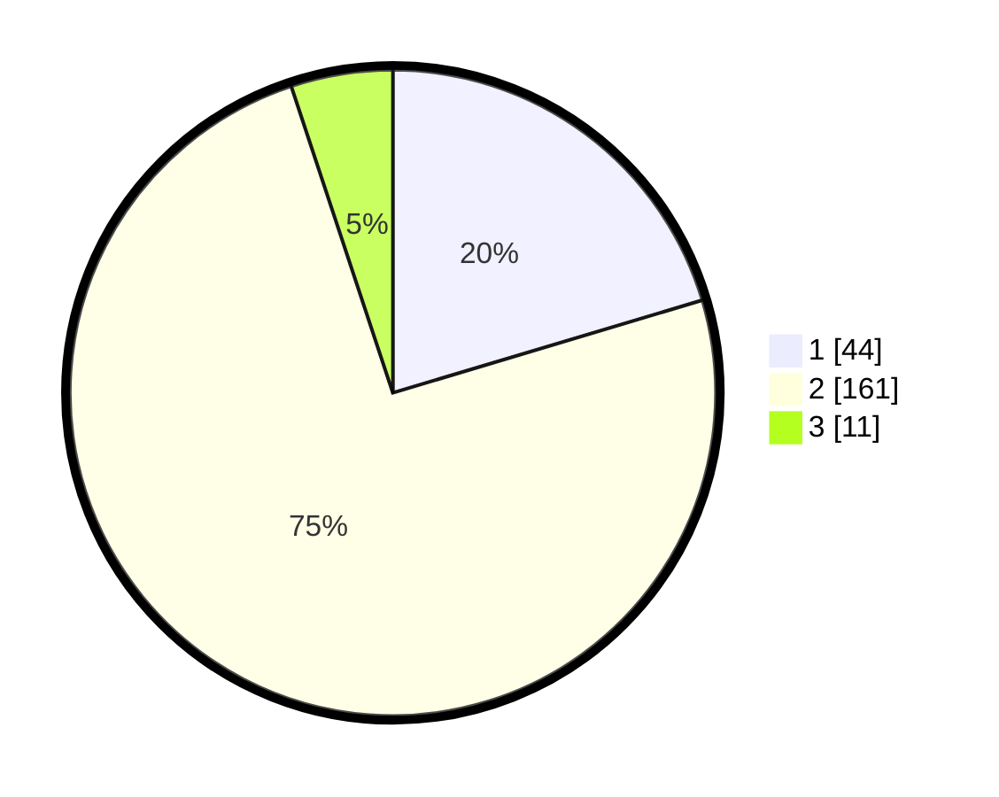

# Hasil

## Grafik

## Tabel

| No. | Nama Paslon    | Suara | Suara (raw) | Persentase |
|:--- |:-------------- | -----:| -----------:| ----------:|
| 1   | ANIES MUHAIMIN | 44    | [44][p-1]   | 20,37      |
| 2   | PRABOWO GIBRAN | 161   | [161][p-2]  | 74,54      |
| 3   | GANJAR MAHFUD  | 11    | [11][p-3]   | 5,09       |

[p-1]: https://github.com/gigit-pemilu/pemilu-2024-36-banten/blob/main/pilpres/hitung-suara/sub/36-banten/sub/03-tangerang/sub/09-kemiri/sub/2001-patramanggala/sub/003-tps/sub/paslon-1.txt
[p-2]: https://github.com/gigit-pemilu/pemilu-2024-36-banten/blob/main/pilpres/hitung-suara/sub/36-banten/sub/03-tangerang/sub/09-kemiri/sub/2001-patramanggala/sub/003-tps/sub/paslon-2.txt
[p-3]: https://github.com/gigit-pemilu/pemilu-2024-36-banten/blob/main/pilpres/hitung-suara/sub/36-banten/sub/03-tangerang/sub/09-kemiri/sub/2001-patramanggala/sub/003-tps/sub/paslon-3.txt

## Foto C Plano

https://sirekap-obj-formc.kpu.go.id/8d36/pemilu/ppwp/36/03/09/20/01/3603092001003-20240218-100749--99e81fcf-7667-4b6f-89ab-bec8c15f6f83.jpg

https://sirekap-obj-formc.kpu.go.id/8d36/pemilu/ppwp/36/03/09/20/01/3603092001003-20240218-101308--4a21500b-c107-4d30-988d-9777a0c92d8d.jpg

https://sirekap-obj-formc.kpu.go.id/8d36/pemilu/ppwp/36/03/09/20/01/3603092001003-20240218-101346--e9e7ad33-2d68-4010-a426-15605d5a7c00.jpg

## Metadata

| Key        | Value               |
| ---------- | ------------------- |
| Time Stamp | 2024-02-19 06:16:00 |

