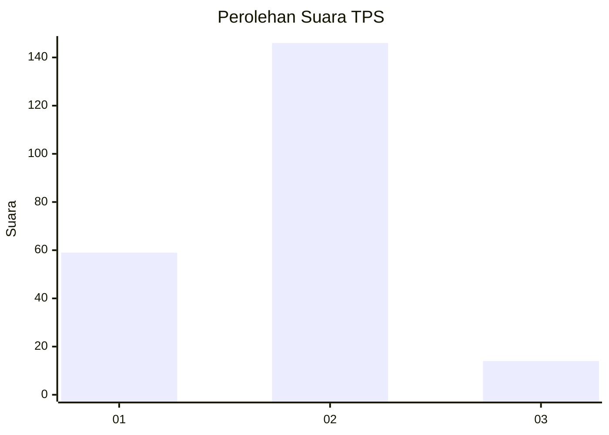
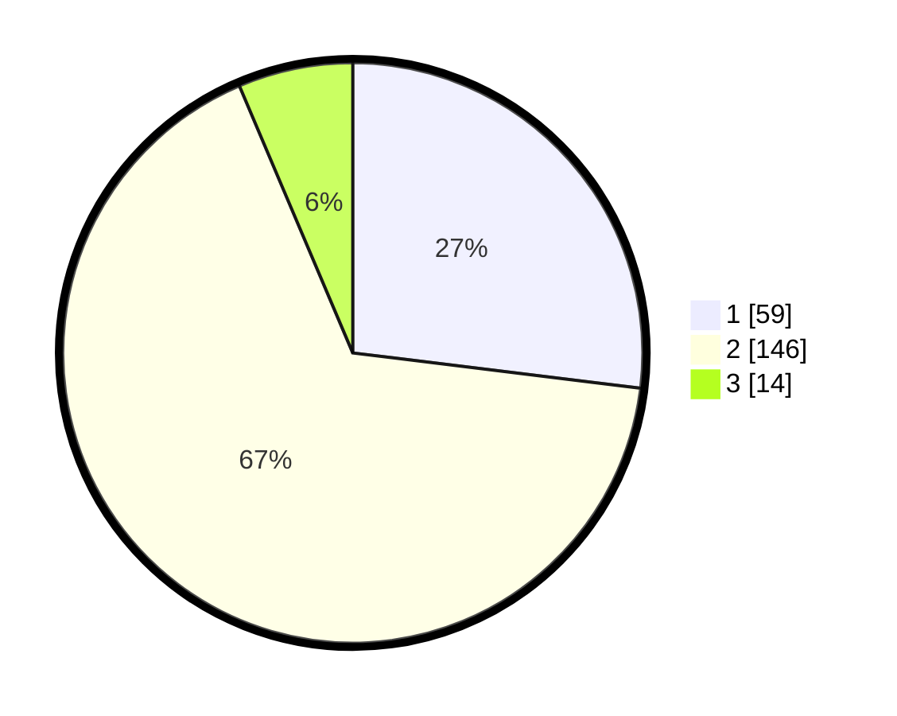

# Hasil

## Grafik

## Tabel

| No. | Nama Paslon    | Suara | Suara (raw) | Persentase |
|:--- |:-------------- | -----:| -----------:| ----------:|
| 1   | ANIES MUHAIMIN | 59    | [59][p-1]   | 26,94      |
| 2   | PRABOWO GIBRAN | 146   | [146][p-2]  | 66,67      |
| 3   | GANJAR MAHFUD  | 14    | [14][p-3]   | 6,39       |

[p-1]: https://github.com/gigit-pemilu/pemilu-2024/blob/main/pilpres/hitung-suara/sub/36-banten/sub/03-tangerang/sub/09-kemiri/sub/2001-patramanggala/sub/005-tps/sub/paslon-1.txt
[p-2]: https://github.com/gigit-pemilu/pemilu-2024/blob/main/pilpres/hitung-suara/sub/36-banten/sub/03-tangerang/sub/09-kemiri/sub/2001-patramanggala/sub/005-tps/sub/paslon-2.txt
[p-3]: https://github.com/gigit-pemilu/pemilu-2024/blob/main/pilpres/hitung-suara/sub/36-banten/sub/03-tangerang/sub/09-kemiri/sub/2001-patramanggala/sub/005-tps/sub/paslon-3.txt

## Foto C Plano

https://sirekap-obj-formc.kpu.go.id/000a/pemilu/ppwp/36/03/09/20/01/3603092001005-20240218-103251--17b22c32-f026-44b0-bf89-e4d7e0ee300e.jpg

https://sirekap-obj-formc.kpu.go.id/000a/pemilu/ppwp/36/03/09/20/01/3603092001005-20240218-103330--b51b95da-d90d-40ff-93c9-cb6484a9f776.jpg

https://sirekap-obj-formc.kpu.go.id/000a/pemilu/ppwp/36/03/09/20/01/3603092001005-20240218-103436--c61e5a8d-8433-44f3-bc7a-8215336281d9.jpg

## Metadata

| Key        | Value               |
| ---------- | ------------------- |
| Time Stamp | 2024-02-19 11:00:00 |

