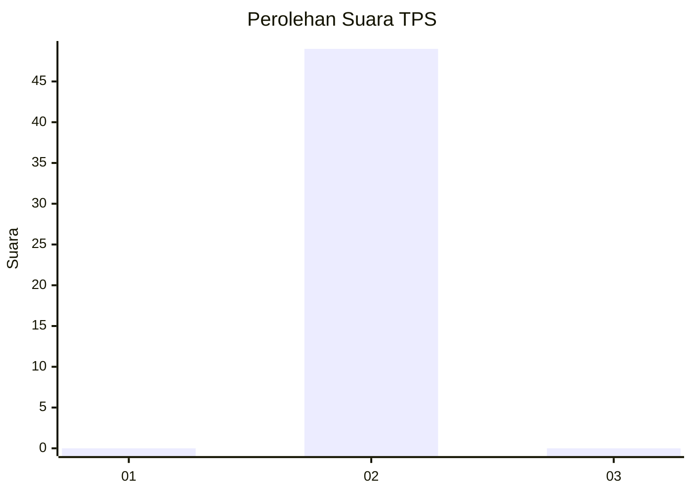
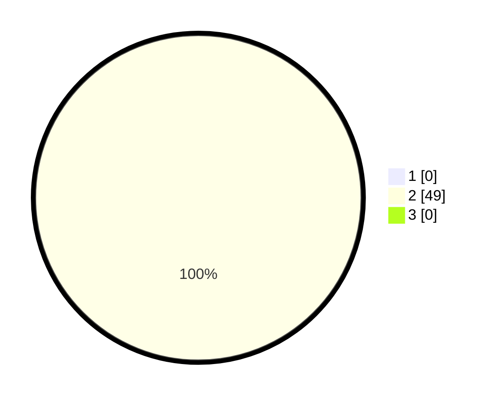

# Hasil

## Grafik

## Tabel

| No. | Nama Paslon    | Suara | Suara (raw) | Persentase |
|:--- |:-------------- | -----:| -----------:| ----------:|
| 1   | ANIES MUHAIMIN | 0     | [0][p-1]    | 0,00       |
| 2   | PRABOWO GIBRAN | 49    | [49][p-2]   | 100,00     |
| 3   | GANJAR MAHFUD  | 0     | [0][p-3]    | 0,00       |

[p-1]: https://github.com/gigit-pemilu/pemilu-2024/blob/main/pilpres/hitung-suara/sub/36-banten/sub/03-tangerang/sub/10-sukadiri/sub/2002-buaran-jati/sub/019-tps/sub/paslon-1.txt
[p-2]: https://github.com/gigit-pemilu/pemilu-2024/blob/main/pilpres/hitung-suara/sub/36-banten/sub/03-tangerang/sub/10-sukadiri/sub/2002-buaran-jati/sub/019-tps/sub/paslon-2.txt
[p-3]: https://github.com/gigit-pemilu/pemilu-2024/blob/main/pilpres/hitung-suara/sub/36-banten/sub/03-tangerang/sub/10-sukadiri/sub/2002-buaran-jati/sub/019-tps/sub/paslon-3.txt

## Foto C Plano

https://sirekap-obj-formc.kpu.go.id/eabc/pemilu/ppwp/36/03/10/20/02/3603102002019-20240222-121836--3b489db9-eb0e-4e26-aaf2-41d52ae255b1.jpg

https://sirekap-obj-formc.kpu.go.id/eabc/pemilu/ppwp/36/03/10/20/02/3603102002019-20240222-122028--276cf28b-4887-4742-9ce1-d51a82692e5e.jpg

https://sirekap-obj-formc.kpu.go.id/eabc/pemilu/ppwp/36/03/10/20/02/3603102002019-20240222-122151--15f6568c-6fd5-4e6d-b4ff-1d0e1307327b.jpg

## Metadata

| Key        | Value               |
| ---------- | ------------------- |
| Time Stamp | 2024-02-22 13:00:00 |

## DATA PEMILIH TETAP

Jumlah pemilih dalam DPT: **280**.
 * L: **852**.
 * P: **339**.

## DATA PENGGUNA HAK PILIH

Jumlah pengguna hak pilih dalam DPT: **232**.
 * L: **26**.
 * P: **435**.

Jumlah pengguna hak pilih dalam DPTb: **222**.
 * L: **88**.
 * P: **88**.

Jumlah pengguna hak pilih dalam DPK: **252**.
 * L: **680**.
 * P: **888**.

Jumlah pengguna hak pilih: **222**.
 * L: **626**.
 * P: **603**.

## JUMLAH SUARA SAH DAN TIDAK SAH

JUMLAH SELURUH SUARA SAH: **230**.

JUMLAH SUARA TIDAK SAH: **884**.

JUMLAH SELURUH SUARA SAH DAN SUARA TIDAK SAH: **334**.

