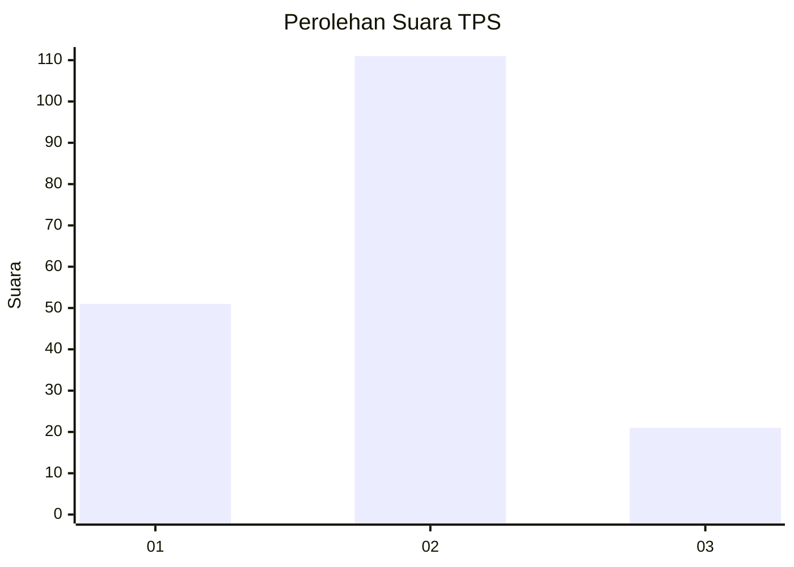
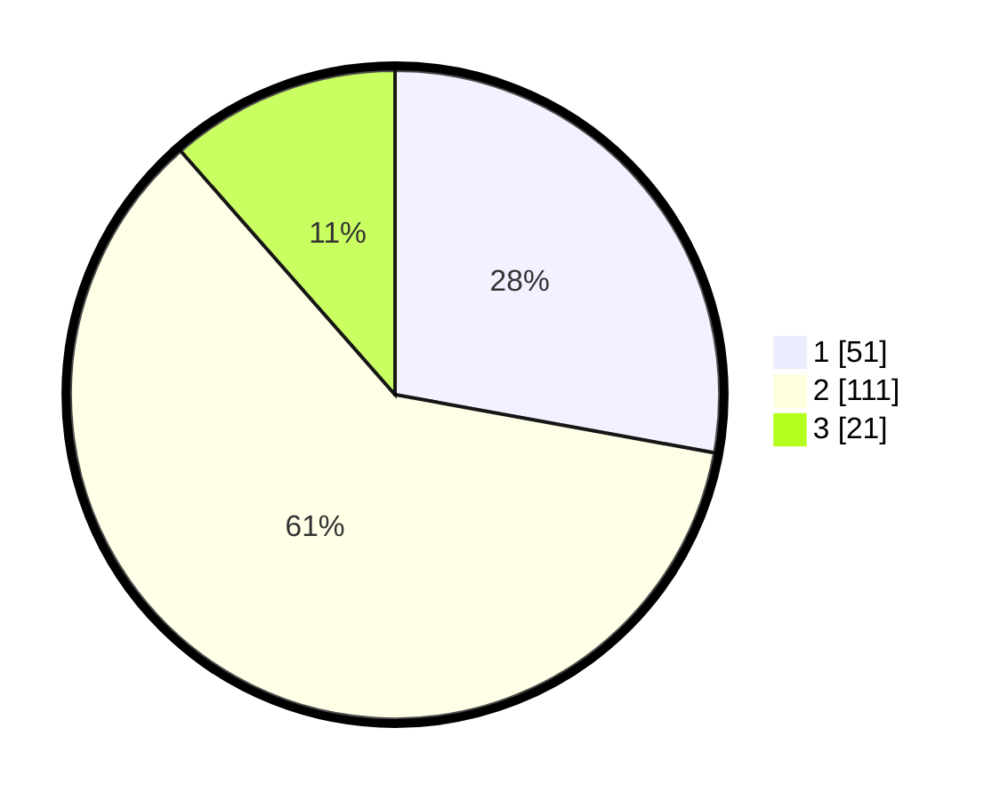

# Hasil

## Grafik

## Tabel

| No. | Nama Paslon    | Suara | Suara (raw) | Persentase |
|:--- |:-------------- | -----:| -----------:| ----------:|
| 1   | ANIES MUHAIMIN | 51    | [51][p-1]   | 27,87      |
| 2   | PRABOWO GIBRAN | 111   | [111][p-2]  | 60,66      |
| 3   | GANJAR MAHFUD  | 21    | [21][p-3]   | 11,48      |

[p-1]: https://github.com/gigit-pemilu/pemilu-2024-36-banten/blob/main/pilpres/hitung-suara/sub/36-banten/sub/03-tangerang/sub/10-sukadiri/sub/2004-pekayon/sub/034-tps/sub/paslon-1.txt
[p-2]: https://github.com/gigit-pemilu/pemilu-2024-36-banten/blob/main/pilpres/hitung-suara/sub/36-banten/sub/03-tangerang/sub/10-sukadiri/sub/2004-pekayon/sub/034-tps/sub/paslon-2.txt
[p-3]: https://github.com/gigit-pemilu/pemilu-2024-36-banten/blob/main/pilpres/hitung-suara/sub/36-banten/sub/03-tangerang/sub/10-sukadiri/sub/2004-pekayon/sub/034-tps/sub/paslon-3.txt

## Foto C Plano

https://sirekap-obj-formc.kpu.go.id/038a/pemilu/ppwp/36/03/10/20/04/3603102004034-20240223-135714--bc68aea9-cfc0-4cc4-83ea-cd7a107af81c.jpg

https://sirekap-obj-formc.kpu.go.id/038a/pemilu/ppwp/36/03/10/20/04/3603102004034-20240223-140117--3cde71c3-81c2-44e5-a6a6-54d5b740f269.jpg

https://sirekap-obj-formc.kpu.go.id/038a/pemilu/ppwp/36/03/10/20/04/3603102004034-20240223-140415--1a9dbd20-d7ac-44ef-b53c-b845cf61d534.jpg

## Metadata

| Key        | Value               |
| ---------- | ------------------- |
| Time Stamp | 2024-02-24 22:31:28 |

## DATA PEMILIH TETAP

Jumlah pemilih dalam DPT: **216**.
 * L: **100**.
 * P: **116**.

## DATA PENGGUNA HAK PILIH

Jumlah pengguna hak pilih dalam DPT: **494**.
 * L: **88**.
 * P: **106**.

Jumlah pengguna hak pilih dalam DPTb: **840**.
 * L: **880**.
 * P: **880**.

Jumlah pengguna hak pilih dalam DPK: **800**.
 * L: **800**.
 * P: **888**.

Jumlah pengguna hak pilih: **194**.
 * L: **88**.
 * P: **196**.

## JUMLAH SUARA SAH DAN TIDAK SAH

JUMLAH SELURUH SUARA SAH: **183**.

JUMLAH SUARA TIDAK SAH: **11**.

JUMLAH SELURUH SUARA SAH DAN SUARA TIDAK SAH: **194**.

