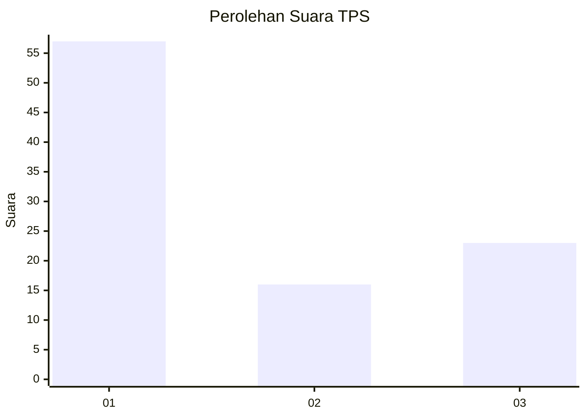
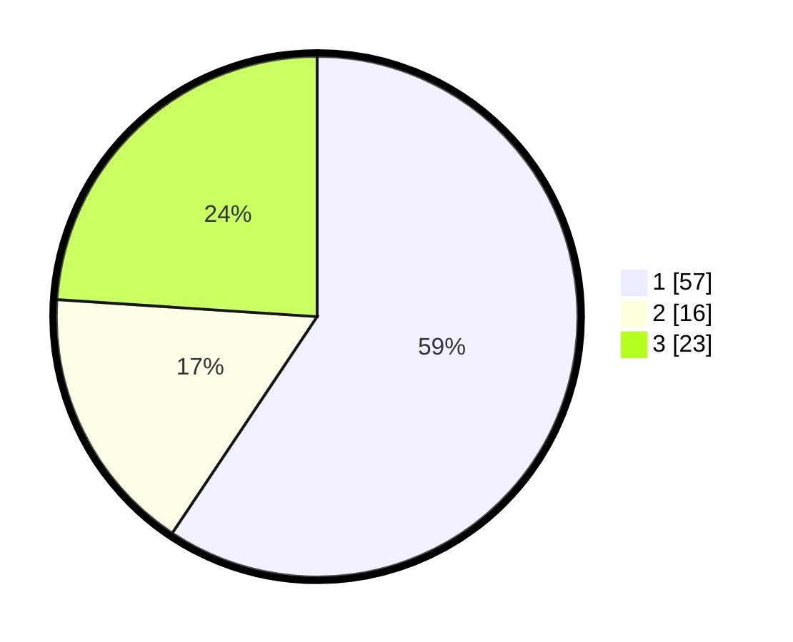

# Hasil

## Grafik

## Tabel

| No. | Nama Paslon    | Suara | Suara (raw) | Persentase |
|:--- |:-------------- | -----:| -----------:| ----------:|
| 1   | ANIES MUHAIMIN | 57    | [57][p-1]   | 59,38      |
| 2   | PRABOWO GIBRAN | 16    | [16][p-2]   | 16,67      |
| 3   | GANJAR MAHFUD  | 23    | [23][p-3]   | 23,96      |

[p-1]: https://github.com/gigit-pemilu/pemilu-2024-36-banten/blob/main/pilpres/hitung-suara/sub/36-banten/sub/03-tangerang/sub/10-sukadiri/sub/2005-karang-serang/sub/010-tps/sub/paslon-1.txt
[p-2]: https://github.com/gigit-pemilu/pemilu-2024-36-banten/blob/main/pilpres/hitung-suara/sub/36-banten/sub/03-tangerang/sub/10-sukadiri/sub/2005-karang-serang/sub/010-tps/sub/paslon-2.txt
[p-3]: https://github.com/gigit-pemilu/pemilu-2024-36-banten/blob/main/pilpres/hitung-suara/sub/36-banten/sub/03-tangerang/sub/10-sukadiri/sub/2005-karang-serang/sub/010-tps/sub/paslon-3.txt

## Foto C Plano

https://sirekap-obj-formc.kpu.go.id/00d6/pemilu/ppwp/36/03/10/20/05/3603102005010-20240223-151304--88a8f726-6e6e-4625-98d2-810f80cb0438.jpg

https://sirekap-obj-formc.kpu.go.id/00d6/pemilu/ppwp/36/03/10/20/05/3603102005010-20240223-151430--902c5725-f8ca-4fe4-8c95-d7547a8d224a.jpg

https://sirekap-obj-formc.kpu.go.id/00d6/pemilu/ppwp/36/03/10/20/05/3603102005010-20240223-151713--26bf53a4-271a-4260-8092-4b791cb85b05.jpg

## Metadata

| Key        | Value               |
| ---------- | ------------------- |
| Time Stamp | 2024-02-24 22:31:28 |

## DATA PEMILIH TETAP

Jumlah pemilih dalam DPT: **0**.
 * L: **0**.
 * P: **0**.

## DATA PENGGUNA HAK PILIH

Jumlah pengguna hak pilih dalam DPT: **12**.
 * L: **0**.
 * P: **0**.

Jumlah pengguna hak pilih dalam DPTb: **750**.
 * L: **555**.
 * P: **750**.

Jumlah pengguna hak pilih dalam DPK: **1**.
 * L: **1**.
 * P: **0**.

Jumlah pengguna hak pilih: **236**.
 * L: **120**.
 * P: **116**.

## JUMLAH SUARA SAH DAN TIDAK SAH

JUMLAH SELURUH SUARA SAH: **185**.

JUMLAH SUARA TIDAK SAH: **12**.

JUMLAH SELURUH SUARA SAH DAN SUARA TIDAK SAH: **197**.

