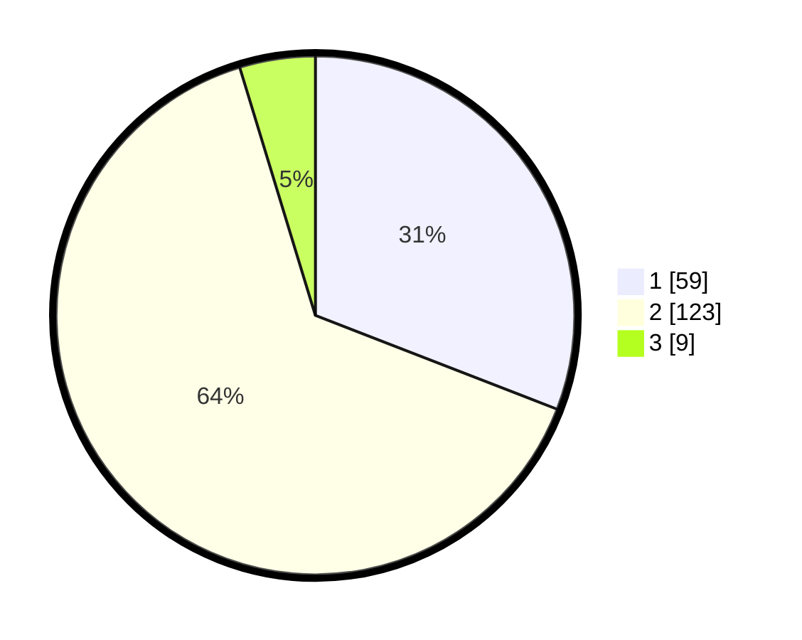

# Hasil

## Grafik

## Tabel

| No. | Nama Paslon    | Suara | Suara (raw) | Persentase |
|:--- |:-------------- | -----:| -----------:| ----------:|
| 1   | ANIES MUHAIMIN | 59    | [59][p-1]   | 30,89      |
| 2   | PRABOWO GIBRAN | 123   | [123][p-2]  | 64,40      |
| 3   | GANJAR MAHFUD  | 9     | [9][p-3]    | 4,71       |

[p-1]: https://github.com/gigit-pemilu/pemilu-2024-36-banten/blob/main/pilpres/hitung-suara/sub/36-banten/sub/03-tangerang/sub/10-sukadiri/sub/2005-karang-serang/sub/012-tps/sub/paslon-1.txt
[p-2]: https://github.com/gigit-pemilu/pemilu-2024-36-banten/blob/main/pilpres/hitung-suara/sub/36-banten/sub/03-tangerang/sub/10-sukadiri/sub/2005-karang-serang/sub/012-tps/sub/paslon-2.txt
[p-3]: https://github.com/gigit-pemilu/pemilu-2024-36-banten/blob/main/pilpres/hitung-suara/sub/36-banten/sub/03-tangerang/sub/10-sukadiri/sub/2005-karang-serang/sub/012-tps/sub/paslon-3.txt

## Foto C Plano

https://sirekap-obj-formc.kpu.go.id/10ff/pemilu/ppwp/36/03/10/20/05/3603102005012-20240223-154313--6f461324-ea70-4307-9f54-60d119ea94cb.jpg

https://sirekap-obj-formc.kpu.go.id/10ff/pemilu/ppwp/36/03/10/20/05/3603102005012-20240223-154433--b1666588-8a34-4903-b6ec-2bd2c5f96e31.jpg

https://sirekap-obj-formc.kpu.go.id/10ff/pemilu/ppwp/36/03/10/20/05/3603102005012-20240223-154539--e1a69c39-9d59-4210-bb0b-fcd6d8059809.jpg

## Metadata

| Key        | Value               |
| ---------- | ------------------- |
| Time Stamp | 2024-02-24 22:31:28 |

## DATA PEMILIH TETAP

Jumlah pemilih dalam DPT: **0**.
 * L: **20**.
 * P: **0**.

## DATA PENGGUNA HAK PILIH

Jumlah pengguna hak pilih dalam DPT: **441**.
 * L: **0**.
 * P: **597**.

Jumlah pengguna hak pilih dalam DPTb: **441**.
 * L: **54**.
 * P: **544**.

Jumlah pengguna hak pilih dalam DPK: **556**.
 * L: **22**.
 * P: **252**.

Jumlah pengguna hak pilih: **451**.
 * L: **55**.
 * P: **575**.

## JUMLAH SUARA SAH DAN TIDAK SAH

JUMLAH SELURUH SUARA SAH: **191**.

JUMLAH SUARA TIDAK SAH: **6**.

JUMLAH SELURUH SUARA SAH DAN SUARA TIDAK SAH: **197**.

