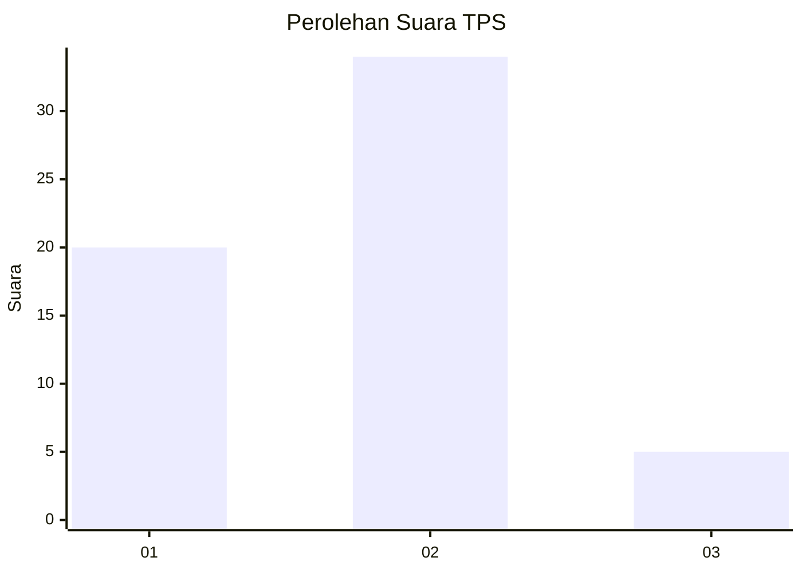
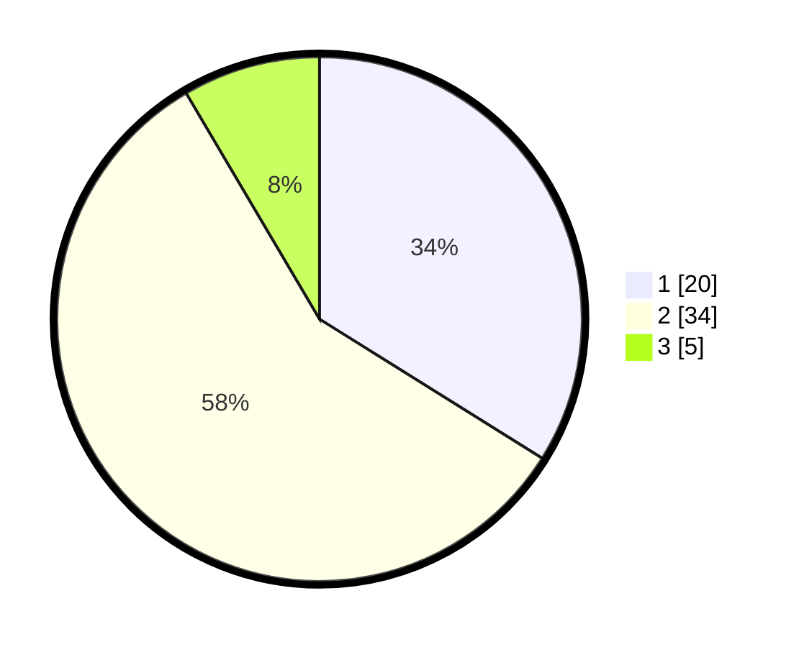

# Hasil

## Grafik

## Tabel

| No. | Nama Paslon    | Suara | Suara (raw) | Persentase |
|:--- |:-------------- | -----:| -----------:| ----------:|
| 1   | ANIES MUHAIMIN | 20    | [20][p-1]   | 33,90      |
| 2   | PRABOWO GIBRAN | 34    | [34][p-2]   | 57,63      |
| 3   | GANJAR MAHFUD  | 5     | [5][p-3]    | 8,47       |

[p-1]: https://github.com/gigit-pemilu/pemilu-2024/blob/main/pilpres/hitung-suara/sub/36-banten/sub/03-tangerang/sub/10-sukadiri/sub/2005-karang-serang/sub/019-tps/sub/paslon-1.txt
[p-2]: https://github.com/gigit-pemilu/pemilu-2024/blob/main/pilpres/hitung-suara/sub/36-banten/sub/03-tangerang/sub/10-sukadiri/sub/2005-karang-serang/sub/019-tps/sub/paslon-2.txt
[p-3]: https://github.com/gigit-pemilu/pemilu-2024/blob/main/pilpres/hitung-suara/sub/36-banten/sub/03-tangerang/sub/10-sukadiri/sub/2005-karang-serang/sub/019-tps/sub/paslon-3.txt

## Foto C Plano

https://sirekap-obj-formc.kpu.go.id/ad11/pemilu/ppwp/36/03/10/20/05/3603102005019-20240223-214459--e4b2fd27-41ea-4ef1-aa66-49b9235faa30.jpg

https://sirekap-obj-formc.kpu.go.id/ad11/pemilu/ppwp/36/03/10/20/05/3603102005019-20240223-214540--06ebda5e-5e4c-491c-a78d-9fb4b7195616.jpg

https://sirekap-obj-formc.kpu.go.id/ad11/pemilu/ppwp/36/03/10/20/05/3603102005019-20240223-214623--9743c72b-2eeb-47cd-831b-a2a9cf94d9c9.jpg

## Metadata

| Key        | Value               |
| ---------- | ------------------- |
| Time Stamp | 2024-02-24 22:31:28 |

## DATA PEMILIH TETAP

Jumlah pemilih dalam DPT: **232**.
 * L: **444**.
 * P: **496**.

## DATA PENGGUNA HAK PILIH

Jumlah pengguna hak pilih dalam DPT: **657**.
 * L: **838**.
 * P: **99**.

Jumlah pengguna hak pilih dalam DPTb: **280**.
 * L: **8**.
 * P: **72**.

Jumlah pengguna hak pilih dalam DPK: **0**.
 * L: **888**.
 * P: **802**.

Jumlah pengguna hak pilih: **682**.
 * L: **855**.
 * P: **92**.

## JUMLAH SUARA SAH DAN TIDAK SAH

JUMLAH SELURUH SUARA SAH: **689**.

JUMLAH SUARA TIDAK SAH: **884**.

JUMLAH SELURUH SUARA SAH DAN SUARA TIDAK SAH: **383**.

