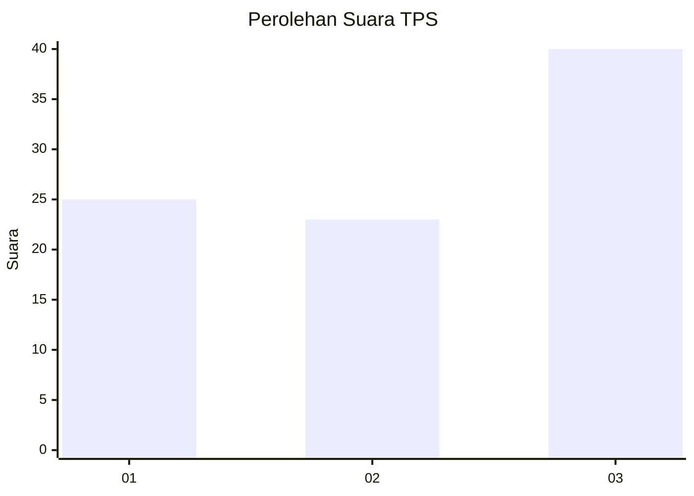
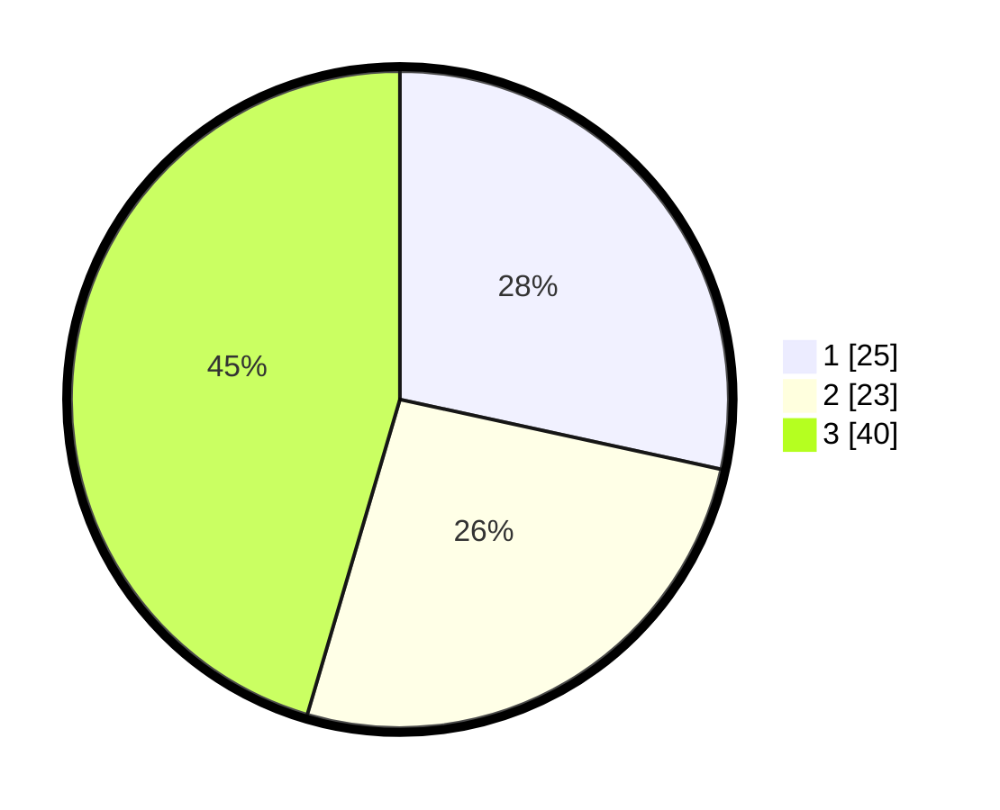

# Hasil

## Grafik

## Tabel

| No. | Nama Paslon    | Suara | Suara (raw) | Persentase |
|:--- |:-------------- | -----:| -----------:| ----------:|
| 1   | ANIES MUHAIMIN | 25    | [25][p-1]   | 28,41      |
| 2   | PRABOWO GIBRAN | 23    | [23][p-2]   | 26,14      |
| 3   | GANJAR MAHFUD  | 40    | [40][p-3]   | 45,45      |

[p-1]: https://github.com/gigit-pemilu/pemilu-2024-36-banten/blob/main/pilpres/hitung-suara/sub/36-banten/sub/03-tangerang/sub/10-sukadiri/sub/2005-karang-serang/sub/022-tps/sub/paslon-1.txt
[p-2]: https://github.com/gigit-pemilu/pemilu-2024-36-banten/blob/main/pilpres/hitung-suara/sub/36-banten/sub/03-tangerang/sub/10-sukadiri/sub/2005-karang-serang/sub/022-tps/sub/paslon-2.txt
[p-3]: https://github.com/gigit-pemilu/pemilu-2024-36-banten/blob/main/pilpres/hitung-suara/sub/36-banten/sub/03-tangerang/sub/10-sukadiri/sub/2005-karang-serang/sub/022-tps/sub/paslon-3.txt

## Foto C Plano

https://sirekap-obj-formc.kpu.go.id/4994/pemilu/ppwp/36/03/10/20/05/3603102005022-20240223-225623--41420f30-9d48-46e4-8472-64cd218fee8d.jpg

https://sirekap-obj-formc.kpu.go.id/4994/pemilu/ppwp/36/03/10/20/05/3603102005022-20240223-225702--48bb5f89-2178-4da5-b3e6-7b8bee095df1.jpg

https://sirekap-obj-formc.kpu.go.id/4994/pemilu/ppwp/36/03/10/20/05/3603102005022-20240223-225739--98eca907-df82-4ab3-b061-d23f235315ca.jpg

## Metadata

| Key        | Value               |
| ---------- | ------------------- |
| Time Stamp | 2024-02-24 22:31:28 |

## DATA PEMILIH TETAP

Jumlah pemilih dalam DPT: **239**.
 * L: **727**.
 * P: **735**.

## DATA PENGGUNA HAK PILIH

Jumlah pengguna hak pilih dalam DPT: **539**.
 * L: **758**.
 * P: **938**.

Jumlah pengguna hak pilih dalam DPTb: **808**.
 * L: **272**.
 * P: **888**.

Jumlah pengguna hak pilih dalam DPK: **802**.
 * L: **272**.
 * P: **700**.

Jumlah pengguna hak pilih: **693**.
 * L: **777**.
 * P: **93**.

## JUMLAH SUARA SAH DAN TIDAK SAH

JUMLAH SELURUH SUARA SAH: **633**.

JUMLAH SUARA TIDAK SAH: **3**.

JUMLAH SELURUH SUARA SAH DAN SUARA TIDAK SAH: **88**.

