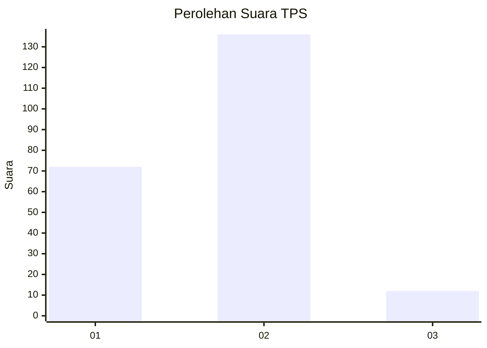
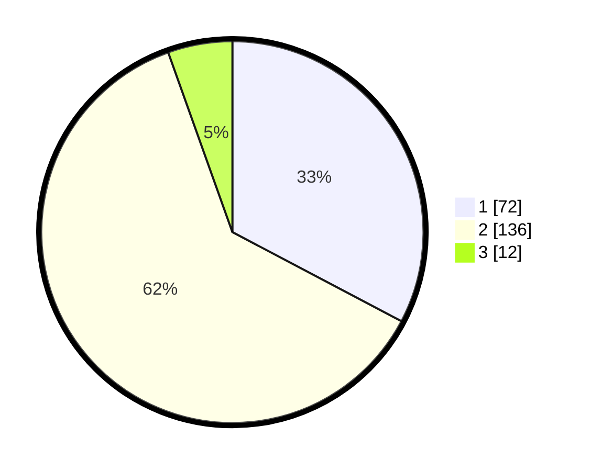

# Hasil

## Grafik

## Tabel

| No. | Nama Paslon    | Suara | Suara (raw) | Persentase |
|:--- |:-------------- | -----:| -----------:| ----------:|
| 1   | ANIES MUHAIMIN | 72    | [72][p-1]   | 32,73      |
| 2   | PRABOWO GIBRAN | 136   | [136][p-2]  | 61,82      |
| 3   | GANJAR MAHFUD  | 12    | [12][p-3]   | 5,45       |

[p-1]: https://github.com/gigit-pemilu/pemilu-2024/blob/main/pilpres/hitung-suara/sub/36-banten/sub/03-tangerang/sub/10-sukadiri/sub/2008-gintung/sub/004-tps/sub/paslon-1.txt
[p-2]: https://github.com/gigit-pemilu/pemilu-2024/blob/main/pilpres/hitung-suara/sub/36-banten/sub/03-tangerang/sub/10-sukadiri/sub/2008-gintung/sub/004-tps/sub/paslon-2.txt
[p-3]: https://github.com/gigit-pemilu/pemilu-2024/blob/main/pilpres/hitung-suara/sub/36-banten/sub/03-tangerang/sub/10-sukadiri/sub/2008-gintung/sub/004-tps/sub/paslon-3.txt

## Foto C Plano

https://sirekap-obj-formc.kpu.go.id/2d76/pemilu/ppwp/36/03/10/20/08/3603102008004-20240220-110636--f188599c-8aca-4908-9bcc-c6ff27dfb52b.jpg

https://sirekap-obj-formc.kpu.go.id/2d76/pemilu/ppwp/36/03/10/20/08/3603102008004-20240220-110704--37a17348-d531-4155-99d4-bee9fdfcbe97.jpg

https://sirekap-obj-formc.kpu.go.id/2d76/pemilu/ppwp/36/03/10/20/08/3603102008004-20240220-110825--adbeb627-0e17-47a2-b735-a33636be9945.jpg

## Metadata

| Key        | Value               |
| ---------- | ------------------- |
| Time Stamp | 2024-02-20 13:00:00 |

## DATA PEMILIH TETAP

Jumlah pemilih dalam DPT: **250**.
 * L: **628**.
 * P: **622**.

## DATA PENGGUNA HAK PILIH

Jumlah pengguna hak pilih dalam DPT: **224**.
 * L: **110**.
 * P: **464**.

Jumlah pengguna hak pilih dalam DPTb: **80**.
 * L: **8**.
 * P: **80**.

Jumlah pengguna hak pilih dalam DPK: **3**.
 * L: **2**.
 * P: **880**.

Jumlah pengguna hak pilih: **225**.
 * L: **112**.
 * P: **684**.

## JUMLAH SUARA SAH DAN TIDAK SAH

JUMLAH SELURUH SUARA SAH: **220**.

JUMLAH SUARA TIDAK SAH: **6**.

JUMLAH SELURUH SUARA SAH DAN SUARA TIDAK SAH: **226**.

