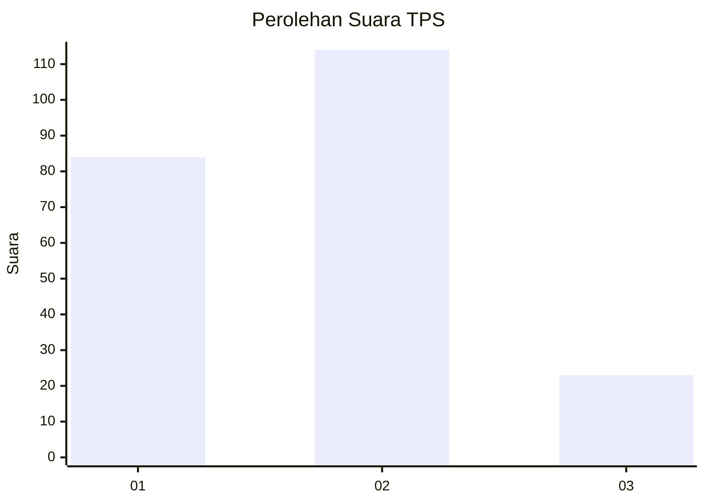
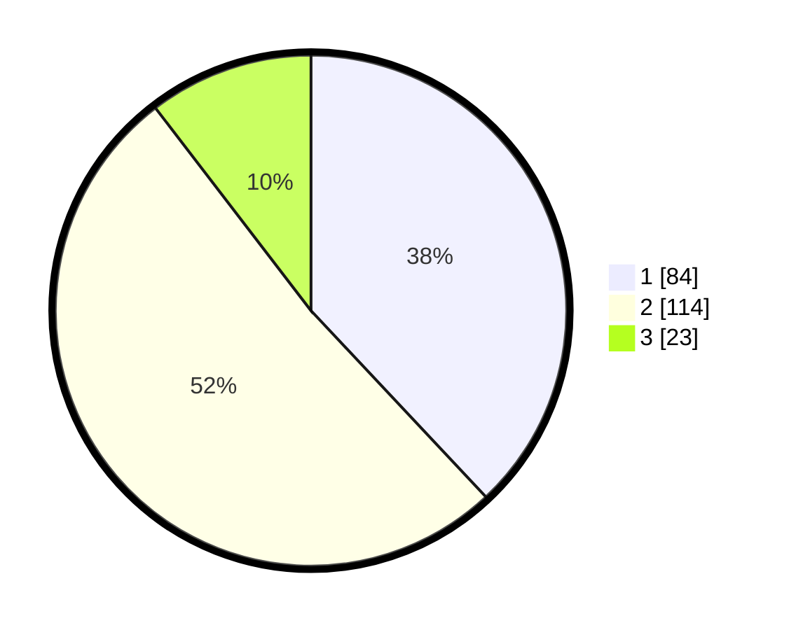

# Hasil

## Grafik

## Tabel

| No. | Nama Paslon    | Suara | Suara (raw) | Persentase |
|:--- |:-------------- | -----:| -----------:| ----------:|
| 1   | ANIES MUHAIMIN | 84    | [84][p-1]   | 38,01      |
| 2   | PRABOWO GIBRAN | 114   | [114][p-2]  | 51,58      |
| 3   | GANJAR MAHFUD  | 23    | [23][p-3]   | 10,41      |

[p-1]: https://github.com/gigit-pemilu/pemilu-2024-36-banten/blob/main/pilpres/hitung-suara/sub/36-banten/sub/03-tangerang/sub/11-rajeg/sub/1010-sukatani/sub/002-tps/sub/paslon-1.txt
[p-2]: https://github.com/gigit-pemilu/pemilu-2024-36-banten/blob/main/pilpres/hitung-suara/sub/36-banten/sub/03-tangerang/sub/11-rajeg/sub/1010-sukatani/sub/002-tps/sub/paslon-2.txt
[p-3]: https://github.com/gigit-pemilu/pemilu-2024-36-banten/blob/main/pilpres/hitung-suara/sub/36-banten/sub/03-tangerang/sub/11-rajeg/sub/1010-sukatani/sub/002-tps/sub/paslon-3.txt

## Foto C Plano

https://sirekap-obj-formc.kpu.go.id/e325/pemilu/ppwp/36/03/11/10/10/3603111010002-20240226-141524--b72f0567-f4d3-4efa-81a1-ca42255210ef.jpg

https://sirekap-obj-formc.kpu.go.id/e325/pemilu/ppwp/36/03/11/10/10/3603111010002-20240226-141751--cd3b96da-83af-46ac-9e64-47bb303099c0.jpg

https://sirekap-obj-formc.kpu.go.id/e325/pemilu/ppwp/36/03/11/10/10/3603111010002-20240226-142357--6da9a866-2500-4f8e-b677-d3aa5296fdb1.jpg

## Metadata

| Key        | Value               |
| ---------- | ------------------- |
| Time Stamp | 2024-02-29 11:00:00 |

