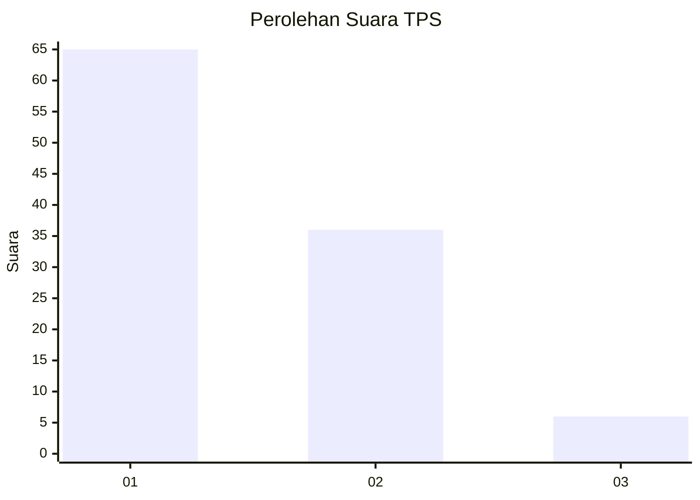
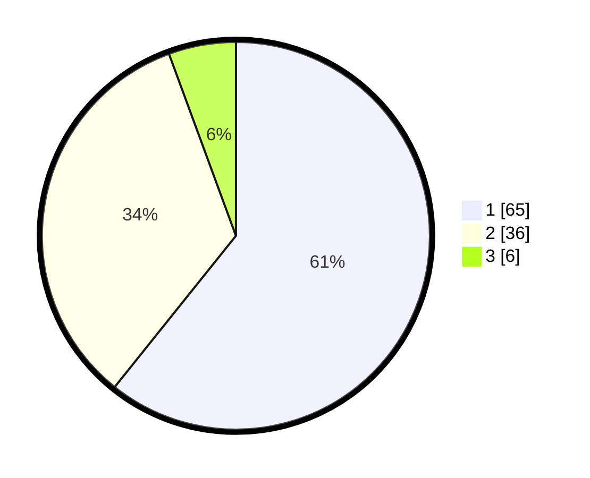

# Hasil

## Grafik

## Tabel

| No. | Nama Paslon    | Suara | Suara (raw) | Persentase |
|:--- |:-------------- | -----:| -----------:| ----------:|
| 1   | ANIES MUHAIMIN | 65    | [65][p-1]   | 60,75      |
| 2   | PRABOWO GIBRAN | 36    | [36][p-2]   | 33,64      |
| 3   | GANJAR MAHFUD  | 6     | [6][p-3]    | 5,61       |

[p-1]: https://github.com/gigit-pemilu/pemilu-2024/blob/main/pilpres/hitung-suara/sub/36-banten/sub/03-tangerang/sub/11-rajeg/sub/2001-rajeg/sub/009-tps/sub/paslon-1.txt
[p-2]: https://github.com/gigit-pemilu/pemilu-2024/blob/main/pilpres/hitung-suara/sub/36-banten/sub/03-tangerang/sub/11-rajeg/sub/2001-rajeg/sub/009-tps/sub/paslon-2.txt
[p-3]: https://github.com/gigit-pemilu/pemilu-2024/blob/main/pilpres/hitung-suara/sub/36-banten/sub/03-tangerang/sub/11-rajeg/sub/2001-rajeg/sub/009-tps/sub/paslon-3.txt

## Foto C Plano

https://sirekap-obj-formc.kpu.go.id/db84/pemilu/ppwp/36/03/11/20/01/3603112001009-20240220-220458--2bed6a79-6577-4675-854b-64a89102b47c.jpg

https://sirekap-obj-formc.kpu.go.id/db84/pemilu/ppwp/36/03/11/20/01/3603112001009-20240220-220529--c1f17d26-5386-400c-8a34-e2efe6b77f53.jpg

https://sirekap-obj-formc.kpu.go.id/db84/pemilu/ppwp/36/03/11/20/01/3603112001009-20240220-220618--d82f53c7-229b-4aa0-af3e-e5eb0a41e91f.jpg

## Metadata

| Key        | Value               |
| ---------- | ------------------- |
| Time Stamp | 2024-02-20 23:00:00 |

## DATA PEMILIH TETAP

Jumlah pemilih dalam DPT: **275**.
 * L: **642**.
 * P: **833**.

## DATA PENGGUNA HAK PILIH

Jumlah pengguna hak pilih dalam DPT: **246**.
 * L: **104**.
 * P: **610**.

Jumlah pengguna hak pilih dalam DPTb: **588**.
 * L: **808**.
 * P: **888**.

Jumlah pengguna hak pilih dalam DPK: **888**.
 * L: **880**.
 * P: **80**.

Jumlah pengguna hak pilih: **246**.
 * L: **105**.
 * P: **648**.

## JUMLAH SUARA SAH DAN TIDAK SAH

JUMLAH SELURUH SUARA SAH: **207**.

JUMLAH SUARA TIDAK SAH: **9**.

JUMLAH SELURUH SUARA SAH DAN SUARA TIDAK SAH: **216**.

