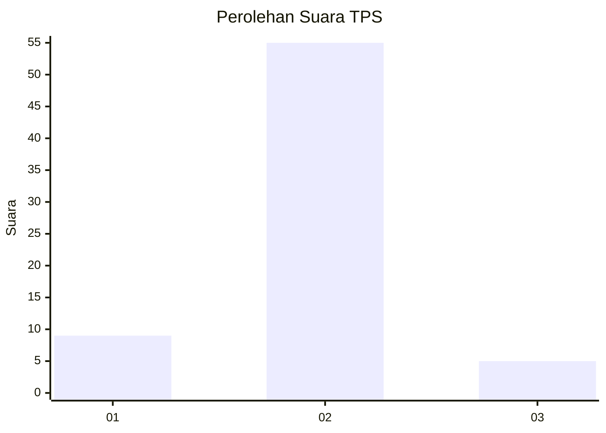
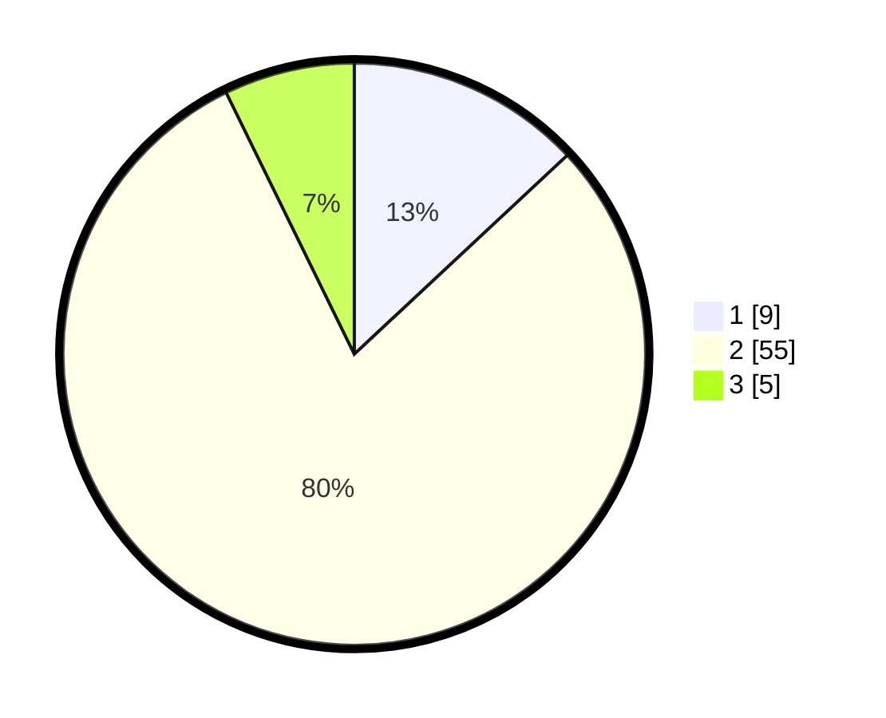

# Hasil

## Grafik

## Tabel

| No. | Nama Paslon    | Suara | Suara (raw) | Persentase |
|:--- |:-------------- | -----:| -----------:| ----------:|
| 1   | ANIES MUHAIMIN | 9     | [9][p-1]    | 13,04      |
| 2   | PRABOWO GIBRAN | 55    | [55][p-2]   | 79,71      |
| 3   | GANJAR MAHFUD  | 5     | [5][p-3]    | 7,25       |

[p-1]: https://github.com/gigit-pemilu/pemilu-2024/blob/main/pilpres/hitung-suara/sub/36-banten/sub/03-tangerang/sub/11-rajeg/sub/2001-rajeg/sub/010-tps/sub/paslon-1.txt
[p-2]: https://github.com/gigit-pemilu/pemilu-2024/blob/main/pilpres/hitung-suara/sub/36-banten/sub/03-tangerang/sub/11-rajeg/sub/2001-rajeg/sub/010-tps/sub/paslon-2.txt
[p-3]: https://github.com/gigit-pemilu/pemilu-2024/blob/main/pilpres/hitung-suara/sub/36-banten/sub/03-tangerang/sub/11-rajeg/sub/2001-rajeg/sub/010-tps/sub/paslon-3.txt

## Foto C Plano

https://sirekap-obj-formc.kpu.go.id/5e7f/pemilu/ppwp/36/03/11/20/01/3603112001010-20240221-115754--582bc9c3-3881-4160-ad83-e38f5623c8b5.jpg

https://sirekap-obj-formc.kpu.go.id/5e7f/pemilu/ppwp/36/03/11/20/01/3603112001010-20240221-115826--25b5960e-65bb-428a-8831-c7d94c198ac2.jpg

https://sirekap-obj-formc.kpu.go.id/5e7f/pemilu/ppwp/36/03/11/20/01/3603112001010-20240221-115906--c2d5cef9-7093-43f1-8a28-6a21d9f4f4f8.jpg

## Metadata

| Key        | Value               |
| ---------- | ------------------- |
| Time Stamp | 2024-02-21 12:00:00 |

## DATA PEMILIH TETAP

Jumlah pemilih dalam DPT: **632**.
 * L: **222**.
 * P: **460**.

## DATA PENGGUNA HAK PILIH

Jumlah pengguna hak pilih dalam DPT: **325**.
 * L: **22**.
 * P: **972**.

Jumlah pengguna hak pilih dalam DPTb: **555**.
 * L: **555**.
 * P: **455**.

Jumlah pengguna hak pilih dalam DPK: **884**.
 * L: **881**.
 * P: **883**.

Jumlah pengguna hak pilih: **322**.
 * L: **710**.
 * P: **513**.

## JUMLAH SUARA SAH DAN TIDAK SAH

JUMLAH SELURUH SUARA SAH: **222**.

JUMLAH SUARA TIDAK SAH: **3**.

JUMLAH SELURUH SUARA SAH DAN SUARA TIDAK SAH: **258**.

