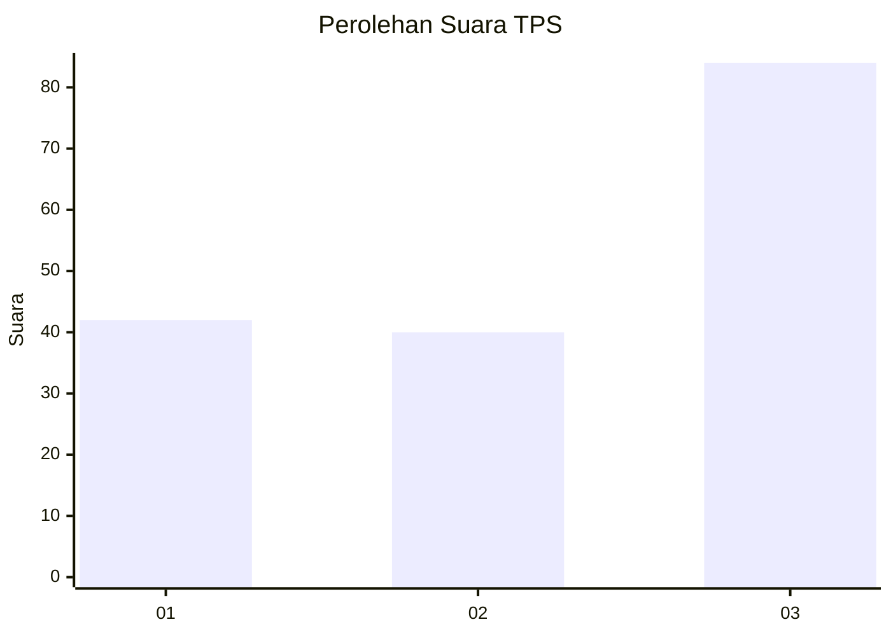
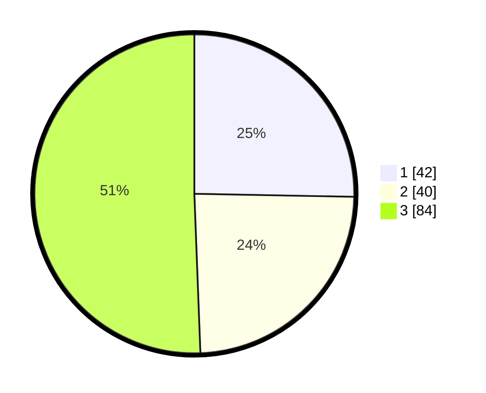

# Hasil

## Grafik

## Tabel

| No. | Nama Paslon    | Suara | Suara (raw) | Persentase |
|:--- |:-------------- | -----:| -----------:| ----------:|
| 1   | ANIES MUHAIMIN | 42    | [42][p-1]   | 25,30      |
| 2   | PRABOWO GIBRAN | 40    | [40][p-2]   | 24,10      |
| 3   | GANJAR MAHFUD  | 84    | [84][p-3]   | 50,60      |

[p-1]: https://github.com/gigit-pemilu/pemilu-2024/blob/main/pilpres/hitung-suara/sub/36-banten/sub/03-tangerang/sub/11-rajeg/sub/2001-rajeg/sub/014-tps/sub/paslon-1.txt
[p-2]: https://github.com/gigit-pemilu/pemilu-2024/blob/main/pilpres/hitung-suara/sub/36-banten/sub/03-tangerang/sub/11-rajeg/sub/2001-rajeg/sub/014-tps/sub/paslon-2.txt
[p-3]: https://github.com/gigit-pemilu/pemilu-2024/blob/main/pilpres/hitung-suara/sub/36-banten/sub/03-tangerang/sub/11-rajeg/sub/2001-rajeg/sub/014-tps/sub/paslon-3.txt

## Foto C Plano

https://sirekap-obj-formc.kpu.go.id/3a90/pemilu/ppwp/36/03/11/20/01/3603112001014-20240221-165810--00e10171-be7b-4707-b522-5eaf1965ed1d.jpg

https://sirekap-obj-formc.kpu.go.id/3a90/pemilu/ppwp/36/03/11/20/01/3603112001014-20240221-165853--439890a7-8569-48b8-88fb-06f0428bede9.jpg

https://sirekap-obj-formc.kpu.go.id/3a90/pemilu/ppwp/36/03/11/20/01/3603112001014-20240221-170001--40aa8fb6-26f8-4828-8e17-9de0c3ba159e.jpg

## Metadata

| Key        | Value               |
| ---------- | ------------------- |
| Time Stamp | 2024-02-21 18:00:00 |

## DATA PEMILIH TETAP

Jumlah pemilih dalam DPT: **231**.
 * L: **613**.
 * P: **443**.

## DATA PENGGUNA HAK PILIH

Jumlah pengguna hak pilih dalam DPT: **204**.
 * L: **897**.
 * P: **107**.

Jumlah pengguna hak pilih dalam DPTb: **888**.
 * L: **888**.
 * P: **884**.

Jumlah pengguna hak pilih dalam DPK: **880**.
 * L: **888**.
 * P: **888**.

Jumlah pengguna hak pilih: **204**.
 * L: **897**.
 * P: **307**.

## JUMLAH SUARA SAH DAN TIDAK SAH

JUMLAH SELURUH SUARA SAH: **353**.

JUMLAH SUARA TIDAK SAH: **7**.

JUMLAH SELURUH SUARA SAH DAN SUARA TIDAK SAH: **204**.

