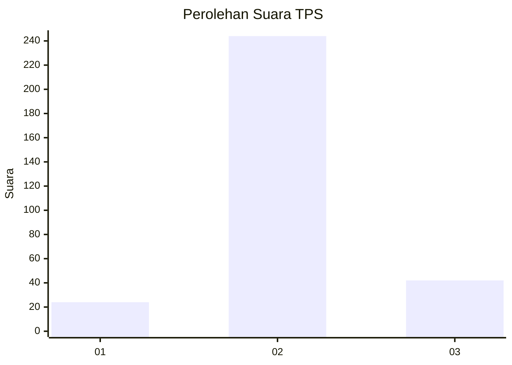
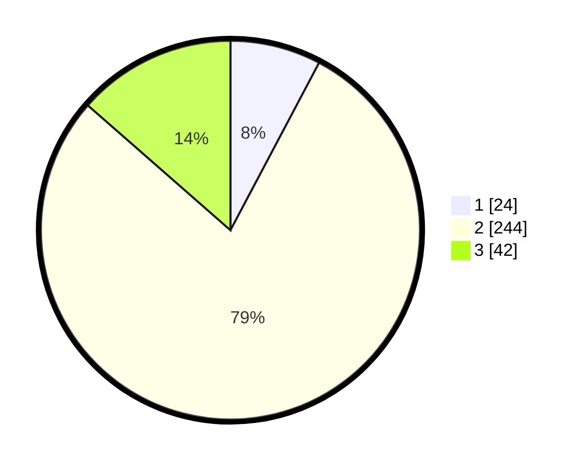

# Hasil

## Grafik

## Tabel

| No. | Nama Paslon    | Suara | Suara (raw) | Persentase |
|:--- |:-------------- | -----:| -----------:| ----------:|
| 1   | ANIES MUHAIMIN | 24    | [24][p-1]   | 7,74       |
| 2   | PRABOWO GIBRAN | 244   | [244][p-2]  | 78,71      |
| 3   | GANJAR MAHFUD  | 42    | [42][p-3]   | 13,55      |

[p-1]: https://github.com/gigit-pemilu/pemilu-2024-36-banten/blob/main/pilpres/hitung-suara/sub/36-banten/sub/03-tangerang/sub/11-rajeg/sub/2001-rajeg/sub/015-tps/sub/paslon-1.txt
[p-2]: https://github.com/gigit-pemilu/pemilu-2024-36-banten/blob/main/pilpres/hitung-suara/sub/36-banten/sub/03-tangerang/sub/11-rajeg/sub/2001-rajeg/sub/015-tps/sub/paslon-2.txt
[p-3]: https://github.com/gigit-pemilu/pemilu-2024-36-banten/blob/main/pilpres/hitung-suara/sub/36-banten/sub/03-tangerang/sub/11-rajeg/sub/2001-rajeg/sub/015-tps/sub/paslon-3.txt

## Foto C Plano

https://sirekap-obj-formc.kpu.go.id/fd30/pemilu/ppwp/36/03/11/20/01/3603112001015-20240221-173043--d2a26ef5-593f-44a8-8510-a91972c7f7a6.jpg

https://sirekap-obj-formc.kpu.go.id/fd30/pemilu/ppwp/36/03/11/20/01/3603112001015-20240221-173110--6c23b773-05da-477a-be26-68acc8799c4e.jpg

https://sirekap-obj-formc.kpu.go.id/fd30/pemilu/ppwp/36/03/11/20/01/3603112001015-20240221-173209--dfde8d15-ca27-41e3-ba7f-38ec8ce8e248.jpg

## Metadata

| Key        | Value               |
| ---------- | ------------------- |
| Time Stamp | 2024-02-21 18:00:00 |

## DATA PEMILIH TETAP

Jumlah pemilih dalam DPT: **233**.
 * L: **559**.
 * P: **339**.

## DATA PENGGUNA HAK PILIH

Jumlah pengguna hak pilih dalam DPT: **889**.
 * L: **883**.
 * P: **230**.

Jumlah pengguna hak pilih dalam DPTb: **88**.
 * L: **783**.
 * P: **382**.

Jumlah pengguna hak pilih dalam DPK: **888**.
 * L: **43**.
 * P: **448**.

Jumlah pengguna hak pilih: **532**.
 * L: **853**.
 * P: **290**.

## JUMLAH SUARA SAH DAN TIDAK SAH

JUMLAH SELURUH SUARA SAH: **853**.

JUMLAH SUARA TIDAK SAH: **385**.

JUMLAH SELURUH SUARA SAH DAN SUARA TIDAK SAH: **253**.

