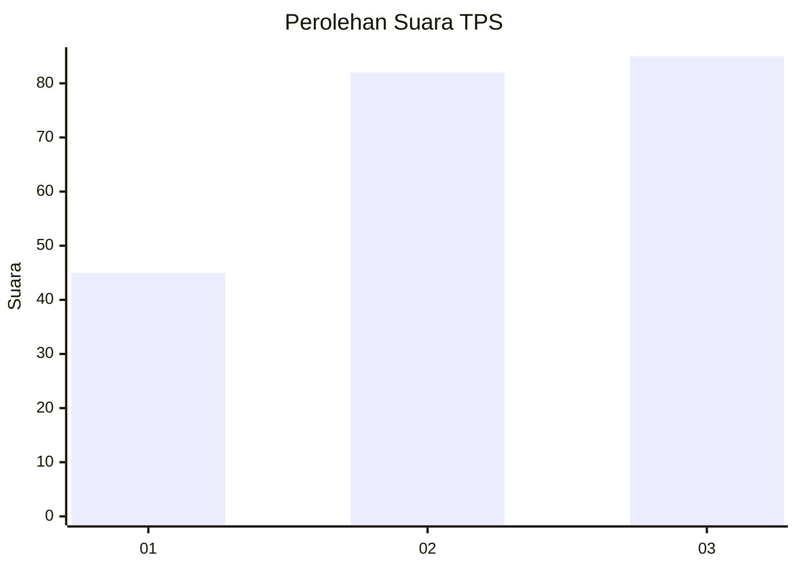
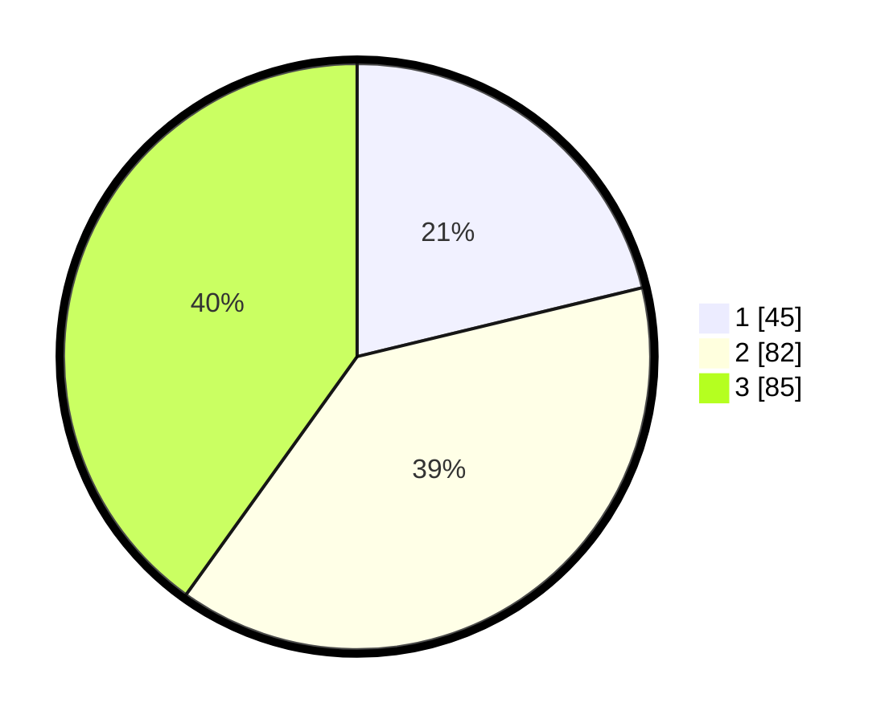

# Hasil

## Grafik

## Tabel

| No. | Nama Paslon    | Suara | Suara (raw) | Persentase |
|:--- |:-------------- | -----:| -----------:| ----------:|
| 1   | ANIES MUHAIMIN | 45    | [45][p-1]   | 21,23      |
| 2   | PRABOWO GIBRAN | 82    | [82][p-2]   | 38,68      |
| 3   | GANJAR MAHFUD  | 85    | [85][p-3]   | 40,09      |

[p-1]: https://github.com/gigit-pemilu/pemilu-2024/blob/main/pilpres/hitung-suara/sub/36-banten/sub/03-tangerang/sub/11-rajeg/sub/2001-rajeg/sub/016-tps/sub/paslon-1.txt
[p-2]: https://github.com/gigit-pemilu/pemilu-2024/blob/main/pilpres/hitung-suara/sub/36-banten/sub/03-tangerang/sub/11-rajeg/sub/2001-rajeg/sub/016-tps/sub/paslon-2.txt
[p-3]: https://github.com/gigit-pemilu/pemilu-2024/blob/main/pilpres/hitung-suara/sub/36-banten/sub/03-tangerang/sub/11-rajeg/sub/2001-rajeg/sub/016-tps/sub/paslon-3.txt

## Foto C Plano

https://sirekap-obj-formc.kpu.go.id/2962/pemilu/ppwp/36/03/11/20/01/3603112001016-20240221-202936--9660b489-4b0a-461f-9762-c6bdc354953b.jpg

https://sirekap-obj-formc.kpu.go.id/2962/pemilu/ppwp/36/03/11/20/01/3603112001016-20240221-203042--42bc57cd-e20c-4eca-b4cc-c185a2650069.jpg

https://sirekap-obj-formc.kpu.go.id/2962/pemilu/ppwp/36/03/11/20/01/3603112001016-20240221-203111--c4570231-f72e-4e6b-b379-e80ba62e1525.jpg

## Metadata

| Key        | Value               |
| ---------- | ------------------- |
| Time Stamp | 2024-02-21 21:00:04 |

## DATA PEMILIH TETAP

Jumlah pemilih dalam DPT: **382**.
 * L: **560**.
 * P: **585**.

## DATA PENGGUNA HAK PILIH

Jumlah pengguna hak pilih dalam DPT: **896**.
 * L: **845**.
 * P: **846**.

Jumlah pengguna hak pilih dalam DPTb: **445**.
 * L: **585**.
 * P: **555**.

Jumlah pengguna hak pilih dalam DPK: **823**.
 * L: **888**.
 * P: **885**.

Jumlah pengguna hak pilih: **106**.
 * L: **855**.
 * P: **851**.

## JUMLAH SUARA SAH DAN TIDAK SAH

JUMLAH SELURUH SUARA SAH: **506**.

JUMLAH SUARA TIDAK SAH: **565**.

JUMLAH SELURUH SUARA SAH DAN SUARA TIDAK SAH: **809**.

