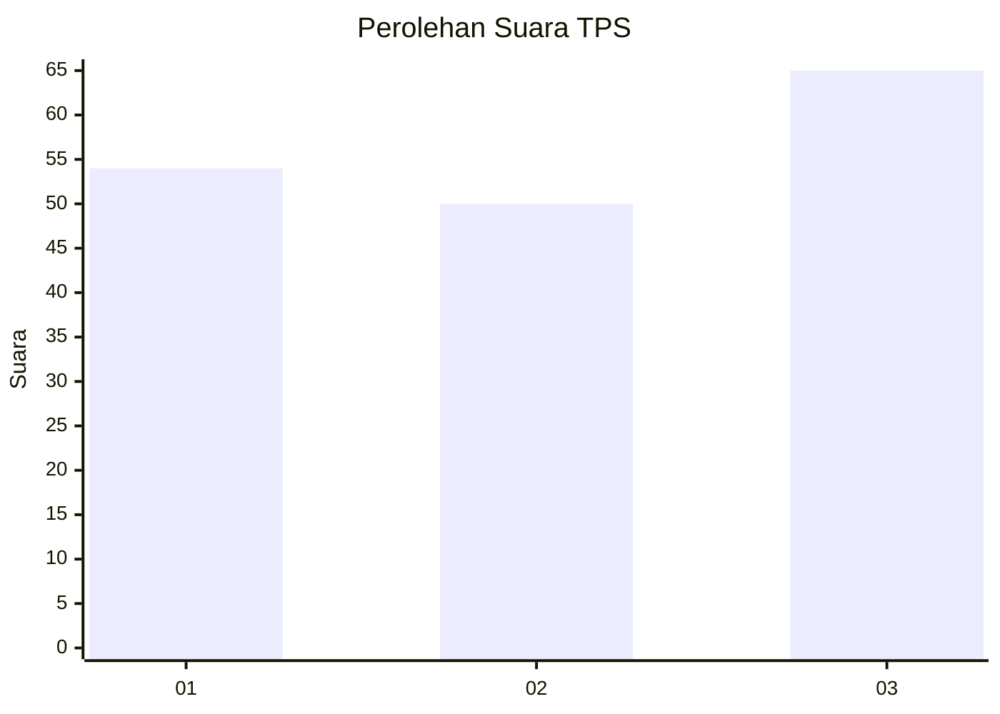
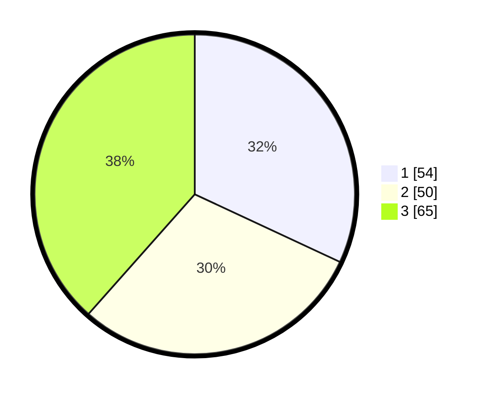

# Hasil

## Grafik

## Tabel

| No. | Nama Paslon    | Suara | Suara (raw) | Persentase |
|:--- |:-------------- | -----:| -----------:| ----------:|
| 1   | ANIES MUHAIMIN | 54    | [54][p-1]   | 31,95      |
| 2   | PRABOWO GIBRAN | 50    | [50][p-2]   | 29,59      |
| 3   | GANJAR MAHFUD  | 65    | [65][p-3]   | 38,46      |

[p-1]: https://github.com/gigit-pemilu/pemilu-2024/blob/main/pilpres/hitung-suara/sub/36-banten/sub/03-tangerang/sub/11-rajeg/sub/2001-rajeg/sub/019-tps/sub/paslon-1.txt
[p-2]: https://github.com/gigit-pemilu/pemilu-2024/blob/main/pilpres/hitung-suara/sub/36-banten/sub/03-tangerang/sub/11-rajeg/sub/2001-rajeg/sub/019-tps/sub/paslon-2.txt
[p-3]: https://github.com/gigit-pemilu/pemilu-2024/blob/main/pilpres/hitung-suara/sub/36-banten/sub/03-tangerang/sub/11-rajeg/sub/2001-rajeg/sub/019-tps/sub/paslon-3.txt

## Foto C Plano

https://sirekap-obj-formc.kpu.go.id/7001/pemilu/ppwp/36/03/11/20/01/3603112001019-20240222-101723--cb67bca2-061b-4024-bac6-ca5b88a91d44.jpg

https://sirekap-obj-formc.kpu.go.id/7001/pemilu/ppwp/36/03/11/20/01/3603112001019-20240222-101757--c4acb194-f6ce-4bdf-9355-a4de8b2c5588.jpg

https://sirekap-obj-formc.kpu.go.id/7001/pemilu/ppwp/36/03/11/20/01/3603112001019-20240222-101830--41eb2475-8e9a-436c-be48-5be803f86eab.jpg

## Metadata

| Key        | Value               |
| ---------- | ------------------- |
| Time Stamp | 2024-02-22 11:00:00 |

## DATA PEMILIH TETAP

Jumlah pemilih dalam DPT: **275**.
 * L: **630**.
 * P: **838**.

## DATA PENGGUNA HAK PILIH

Jumlah pengguna hak pilih dalam DPT: **247**.
 * L: **220**.
 * P: **828**.

Jumlah pengguna hak pilih dalam DPTb: **888**.
 * L: **0**.
 * P: **88**.

Jumlah pengguna hak pilih dalam DPK: **32**.
 * L: **13**.
 * P: **65**.

Jumlah pengguna hak pilih: **272**.
 * L: **162**.
 * P: **442**.

## JUMLAH SUARA SAH DAN TIDAK SAH

JUMLAH SELURUH SUARA SAH: **259**.

JUMLAH SUARA TIDAK SAH: **20**.

JUMLAH SELURUH SUARA SAH DAN SUARA TIDAK SAH: **239**.

