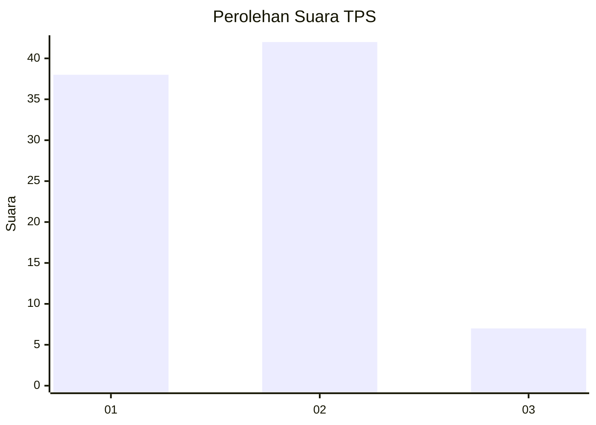
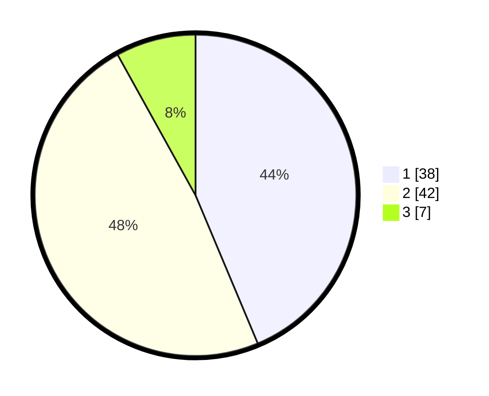

# Hasil

## Grafik

## Tabel

| No. | Nama Paslon    | Suara | Suara (raw) | Persentase |
|:--- |:-------------- | -----:| -----------:| ----------:|
| 1   | ANIES MUHAIMIN | 38    | [38][p-1]   | 43,68      |
| 2   | PRABOWO GIBRAN | 42    | [42][p-2]   | 48,28      |
| 3   | GANJAR MAHFUD  | 7     | [7][p-3]    | 8,05       |

[p-1]: https://github.com/gigit-pemilu/pemilu-2024-36-banten/blob/main/pilpres/hitung-suara/sub/36-banten/sub/03-tangerang/sub/11-rajeg/sub/2001-rajeg/sub/022-tps/sub/paslon-1.txt
[p-2]: https://github.com/gigit-pemilu/pemilu-2024-36-banten/blob/main/pilpres/hitung-suara/sub/36-banten/sub/03-tangerang/sub/11-rajeg/sub/2001-rajeg/sub/022-tps/sub/paslon-2.txt
[p-3]: https://github.com/gigit-pemilu/pemilu-2024-36-banten/blob/main/pilpres/hitung-suara/sub/36-banten/sub/03-tangerang/sub/11-rajeg/sub/2001-rajeg/sub/022-tps/sub/paslon-3.txt

## Foto C Plano

https://sirekap-obj-formc.kpu.go.id/fe81/pemilu/ppwp/36/03/11/20/01/3603112001022-20240222-111317--4bd5b22a-3492-4f14-a41c-35a1755a85a4.jpg

https://sirekap-obj-formc.kpu.go.id/fe81/pemilu/ppwp/36/03/11/20/01/3603112001022-20240222-111340--e43ddc88-634c-4ffa-8da6-d0936937e48a.jpg

https://sirekap-obj-formc.kpu.go.id/fe81/pemilu/ppwp/36/03/11/20/01/3603112001022-20240222-111356--bdfa201a-6082-4d20-9a60-0c0d270a50d1.jpg

## Metadata

| Key        | Value               |
| ---------- | ------------------- |
| Time Stamp | 2024-02-22 12:00:00 |

## DATA PEMILIH TETAP

Jumlah pemilih dalam DPT: **234**.
 * L: **514**.
 * P: **850**.

## DATA PENGGUNA HAK PILIH

Jumlah pengguna hak pilih dalam DPT: **197**.
 * L: **92**.
 * P: **585**.

Jumlah pengguna hak pilih dalam DPTb: **228**.
 * L: **884**.
 * P: **228**.

Jumlah pengguna hak pilih dalam DPK: **484**.
 * L: **808**.
 * P: **888**.

Jumlah pengguna hak pilih: **897**.
 * L: **592**.
 * P: **405**.

## JUMLAH SUARA SAH DAN TIDAK SAH

JUMLAH SELURUH SUARA SAH: **888**.

JUMLAH SUARA TIDAK SAH: **49**.

JUMLAH SELURUH SUARA SAH DAN SUARA TIDAK SAH: **397**.

