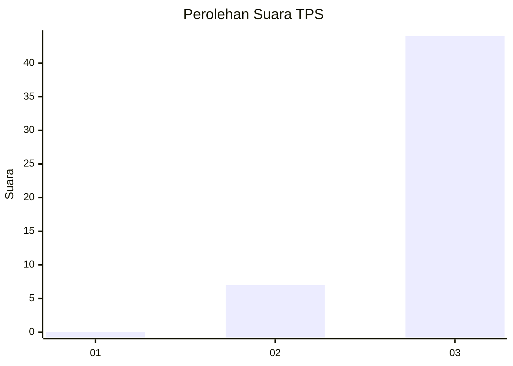
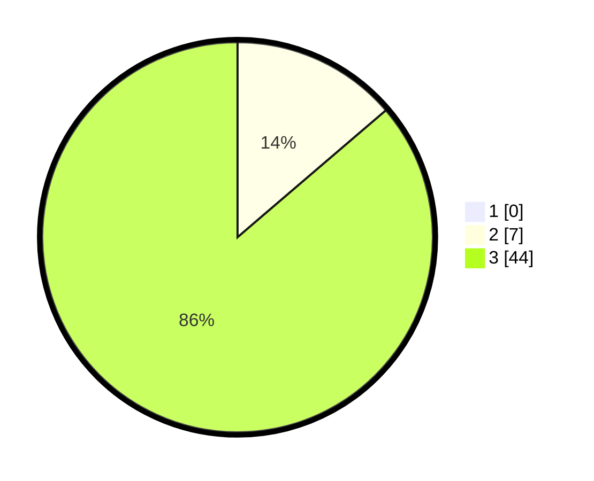

# Hasil

## Grafik

## Tabel

| No. | Nama Paslon    | Suara | Suara (raw) | Persentase |
|:--- |:-------------- | -----:| -----------:| ----------:|
| 1   | ANIES MUHAIMIN | 0     | [0][p-1]    | 0,00       |
| 2   | PRABOWO GIBRAN | 7     | [7][p-2]    | 13,73      |
| 3   | GANJAR MAHFUD  | 44    | [44][p-3]   | 86,27      |

[p-1]: https://github.com/gigit-pemilu/pemilu-2024-36-banten/blob/main/pilpres/hitung-suara/sub/36-banten/sub/03-tangerang/sub/11-rajeg/sub/2001-rajeg/sub/024-tps/sub/paslon-1.txt
[p-2]: https://github.com/gigit-pemilu/pemilu-2024-36-banten/blob/main/pilpres/hitung-suara/sub/36-banten/sub/03-tangerang/sub/11-rajeg/sub/2001-rajeg/sub/024-tps/sub/paslon-2.txt
[p-3]: https://github.com/gigit-pemilu/pemilu-2024-36-banten/blob/main/pilpres/hitung-suara/sub/36-banten/sub/03-tangerang/sub/11-rajeg/sub/2001-rajeg/sub/024-tps/sub/paslon-3.txt

## Foto C Plano

https://sirekap-obj-formc.kpu.go.id/25e8/pemilu/ppwp/36/03/11/20/01/3603112001024-20240222-150350--4a5a7494-e2a0-4a1b-9422-a9b47c37762a.jpg

https://sirekap-obj-formc.kpu.go.id/25e8/pemilu/ppwp/36/03/11/20/01/3603112001024-20240222-150503--03c0c63a-8fbe-4c15-b91b-81f935bd8976.jpg

https://sirekap-obj-formc.kpu.go.id/25e8/pemilu/ppwp/36/03/11/20/01/3603112001024-20240222-150550--30ebae50-3115-4b2e-8005-a6d36f1870ba.jpg

## Metadata

| Key        | Value               |
| ---------- | ------------------- |
| Time Stamp | 2024-02-22 16:00:00 |

## DATA PEMILIH TETAP

Jumlah pemilih dalam DPT: **222**.
 * L: **850**.
 * P: **523**.

## DATA PENGGUNA HAK PILIH

Jumlah pengguna hak pilih dalam DPT: **0**.
 * L: **427**.
 * P: **552**.

Jumlah pengguna hak pilih dalam DPTb: **528**.
 * L: **55**.
 * P: **555**.

Jumlah pengguna hak pilih dalam DPK: **742**.
 * L: **575**.
 * P: **222**.

Jumlah pengguna hak pilih: **222**.
 * L: **257**.
 * P: **27**.

## JUMLAH SUARA SAH DAN TIDAK SAH

JUMLAH SELURUH SUARA SAH: **221**.

JUMLAH SUARA TIDAK SAH: **21**.

JUMLAH SELURUH SUARA SAH DAN SUARA TIDAK SAH: **242**.

