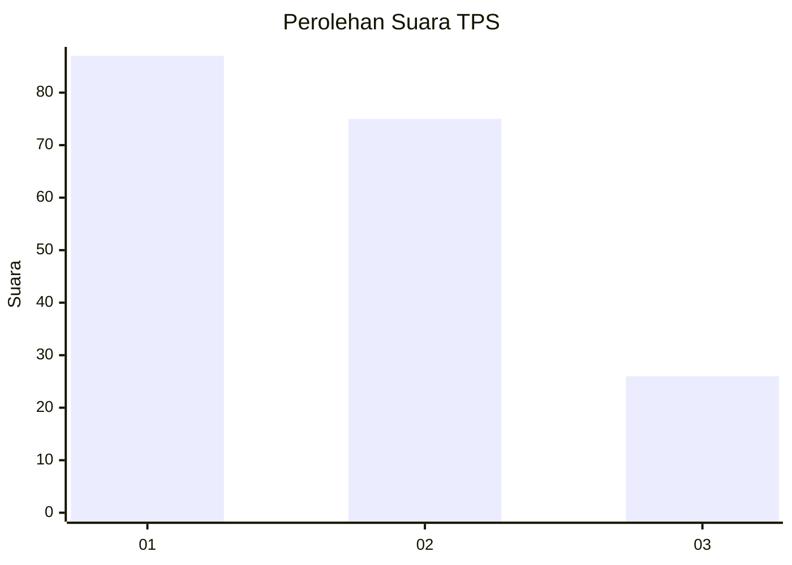
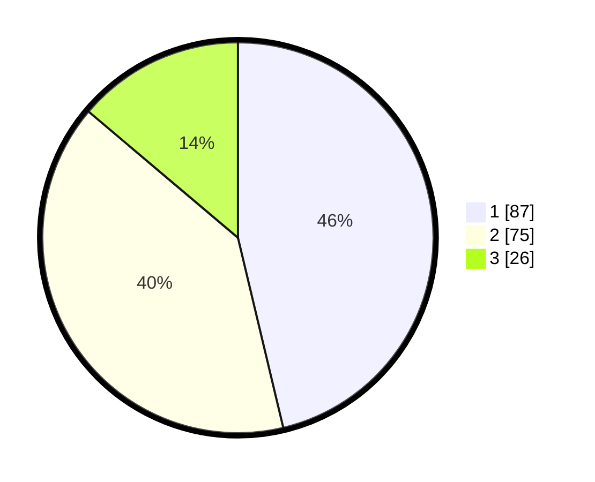

# Hasil

## Grafik

## Tabel

| No. | Nama Paslon    | Suara | Suara (raw) | Persentase |
|:--- |:-------------- | -----:| -----------:| ----------:|
| 1   | ANIES MUHAIMIN | 87    | [87][p-1]   | 46,28      |
| 2   | PRABOWO GIBRAN | 75    | [75][p-2]   | 39,89      |
| 3   | GANJAR MAHFUD  | 26    | [26][p-3]   | 13,83      |

[p-1]: https://github.com/gigit-pemilu/pemilu-2024/blob/main/pilpres/hitung-suara/sub/36-banten/sub/03-tangerang/sub/11-rajeg/sub/2001-rajeg/sub/027-tps/sub/paslon-1.txt
[p-2]: https://github.com/gigit-pemilu/pemilu-2024/blob/main/pilpres/hitung-suara/sub/36-banten/sub/03-tangerang/sub/11-rajeg/sub/2001-rajeg/sub/027-tps/sub/paslon-2.txt
[p-3]: https://github.com/gigit-pemilu/pemilu-2024/blob/main/pilpres/hitung-suara/sub/36-banten/sub/03-tangerang/sub/11-rajeg/sub/2001-rajeg/sub/027-tps/sub/paslon-3.txt

## Foto C Plano

https://sirekap-obj-formc.kpu.go.id/6f7b/pemilu/ppwp/36/03/11/20/01/3603112001027-20240222-171117--79ba68f6-f467-4259-83f8-30fd9cdf19f6.jpg

https://sirekap-obj-formc.kpu.go.id/6f7b/pemilu/ppwp/36/03/11/20/01/3603112001027-20240222-171143--0d71df74-8e7c-4fa8-8c85-b2b32484beb6.jpg

https://sirekap-obj-formc.kpu.go.id/6f7b/pemilu/ppwp/36/03/11/20/01/3603112001027-20240222-171045--2a35669a-2c56-43f8-a8b8-cc6dbed1fd21.jpg

## Metadata

| Key        | Value               |
| ---------- | ------------------- |
| Time Stamp | 2024-02-22 18:00:00 |

## DATA PEMILIH TETAP

Jumlah pemilih dalam DPT: **268**.
 * L: **126**.
 * P: **535**.

## DATA PENGGUNA HAK PILIH

Jumlah pengguna hak pilih dalam DPT: **223**.
 * L: **633**.
 * P: **448**.

Jumlah pengguna hak pilih dalam DPTb: **25**.
 * L: **822**.
 * P: **82**.

Jumlah pengguna hak pilih dalam DPK: **825**.
 * L: **42**.
 * P: **83**.

Jumlah pengguna hak pilih: **243**.
 * L: **119**.
 * P: **229**.

## JUMLAH SUARA SAH DAN TIDAK SAH

JUMLAH SELURUH SUARA SAH: **243**.

JUMLAH SUARA TIDAK SAH: **85**.

JUMLAH SELURUH SUARA SAH DAN SUARA TIDAK SAH: **242**.

