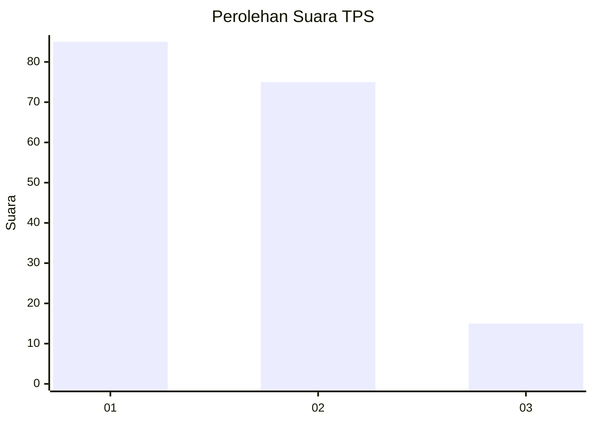
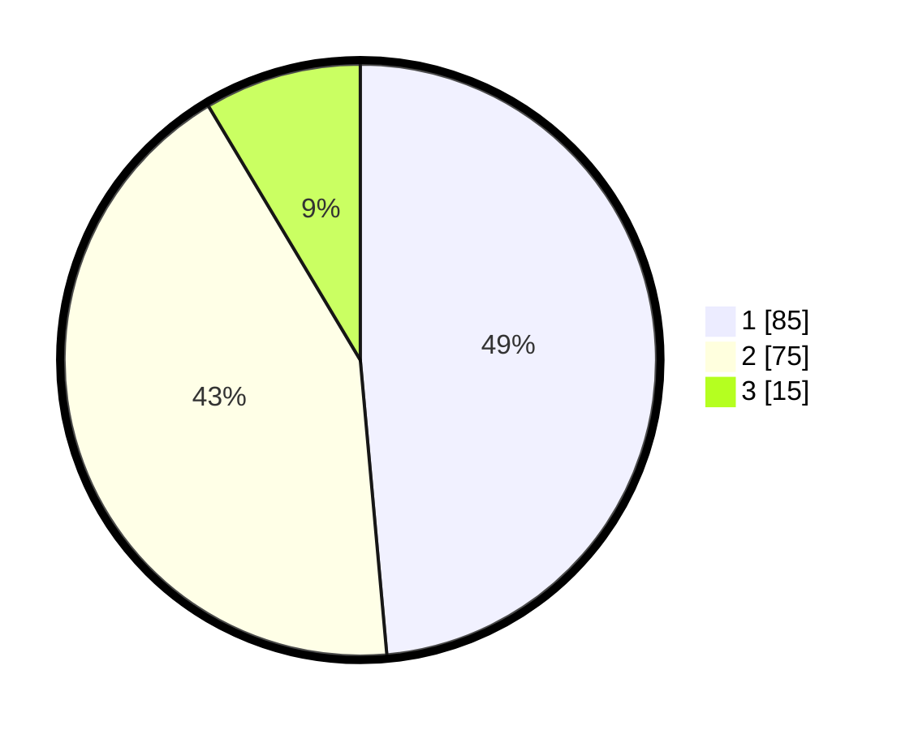

# Hasil

## Grafik

## Tabel

| No. | Nama Paslon    | Suara | Suara (raw) | Persentase |
|:--- |:-------------- | -----:| -----------:| ----------:|
| 1   | ANIES MUHAIMIN | 85    | [85][p-1]   | 48,57      |
| 2   | PRABOWO GIBRAN | 75    | [75][p-2]   | 42,86      |
| 3   | GANJAR MAHFUD  | 15    | [15][p-3]   | 8,57       |

[p-1]: https://github.com/gigit-pemilu/pemilu-2024-36-banten/blob/main/pilpres/hitung-suara/sub/36-banten/sub/03-tangerang/sub/11-rajeg/sub/2001-rajeg/sub/028-tps/sub/paslon-1.txt
[p-2]: https://github.com/gigit-pemilu/pemilu-2024-36-banten/blob/main/pilpres/hitung-suara/sub/36-banten/sub/03-tangerang/sub/11-rajeg/sub/2001-rajeg/sub/028-tps/sub/paslon-2.txt
[p-3]: https://github.com/gigit-pemilu/pemilu-2024-36-banten/blob/main/pilpres/hitung-suara/sub/36-banten/sub/03-tangerang/sub/11-rajeg/sub/2001-rajeg/sub/028-tps/sub/paslon-3.txt

## Foto C Plano

https://sirekap-obj-formc.kpu.go.id/cdd1/pemilu/ppwp/36/03/11/20/01/3603112001028-20240222-203558--ef465be9-f520-46be-9c21-dc1cdbd25ed7.jpg

https://sirekap-obj-formc.kpu.go.id/cdd1/pemilu/ppwp/36/03/11/20/01/3603112001028-20240222-203649--3bf94736-73cf-4969-a574-c57a4f6a3513.jpg

https://sirekap-obj-formc.kpu.go.id/cdd1/pemilu/ppwp/36/03/11/20/01/3603112001028-20240222-203715--75015945-808b-4568-99d0-d856569a6ddc.jpg

## Metadata

| Key        | Value               |
| ---------- | ------------------- |
| Time Stamp | 2024-02-22 21:00:00 |

## DATA PEMILIH TETAP

Jumlah pemilih dalam DPT: **281**.
 * L: **637**.
 * P: **644**.

## DATA PENGGUNA HAK PILIH

Jumlah pengguna hak pilih dalam DPT: **257**.
 * L: **830**.
 * P: **127**.

Jumlah pengguna hak pilih dalam DPTb: **5**.
 * L: **83**.
 * P: **2**.

Jumlah pengguna hak pilih dalam DPK: **828**.
 * L: **809**.
 * P: **9**.

Jumlah pengguna hak pilih: **280**.
 * L: **642**.
 * P: **838**.

## JUMLAH SUARA SAH DAN TIDAK SAH

JUMLAH SELURUH SUARA SAH: **275**.

JUMLAH SUARA TIDAK SAH: **885**.

JUMLAH SELURUH SUARA SAH DAN SUARA TIDAK SAH: **280**.

