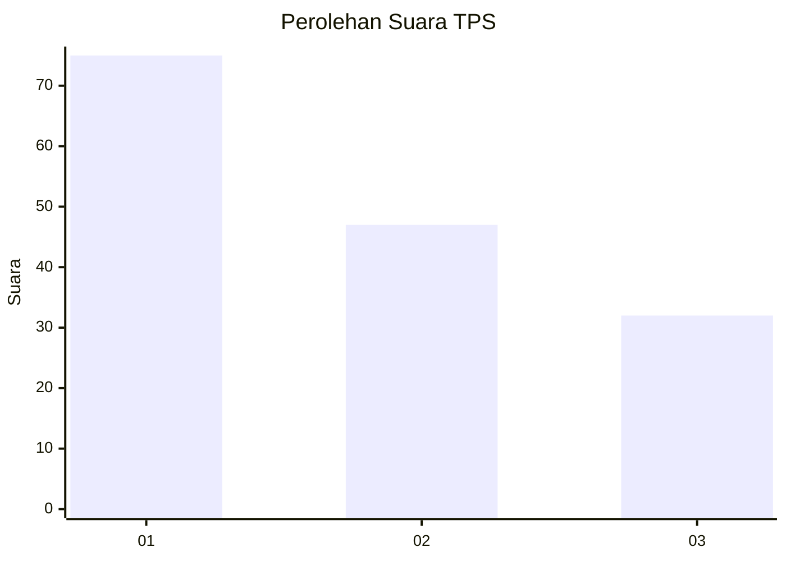
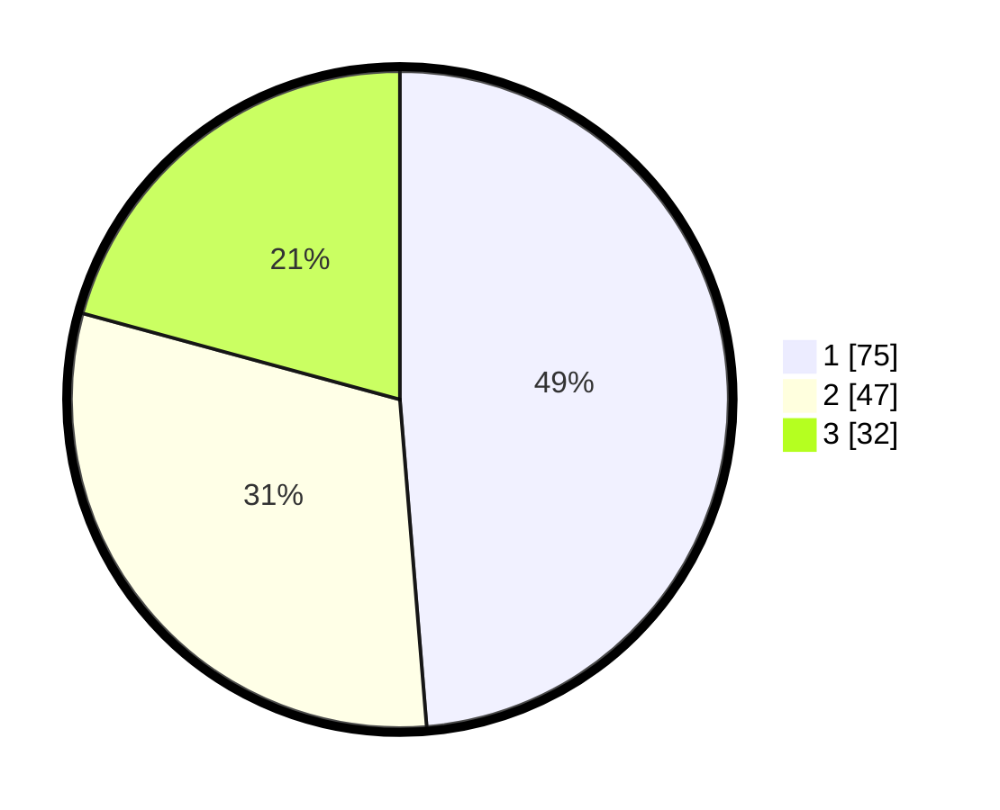

# Hasil

## Grafik

## Tabel

| No. | Nama Paslon    | Suara | Suara (raw) | Persentase |
|:--- |:-------------- | -----:| -----------:| ----------:|
| 1   | ANIES MUHAIMIN | 75    | [75][p-1]   | 48,70      |
| 2   | PRABOWO GIBRAN | 47    | [47][p-2]   | 30,52      |
| 3   | GANJAR MAHFUD  | 32    | [32][p-3]   | 20,78      |

[p-1]: https://github.com/gigit-pemilu/pemilu-2024/blob/main/pilpres/hitung-suara/sub/36-banten/sub/03-tangerang/sub/11-rajeg/sub/2001-rajeg/sub/031-tps/sub/paslon-1.txt
[p-2]: https://github.com/gigit-pemilu/pemilu-2024/blob/main/pilpres/hitung-suara/sub/36-banten/sub/03-tangerang/sub/11-rajeg/sub/2001-rajeg/sub/031-tps/sub/paslon-2.txt
[p-3]: https://github.com/gigit-pemilu/pemilu-2024/blob/main/pilpres/hitung-suara/sub/36-banten/sub/03-tangerang/sub/11-rajeg/sub/2001-rajeg/sub/031-tps/sub/paslon-3.txt

## Foto C Plano

https://sirekap-obj-formc.kpu.go.id/2884/pemilu/ppwp/36/03/11/20/01/3603112001031-20240223-095606--4dec58a4-0087-40ad-aeb8-60c026d7bb62.jpg

https://sirekap-obj-formc.kpu.go.id/2884/pemilu/ppwp/36/03/11/20/01/3603112001031-20240223-095626--3908c43e-59f3-47d8-aad4-1a9f4d4fc843.jpg

https://sirekap-obj-formc.kpu.go.id/2884/pemilu/ppwp/36/03/11/20/01/3603112001031-20240223-095646--cf482530-9623-41a0-abb8-0fa697fed97d.jpg

## Metadata

| Key        | Value               |
| ---------- | ------------------- |
| Time Stamp | 2024-02-24 22:31:28 |

## DATA PEMILIH TETAP

Jumlah pemilih dalam DPT: **289**.
 * L: **839**.
 * P: **859**.

## DATA PENGGUNA HAK PILIH

Jumlah pengguna hak pilih dalam DPT: **246**.
 * L: **162**.
 * P: **134**.

Jumlah pengguna hak pilih dalam DPTb: **848**.
 * L: **808**.
 * P: **888**.

Jumlah pengguna hak pilih dalam DPK: **887**.
 * L: **882**.
 * P: **885**.

Jumlah pengguna hak pilih: **253**.
 * L: **124**.
 * P: **439**.

## JUMLAH SUARA SAH DAN TIDAK SAH

JUMLAH SELURUH SUARA SAH: **253**.

JUMLAH SUARA TIDAK SAH: **884**.

JUMLAH SELURUH SUARA SAH DAN SUARA TIDAK SAH: **253**.

