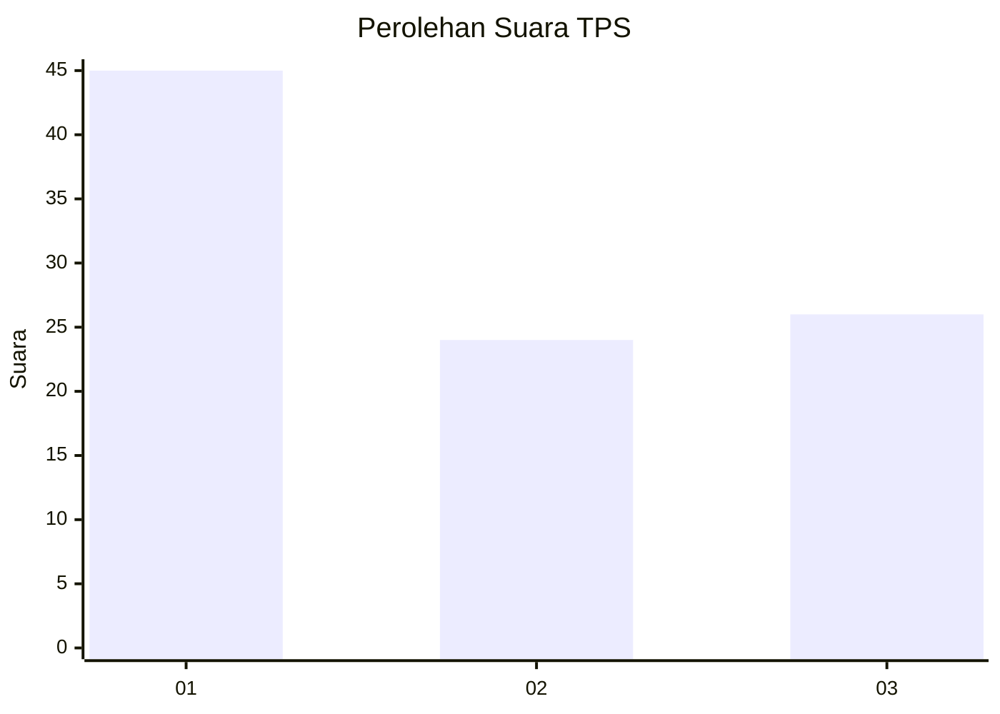
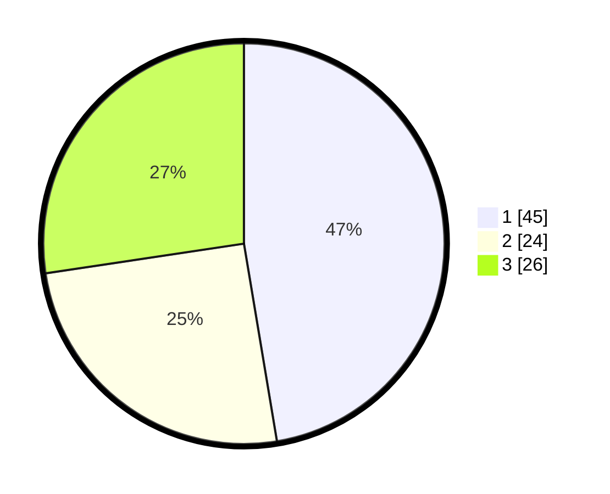

# Hasil

## Grafik

## Tabel

| No. | Nama Paslon    | Suara | Suara (raw) | Persentase |
|:--- |:-------------- | -----:| -----------:| ----------:|
| 1   | ANIES MUHAIMIN | 45    | [45][p-1]   | 47,37      |
| 2   | PRABOWO GIBRAN | 24    | [24][p-2]   | 25,26      |
| 3   | GANJAR MAHFUD  | 26    | [26][p-3]   | 27,37      |

[p-1]: https://github.com/gigit-pemilu/pemilu-2024-36-banten/blob/main/pilpres/hitung-suara/sub/36-banten/sub/03-tangerang/sub/11-rajeg/sub/2001-rajeg/sub/033-tps/sub/paslon-1.txt
[p-2]: https://github.com/gigit-pemilu/pemilu-2024-36-banten/blob/main/pilpres/hitung-suara/sub/36-banten/sub/03-tangerang/sub/11-rajeg/sub/2001-rajeg/sub/033-tps/sub/paslon-2.txt
[p-3]: https://github.com/gigit-pemilu/pemilu-2024-36-banten/blob/main/pilpres/hitung-suara/sub/36-banten/sub/03-tangerang/sub/11-rajeg/sub/2001-rajeg/sub/033-tps/sub/paslon-3.txt

## Foto C Plano

https://sirekap-obj-formc.kpu.go.id/7659/pemilu/ppwp/36/03/11/20/01/3603112001033-20240223-104950--ee414e62-1d7b-4691-84e2-4e83221ac592.jpg

https://sirekap-obj-formc.kpu.go.id/7659/pemilu/ppwp/36/03/11/20/01/3603112001033-20240223-105024--5cfc1789-1766-412e-803f-111ec094680c.jpg

https://sirekap-obj-formc.kpu.go.id/7659/pemilu/ppwp/36/03/11/20/01/3603112001033-20240223-105141--a322948c-f9ac-4505-a387-0ff8fb1a548b.jpg

## Metadata

| Key        | Value               |
| ---------- | ------------------- |
| Time Stamp | 2024-02-24 22:31:28 |

## DATA PEMILIH TETAP

Jumlah pemilih dalam DPT: **276**.
 * L: **144**.
 * P: **432**.

## DATA PENGGUNA HAK PILIH

Jumlah pengguna hak pilih dalam DPT: **238**.
 * L: **623**.
 * P: **845**.

Jumlah pengguna hak pilih dalam DPTb: **282**.
 * L: **885**.
 * P: **882**.

Jumlah pengguna hak pilih dalam DPK: **880**.
 * L: **888**.
 * P: **888**.

Jumlah pengguna hak pilih: **235**.
 * L: **123**.
 * P: **515**.

## JUMLAH SUARA SAH DAN TIDAK SAH

JUMLAH SELURUH SUARA SAH: **236**.

JUMLAH SUARA TIDAK SAH: **2**.

JUMLAH SELURUH SUARA SAH DAN SUARA TIDAK SAH: **238**.

