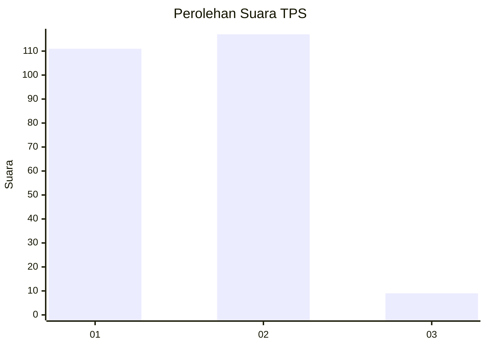
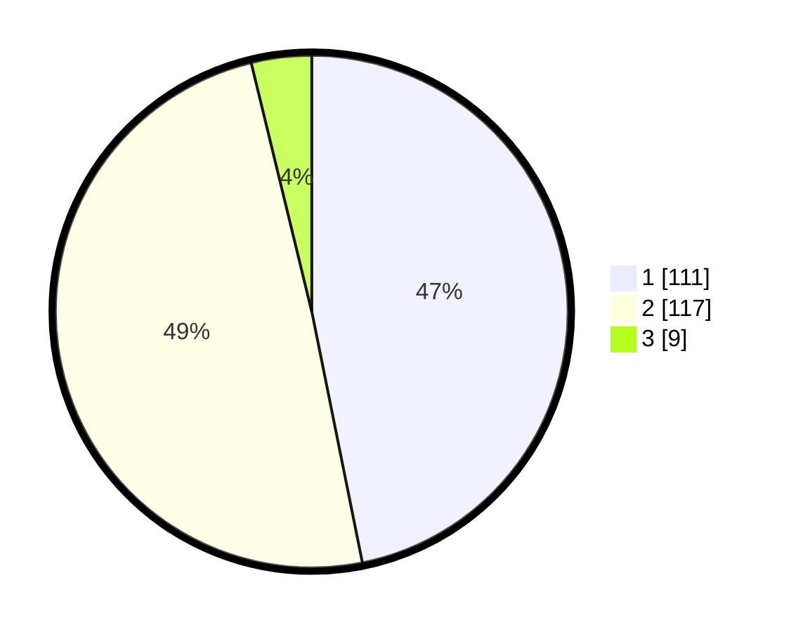

# Hasil

## Grafik

## Tabel

| No. | Nama Paslon    | Suara | Suara (raw) | Persentase |
|:--- |:-------------- | -----:| -----------:| ----------:|
| 1   | ANIES MUHAIMIN | 111   | [111][p-1]  | 46,84      |
| 2   | PRABOWO GIBRAN | 117   | [117][p-2]  | 49,37      |
| 3   | GANJAR MAHFUD  | 9     | [9][p-3]    | 3,80       |

[p-1]: https://github.com/gigit-pemilu/pemilu-2024-36-banten/blob/main/pilpres/hitung-suara/sub/36-banten/sub/03-tangerang/sub/11-rajeg/sub/2011-sukasari/sub/005-tps/sub/paslon-1.txt
[p-2]: https://github.com/gigit-pemilu/pemilu-2024-36-banten/blob/main/pilpres/hitung-suara/sub/36-banten/sub/03-tangerang/sub/11-rajeg/sub/2011-sukasari/sub/005-tps/sub/paslon-2.txt
[p-3]: https://github.com/gigit-pemilu/pemilu-2024-36-banten/blob/main/pilpres/hitung-suara/sub/36-banten/sub/03-tangerang/sub/11-rajeg/sub/2011-sukasari/sub/005-tps/sub/paslon-3.txt

## Foto C Plano

https://sirekap-obj-formc.kpu.go.id/c1ad/pemilu/ppwp/36/03/11/20/11/3603112011005-20240227-102222--4b9111be-dcd3-4309-b712-6aa9723261e4.jpg

https://sirekap-obj-formc.kpu.go.id/c1ad/pemilu/ppwp/36/03/11/20/11/3603112011005-20240227-102257--a784c82f-f8f9-43e7-b8e2-248a1354fb65.jpg

https://sirekap-obj-formc.kpu.go.id/c1ad/pemilu/ppwp/36/03/11/20/11/3603112011005-20240227-102339--cbf761ae-de12-4f18-b557-98e1f66fe81e.jpg

## Metadata

| Key        | Value               |
| ---------- | ------------------- |
| Time Stamp | 2024-02-28 09:00:00 |

## DATA PEMILIH TETAP

Jumlah pemilih dalam DPT: **550**.
 * L: **557**.
 * P: **7**.

## DATA PENGGUNA HAK PILIH

Jumlah pengguna hak pilih dalam DPT: **550**.
 * L: **777**.
 * P: **557**.

Jumlah pengguna hak pilih dalam DPTb: **773**.
 * L: **777**.
 * P: **757**.

Jumlah pengguna hak pilih dalam DPK: **777**.
 * L: **777**.
 * P: **777**.

Jumlah pengguna hak pilih: **777**.
 * L: **777**.
 * P: **777**.

## JUMLAH SUARA SAH DAN TIDAK SAH

JUMLAH SELURUH SUARA SAH: **237**.

JUMLAH SUARA TIDAK SAH: **8**.

JUMLAH SELURUH SUARA SAH DAN SUARA TIDAK SAH: **245**.

