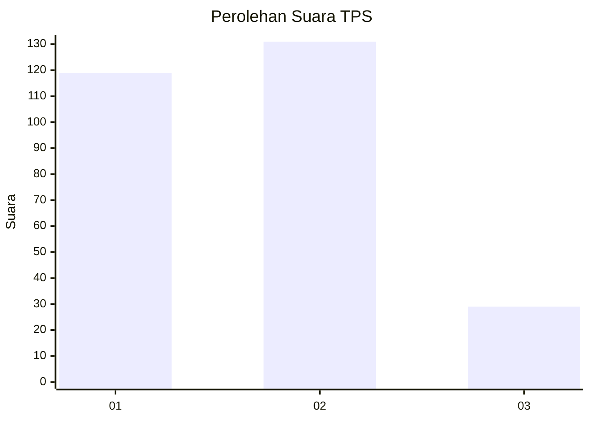
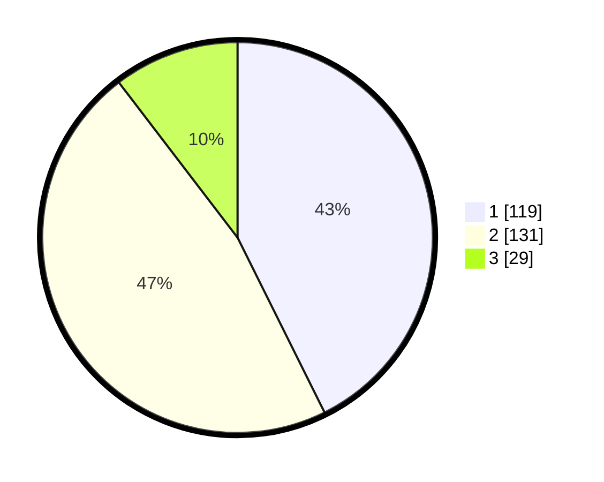

# Hasil

## Grafik

## Tabel

| No. | Nama Paslon    | Suara | Suara (raw) | Persentase |
|:--- |:-------------- | -----:| -----------:| ----------:|
| 1   | ANIES MUHAIMIN | 119   | [119][p-1]  | 42,65      |
| 2   | PRABOWO GIBRAN | 131   | [131][p-2]  | 46,95      |
| 3   | GANJAR MAHFUD  | 29    | [29][p-3]   | 10,39      |

[p-1]: https://github.com/gigit-pemilu/pemilu-2024/blob/main/pilpres/hitung-suara/sub/36-banten/sub/03-tangerang/sub/12-pasar-kemis/sub/1010-kutabumi/sub/090-tps/sub/paslon-1.txt
[p-2]: https://github.com/gigit-pemilu/pemilu-2024/blob/main/pilpres/hitung-suara/sub/36-banten/sub/03-tangerang/sub/12-pasar-kemis/sub/1010-kutabumi/sub/090-tps/sub/paslon-2.txt
[p-3]: https://github.com/gigit-pemilu/pemilu-2024/blob/main/pilpres/hitung-suara/sub/36-banten/sub/03-tangerang/sub/12-pasar-kemis/sub/1010-kutabumi/sub/090-tps/sub/paslon-3.txt

## Foto C Plano

https://sirekap-obj-formc.kpu.go.id/a050/pemilu/ppwp/36/03/12/10/10/3603121010090-20240214-195240--73bdc7a9-ed1b-4655-892b-89370860f9b3.jpg

https://sirekap-obj-formc.kpu.go.id/a050/pemilu/ppwp/36/03/12/10/10/3603121010090-20240214-191545--6ca1119c-84d9-41b4-b1db-69d6cfce645e.jpg

https://sirekap-obj-formc.kpu.go.id/a050/pemilu/ppwp/36/03/12/10/10/3603121010090-20240214-194848--116778c2-53bc-4c12-a59f-e37c6143eaec.jpg

## Metadata

| Key        | Value               |
| ---------- | ------------------- |
| Time Stamp | 2024-02-14 21:46:01 |

