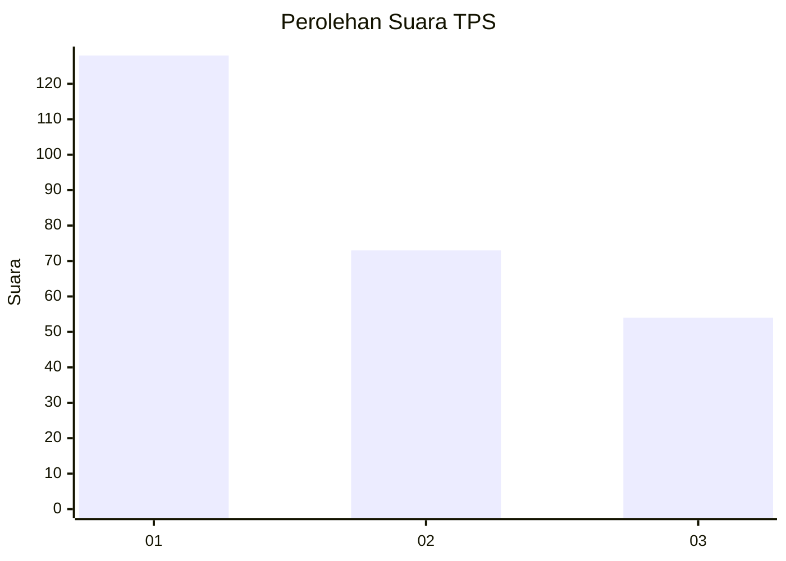
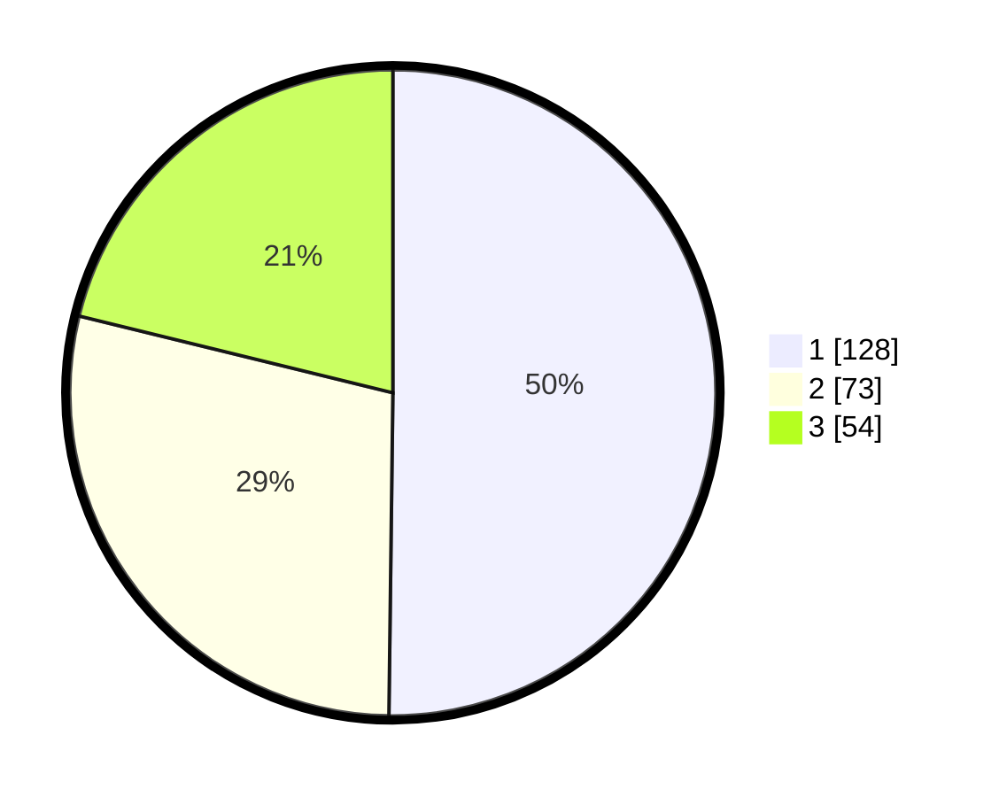

# Hasil

## Grafik

## Tabel

| No. | Nama Paslon    | Suara | Suara (raw) | Persentase |
|:--- |:-------------- | -----:| -----------:| ----------:|
| 1   | ANIES MUHAIMIN | 128   | [128][p-1]  | 50,20      |
| 2   | PRABOWO GIBRAN | 73    | [73][p-2]   | 28,63      |
| 3   | GANJAR MAHFUD  | 54    | [54][p-3]   | 21,18      |

[p-1]: https://github.com/gigit-pemilu/pemilu-2024/blob/main/pilpres/hitung-suara/sub/36-banten/sub/03-tangerang/sub/12-pasar-kemis/sub/2013-gelam-jaya/sub/083-tps/sub/paslon-1.txt
[p-2]: https://github.com/gigit-pemilu/pemilu-2024/blob/main/pilpres/hitung-suara/sub/36-banten/sub/03-tangerang/sub/12-pasar-kemis/sub/2013-gelam-jaya/sub/083-tps/sub/paslon-2.txt
[p-3]: https://github.com/gigit-pemilu/pemilu-2024/blob/main/pilpres/hitung-suara/sub/36-banten/sub/03-tangerang/sub/12-pasar-kemis/sub/2013-gelam-jaya/sub/083-tps/sub/paslon-3.txt

## Foto C Plano

https://sirekap-obj-formc.kpu.go.id/1a1d/pemilu/ppwp/36/03/12/20/13/3603122013083-20240214-230822--d2c8e148-c073-4af5-9185-76eb2610a468.jpg

https://sirekap-obj-formc.kpu.go.id/1a1d/pemilu/ppwp/36/03/12/20/13/3603122013083-20240214-231130--e61cabee-2767-48bf-9aea-39eaad434c97.jpg

https://sirekap-obj-formc.kpu.go.id/1a1d/pemilu/ppwp/36/03/12/20/13/3603122013083-20240215-022518--bb2c1b71-4c18-40dd-a01c-3b7f2be62a88.jpg

## Metadata

| Key        | Value               |
| ---------- | ------------------- |
| Time Stamp | 2024-02-26 11:00:00 |

