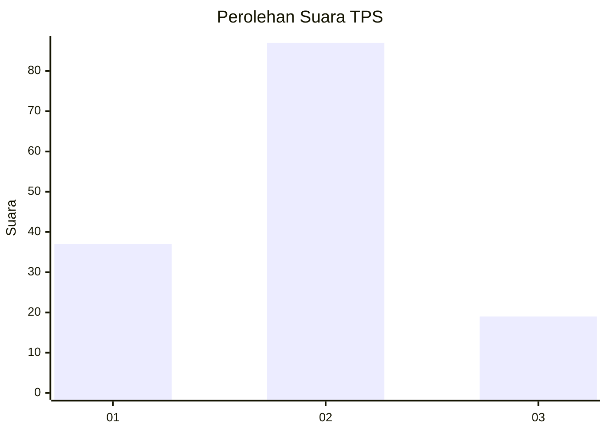
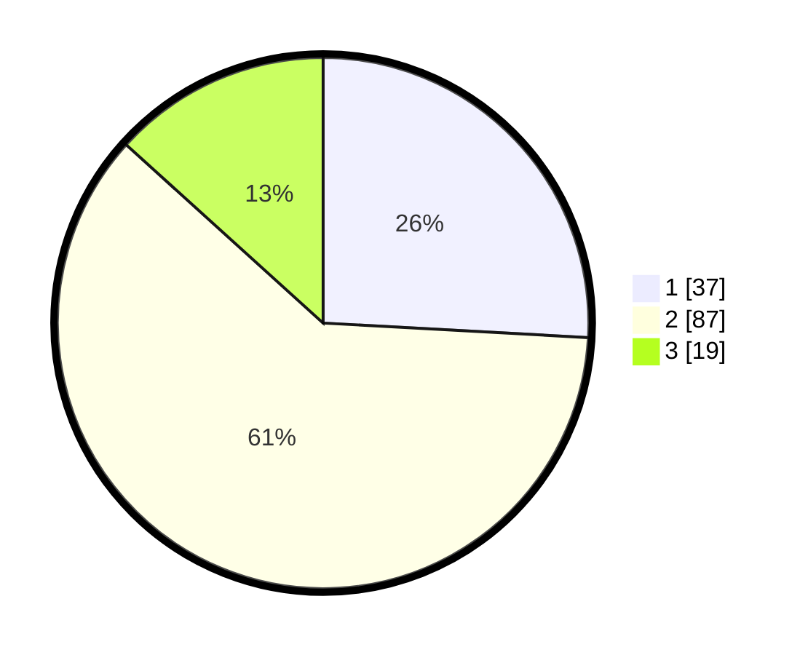

# Hasil

## Grafik

## Tabel

| No. | Nama Paslon    | Suara | Suara (raw) | Persentase |
|:--- |:-------------- | -----:| -----------:| ----------:|
| 1   | ANIES MUHAIMIN | 37    | [37][p-1]   | 25,87      |
| 2   | PRABOWO GIBRAN | 87    | [87][p-2]   | 60,84      |
| 3   | GANJAR MAHFUD  | 19    | [19][p-3]   | 13,29      |

[p-1]: https://github.com/gigit-pemilu/pemilu-2024-36-banten/blob/main/pilpres/hitung-suara/sub/36-banten/sub/03-tangerang/sub/13-teluknaga/sub/2001-teluknaga/sub/001-tps/sub/paslon-1.txt
[p-2]: https://github.com/gigit-pemilu/pemilu-2024-36-banten/blob/main/pilpres/hitung-suara/sub/36-banten/sub/03-tangerang/sub/13-teluknaga/sub/2001-teluknaga/sub/001-tps/sub/paslon-2.txt
[p-3]: https://github.com/gigit-pemilu/pemilu-2024-36-banten/blob/main/pilpres/hitung-suara/sub/36-banten/sub/03-tangerang/sub/13-teluknaga/sub/2001-teluknaga/sub/001-tps/sub/paslon-3.txt

## Foto C Plano

https://sirekap-obj-formc.kpu.go.id/473b/pemilu/ppwp/36/03/13/20/01/3603132001001-20240225-211918--78091fd4-9311-4304-aa62-bc1a6ef2cc41.jpg

https://sirekap-obj-formc.kpu.go.id/473b/pemilu/ppwp/36/03/13/20/01/3603132001001-20240225-212122--e99c13bd-a065-4bcd-b511-0e02fbd5c892.jpg

https://sirekap-obj-formc.kpu.go.id/473b/pemilu/ppwp/36/03/13/20/01/3603132001001-20240225-212247--303d0d08-f164-41fe-be9c-3df8eb6531ab.jpg

## Metadata

| Key        | Value               |
| ---------- | ------------------- |
| Time Stamp | 2024-02-28 21:00:00 |

