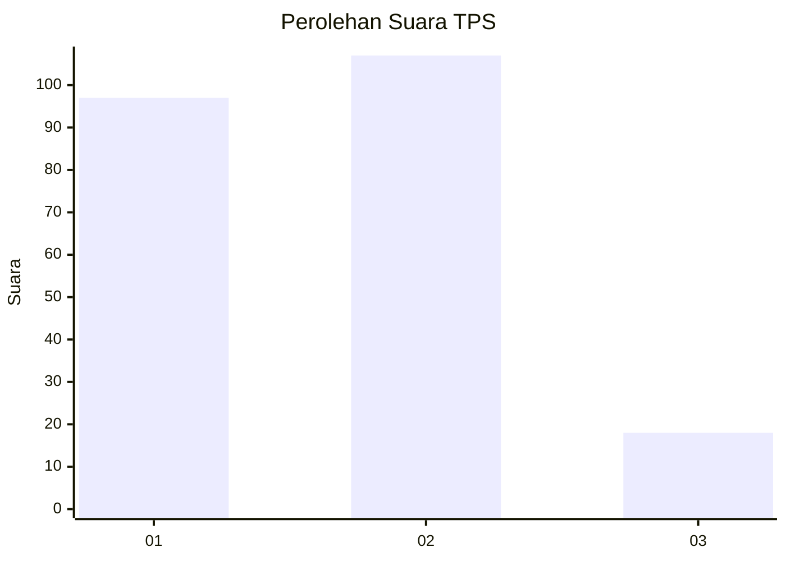
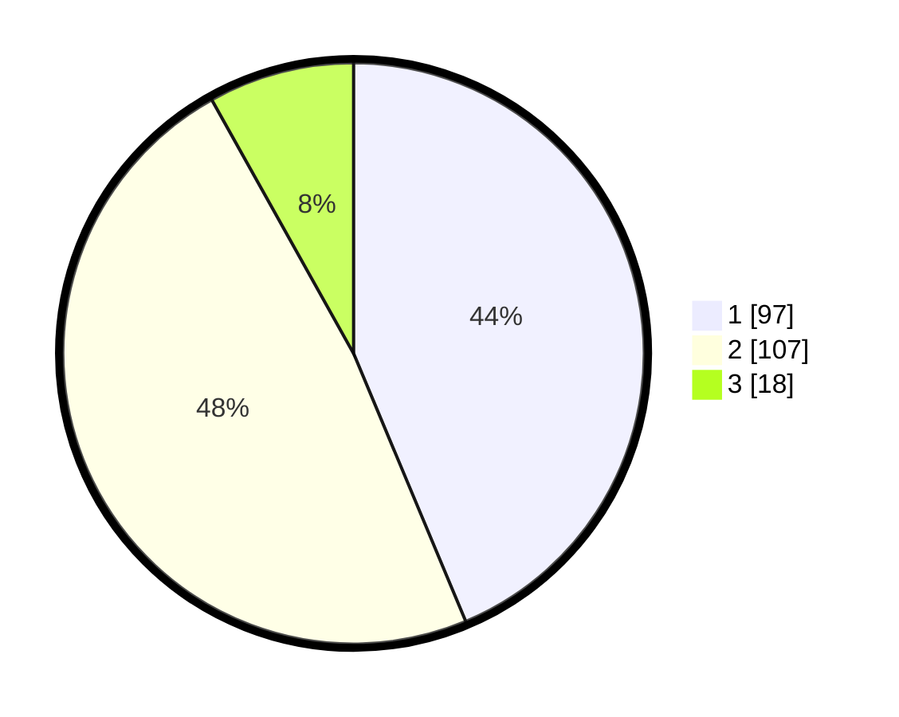

# Hasil

## Grafik

## Tabel

| No. | Nama Paslon    | Suara | Suara (raw) | Persentase |
|:--- |:-------------- | -----:| -----------:| ----------:|
| 1   | ANIES MUHAIMIN | 97    | [97][p-1]   | 43,69      |
| 2   | PRABOWO GIBRAN | 107   | [107][p-2]  | 48,20      |
| 3   | GANJAR MAHFUD  | 18    | [18][p-3]   | 8,11       |

[p-1]: https://github.com/gigit-pemilu/pemilu-2024-36-banten/blob/main/pilpres/hitung-suara/sub/36-banten/sub/03-tangerang/sub/13-teluknaga/sub/2001-teluknaga/sub/007-tps/sub/paslon-1.txt
[p-2]: https://github.com/gigit-pemilu/pemilu-2024-36-banten/blob/main/pilpres/hitung-suara/sub/36-banten/sub/03-tangerang/sub/13-teluknaga/sub/2001-teluknaga/sub/007-tps/sub/paslon-2.txt
[p-3]: https://github.com/gigit-pemilu/pemilu-2024-36-banten/blob/main/pilpres/hitung-suara/sub/36-banten/sub/03-tangerang/sub/13-teluknaga/sub/2001-teluknaga/sub/007-tps/sub/paslon-3.txt

## Foto C Plano

https://sirekap-obj-formc.kpu.go.id/40e2/pemilu/ppwp/36/03/13/20/01/3603132001007-20240222-130622--ad88b134-d0f8-4d85-874e-6de36d037674.jpg

https://sirekap-obj-formc.kpu.go.id/40e2/pemilu/ppwp/36/03/13/20/01/3603132001007-20240222-130856--a954a7ed-0436-4208-9453-8292a30e21db.jpg

https://sirekap-obj-formc.kpu.go.id/40e2/pemilu/ppwp/36/03/13/20/01/3603132001007-20240222-131008--e6f21b79-291e-4cda-83b1-9c61c60a52f6.jpg

## Metadata

| Key        | Value               |
| ---------- | ------------------- |
| Time Stamp | 2024-02-24 22:31:28 |

## DATA PEMILIH TETAP

Jumlah pemilih dalam DPT: **255**.
 * L: **544**.
 * P: **522**.

## DATA PENGGUNA HAK PILIH

Jumlah pengguna hak pilih dalam DPT: **245**.
 * L: **660**.
 * P: **605**.

Jumlah pengguna hak pilih dalam DPTb: **439**.
 * L: **883**.
 * P: **886**.

Jumlah pengguna hak pilih dalam DPK: **883**.
 * L: **822**.
 * P: **888**.

Jumlah pengguna hak pilih: **227**.
 * L: **365**.
 * P: **782**.

## JUMLAH SUARA SAH DAN TIDAK SAH

JUMLAH SELURUH SUARA SAH: **222**.

JUMLAH SUARA TIDAK SAH: **5**.

JUMLAH SELURUH SUARA SAH DAN SUARA TIDAK SAH: **227**.

