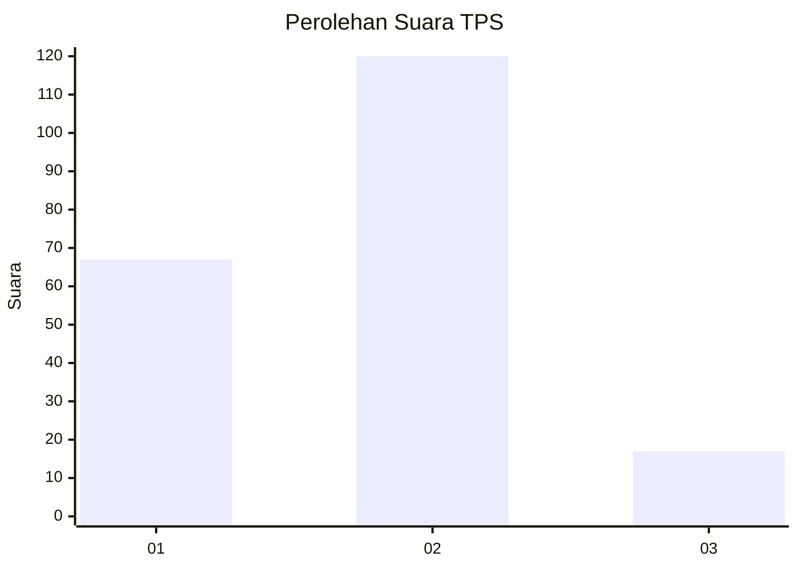
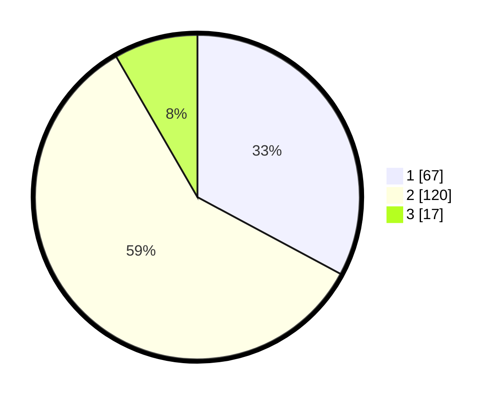

# Hasil

## Grafik

## Tabel

| No. | Nama Paslon    | Suara | Suara (raw) | Persentase |
|:--- |:-------------- | -----:| -----------:| ----------:|
| 1   | ANIES MUHAIMIN | 67    | [67][p-1]   | 32,84      |
| 2   | PRABOWO GIBRAN | 120   | [120][p-2]  | 58,82      |
| 3   | GANJAR MAHFUD  | 17    | [17][p-3]   | 8,33       |

[p-1]: https://github.com/gigit-pemilu/pemilu-2024/blob/main/pilpres/hitung-suara/sub/36-banten/sub/03-tangerang/sub/13-teluknaga/sub/2001-teluknaga/sub/008-tps/sub/paslon-1.txt
[p-2]: https://github.com/gigit-pemilu/pemilu-2024/blob/main/pilpres/hitung-suara/sub/36-banten/sub/03-tangerang/sub/13-teluknaga/sub/2001-teluknaga/sub/008-tps/sub/paslon-2.txt
[p-3]: https://github.com/gigit-pemilu/pemilu-2024/blob/main/pilpres/hitung-suara/sub/36-banten/sub/03-tangerang/sub/13-teluknaga/sub/2001-teluknaga/sub/008-tps/sub/paslon-3.txt

## Foto C Plano

https://sirekap-obj-formc.kpu.go.id/9e02/pemilu/ppwp/36/03/13/20/01/3603132001008-20240222-131322--d42c5962-79b3-450e-9fb3-0cf0a230d972.jpg

https://sirekap-obj-formc.kpu.go.id/9e02/pemilu/ppwp/36/03/13/20/01/3603132001008-20240222-131419--54f20182-0595-4c7f-a5da-35508efc095c.jpg

https://sirekap-obj-formc.kpu.go.id/9e02/pemilu/ppwp/36/03/13/20/01/3603132001008-20240222-131510--6e1d3df2-1a50-414c-af8c-77768571e999.jpg

## Metadata

| Key        | Value               |
| ---------- | ------------------- |
| Time Stamp | 2024-02-24 22:31:28 |

## DATA PEMILIH TETAP

Jumlah pemilih dalam DPT: **333**.
 * L: **833**.
 * P: **339**.

## DATA PENGGUNA HAK PILIH

Jumlah pengguna hak pilih dalam DPT: **395**.
 * L: **459**.
 * P: **335**.

Jumlah pengguna hak pilih dalam DPTb: **847**.
 * L: **843**.
 * P: **385**.

Jumlah pengguna hak pilih dalam DPK: **334**.
 * L: **455**.
 * P: **334**.

Jumlah pengguna hak pilih: **393**.
 * L: **331**.
 * P: **335**.

## JUMLAH SUARA SAH DAN TIDAK SAH

JUMLAH SELURUH SUARA SAH: **204**.

JUMLAH SUARA TIDAK SAH: **2**.

JUMLAH SELURUH SUARA SAH DAN SUARA TIDAK SAH: **206**.

