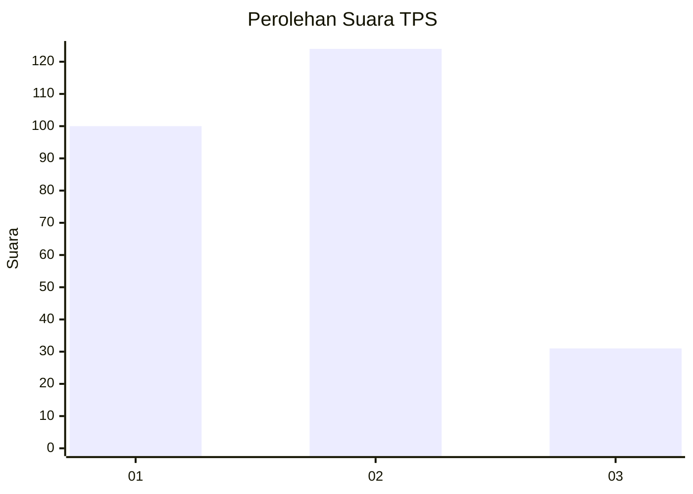
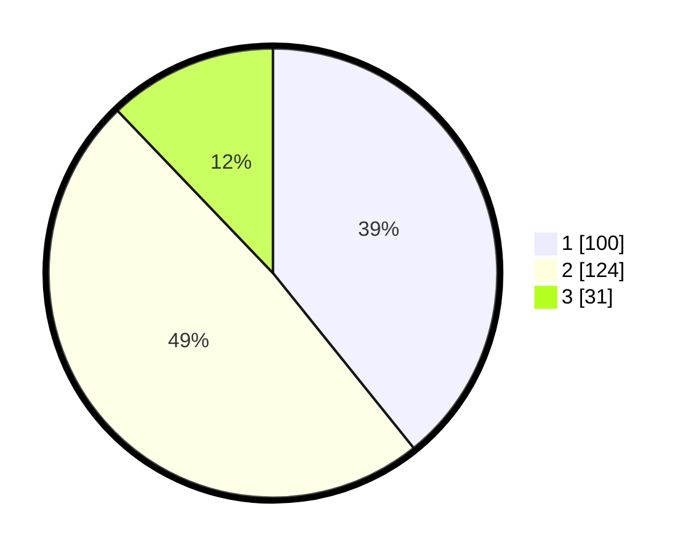

# Hasil

## Grafik

## Tabel

| No. | Nama Paslon    | Suara | Suara (raw) | Persentase |
|:--- |:-------------- | -----:| -----------:| ----------:|
| 1   | ANIES MUHAIMIN | 100   | [100][p-1]  | 39,22      |
| 2   | PRABOWO GIBRAN | 124   | [124][p-2]  | 48,63      |
| 3   | GANJAR MAHFUD  | 31    | [31][p-3]   | 12,16      |

[p-1]: https://github.com/gigit-pemilu/pemilu-2024-36-banten/blob/main/pilpres/hitung-suara/sub/36-banten/sub/03-tangerang/sub/13-teluknaga/sub/2001-teluknaga/sub/010-tps/sub/paslon-1.txt
[p-2]: https://github.com/gigit-pemilu/pemilu-2024-36-banten/blob/main/pilpres/hitung-suara/sub/36-banten/sub/03-tangerang/sub/13-teluknaga/sub/2001-teluknaga/sub/010-tps/sub/paslon-2.txt
[p-3]: https://github.com/gigit-pemilu/pemilu-2024-36-banten/blob/main/pilpres/hitung-suara/sub/36-banten/sub/03-tangerang/sub/13-teluknaga/sub/2001-teluknaga/sub/010-tps/sub/paslon-3.txt

## Foto C Plano

https://sirekap-obj-formc.kpu.go.id/965a/pemilu/ppwp/36/03/13/20/01/3603132001010-20240222-132330--33f5e6d3-442d-4a99-91de-16e068789697.jpg

https://sirekap-obj-formc.kpu.go.id/965a/pemilu/ppwp/36/03/13/20/01/3603132001010-20240222-134852--4eac469b-9a51-4448-b8fb-e5e92b8df6a1.jpg

https://sirekap-obj-formc.kpu.go.id/965a/pemilu/ppwp/36/03/13/20/01/3603132001010-20240222-132558--bf02e122-1184-4842-9a0b-82e4763e2476.jpg

## Metadata

| Key        | Value               |
| ---------- | ------------------- |
| Time Stamp | 2024-02-25 10:00:00 |

## DATA PEMILIH TETAP

Jumlah pemilih dalam DPT: **386**.
 * L: **432**.
 * P: **135**.

## DATA PENGGUNA HAK PILIH

Jumlah pengguna hak pilih dalam DPT: **353**.
 * L: **436**.
 * P: **265**.

Jumlah pengguna hak pilih dalam DPTb: **358**.
 * L: **278**.
 * P: **228**.

Jumlah pengguna hak pilih dalam DPK: **652**.
 * L: **839**.
 * P: **227**.

Jumlah pengguna hak pilih: **253**.
 * L: **655**.
 * P: **423**.

## JUMLAH SUARA SAH DAN TIDAK SAH

JUMLAH SELURUH SUARA SAH: **253**.

JUMLAH SUARA TIDAK SAH: **4**.

JUMLAH SELURUH SUARA SAH DAN SUARA TIDAK SAH: **257**.

