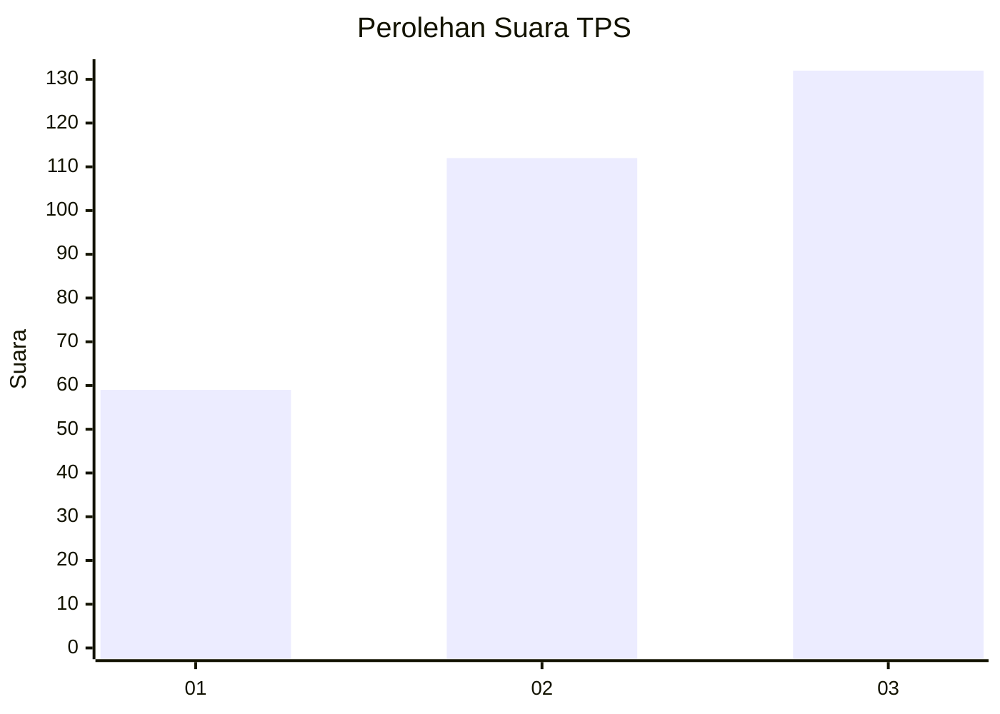
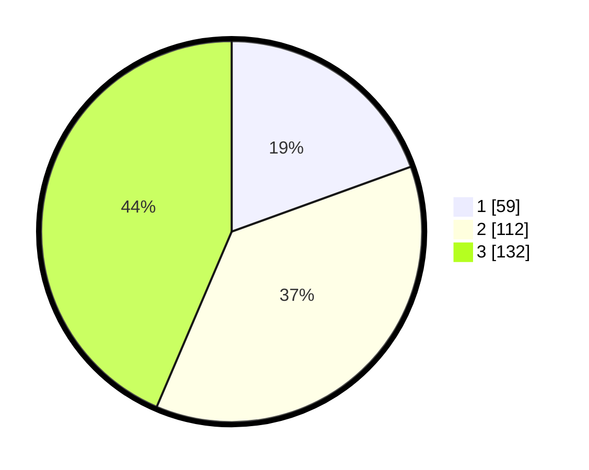

# Hasil

## Grafik

## Tabel

| No. | Nama Paslon    | Suara | Suara (raw) | Persentase |
|:--- |:-------------- | -----:| -----------:| ----------:|
| 1   | ANIES MUHAIMIN | 59    | [59][p-1]   | 19,47      |
| 2   | PRABOWO GIBRAN | 112   | [112][p-2]  | 36,96      |
| 3   | GANJAR MAHFUD  | 132   | [132][p-3]  | 43,56      |

[p-1]: https://github.com/gigit-pemilu/pemilu-2024/blob/main/pilpres/hitung-suara/sub/36-banten/sub/03-tangerang/sub/13-teluknaga/sub/2001-teluknaga/sub/013-tps/sub/paslon-1.txt
[p-2]: https://github.com/gigit-pemilu/pemilu-2024/blob/main/pilpres/hitung-suara/sub/36-banten/sub/03-tangerang/sub/13-teluknaga/sub/2001-teluknaga/sub/013-tps/sub/paslon-2.txt
[p-3]: https://github.com/gigit-pemilu/pemilu-2024/blob/main/pilpres/hitung-suara/sub/36-banten/sub/03-tangerang/sub/13-teluknaga/sub/2001-teluknaga/sub/013-tps/sub/paslon-3.txt

## Foto C Plano

https://sirekap-obj-formc.kpu.go.id/09cf/pemilu/ppwp/36/03/13/20/01/3603132001013-20240222-135025--c55a0ca3-2c40-4e5b-81a4-77b81d9e1ff6.jpg

https://sirekap-obj-formc.kpu.go.id/09cf/pemilu/ppwp/36/03/13/20/01/3603132001013-20240222-135135--65e59dfb-4093-4dff-85df-207d03e8fb80.jpg

https://sirekap-obj-formc.kpu.go.id/09cf/pemilu/ppwp/36/03/13/20/01/3603132001013-20240222-135241--dfc4932c-165d-4700-b68f-c796e495ab54.jpg

## Metadata

| Key        | Value               |
| ---------- | ------------------- |
| Time Stamp | 2024-02-24 22:31:28 |

